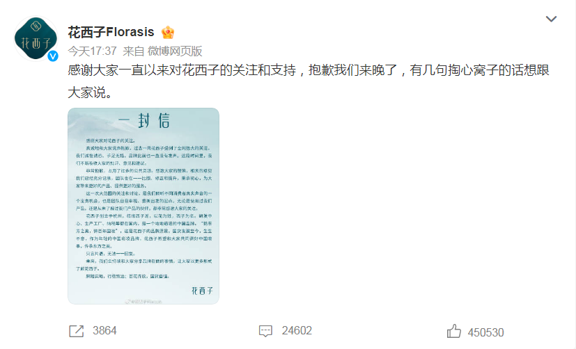
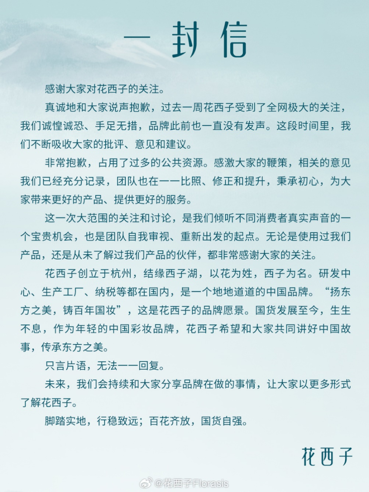
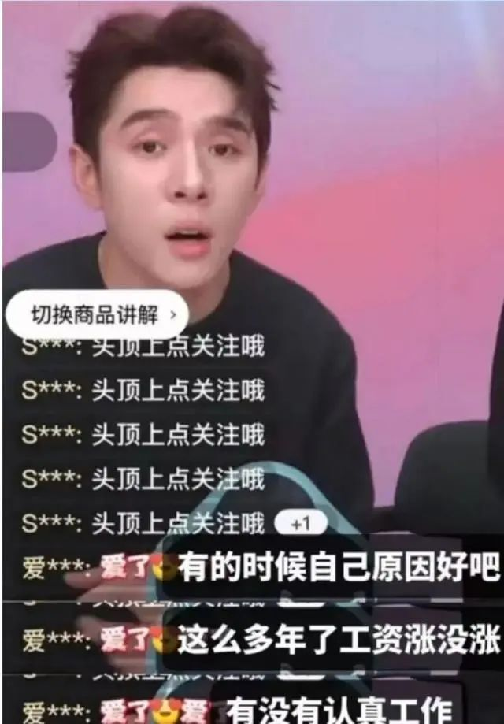
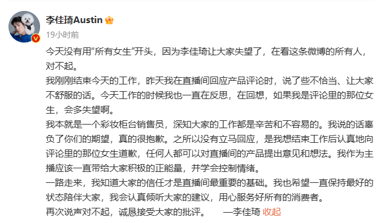

# 花西子道歉称“诚惶诚恐、手足无措”，网友：说了又好像没说

今天傍晚‍‍， **#花西子发声#** 这一话题冲上热搜‍。

_李佳琦直播间怼网友风波后，花西子官方终于发声_

刚刚，花西子官方微博发布《一封信》，声明称：

“真诚地和大家说声抱歉，过去一周花西子受到了全网极大的关注，我们诚惶诚恐、手足无措，品牌此前也一直没有发声。

这段时间里，我们不断吸收大家的批评、意见和建议。非常抱歉，占用了过多的公共资源。

感激大家的鞭策，相关的意见我们已经充分记录，团队也在一一比照、修正和提升，秉承初心，为大家带来更好的产品、提供更好的服务。”

信中强调，花西子是一个地地道道的中国品牌，希望和大家共同讲好中国故事，传承东方之美。

_△图源：花西子官方微博_

日前，李佳琦在直播活动中介绍79元一支的花西子眉笔时，看到有网友留言说越来越贵了，他反问：“哪里贵了？这么多年都是这个价格，不要睁着眼睛乱说，国货品牌很难的……哪里贵了？”

据了解，引发舆论的眉笔为花西子首乌眉粉笔，在李佳琦直播间的价格为79元，买一支送两支替换装。目前，该款眉笔在淘宝官方旗舰店的价格为89元一支送一支替换装，每支净含量0.08克。也就是说，在淘宝花西子官方旗舰店里，89元能买到0.16克眉笔，平均每克556.25元；而李佳琦直播间内，79元能购买0.24克眉笔，平均每克329.17元。

上海黄金交易所数据显示，9月12日黄金早盘价为468.2元/克，这就意味着，1克该品牌的眉笔价格或高于1克黄金。

针对网络上有关花西子对李佳琦的返佣高达60%-80%，甚至是超过100%等信息，有媒体报道，花西子表示，这均是不实谣言，花西子与李佳琦的合作返佣比例属于行业平均水平。

花西子强调，其在2019年与日本某研究所有过短期产研和生产合作，随着国内美妆研发及产业链的综合实力的持续上升，2020年已经停止与该研究所和相关工厂的所有合作，目前花西子的研发中心及生产工厂100%都在国内。

花西子方面表示，就相关谣言已向警方报案。

来源：东方网、中国新闻网、花西子官方微博等

视频：巢思远

编辑：夏小夏、小能手

审稿：卞英豪

