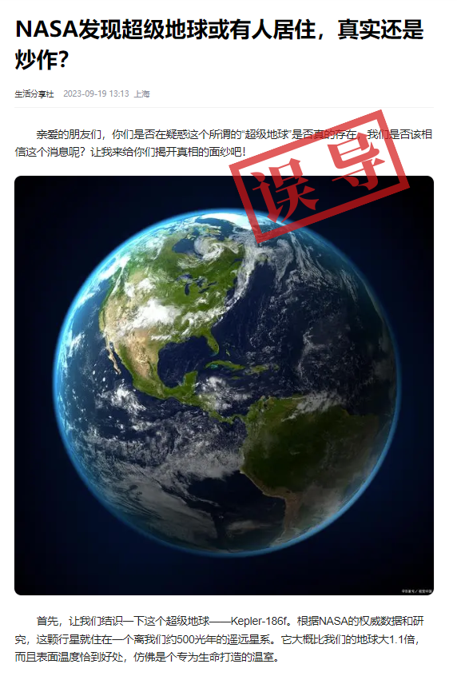
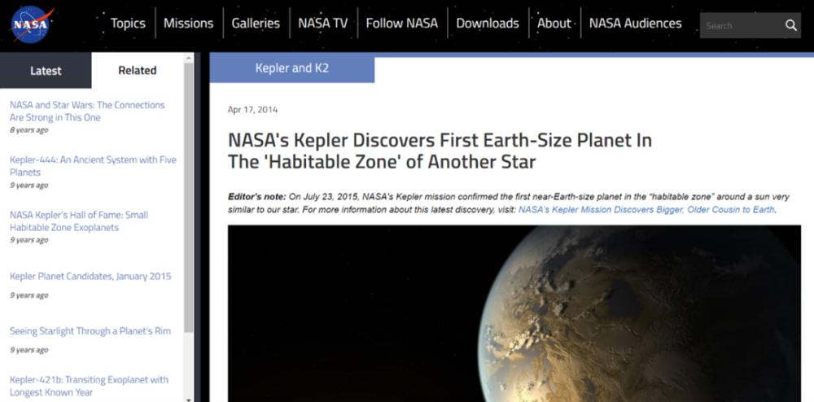
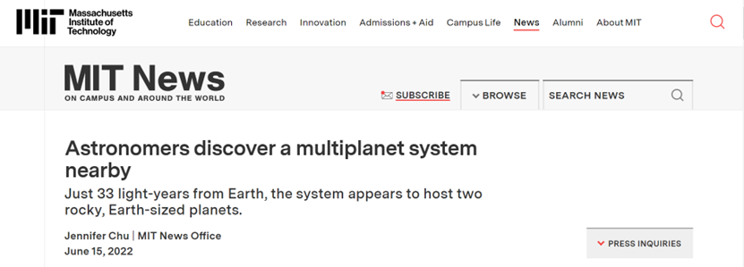
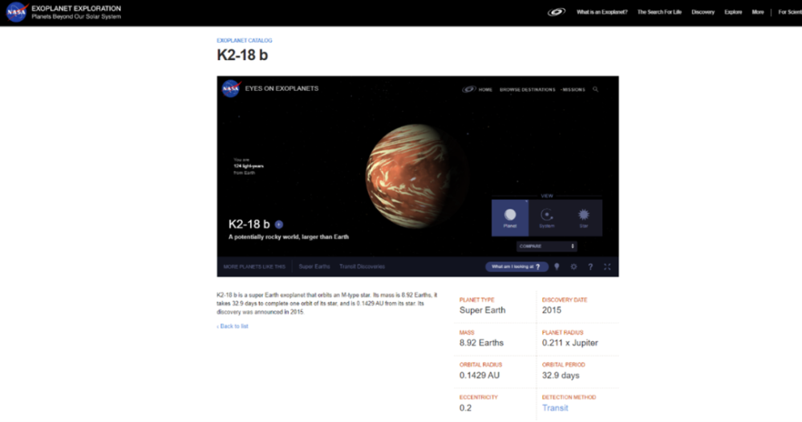
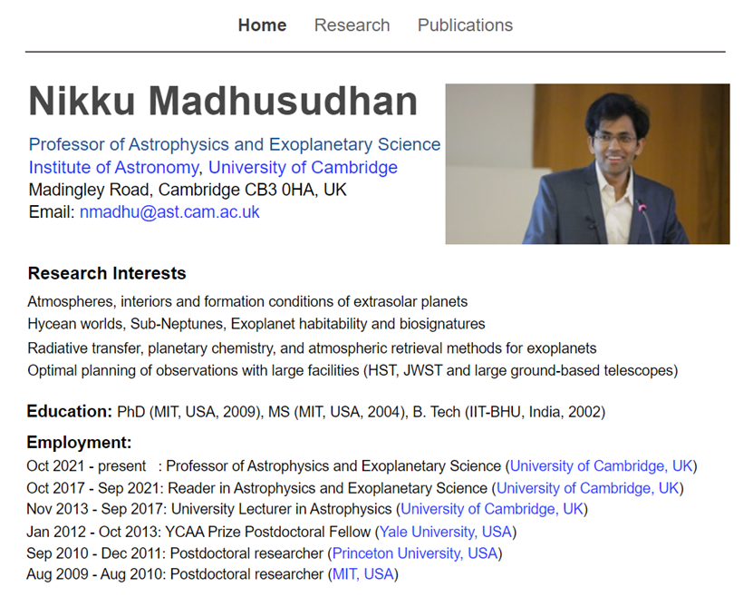
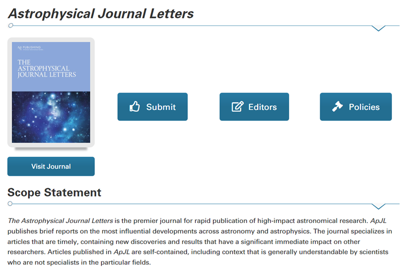
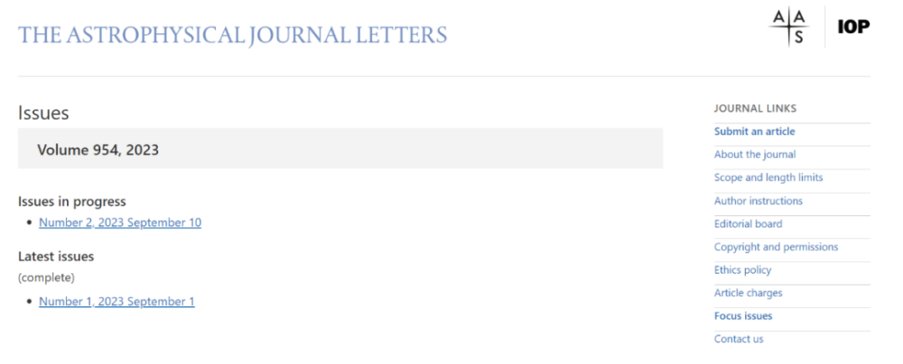
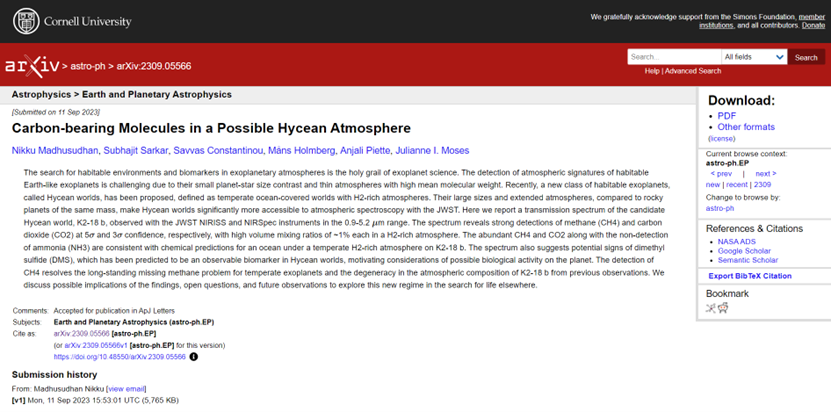

# NASA发现“超级地球”或有人居住？调查后发现细节错误满满

**速览**

  * _1_ “K2-18b”、“Kepler-186f”和“两颗距离地球仅33光年”的不具名行星均非在近日才被发现；发现“K2-18b”上可能存在生物标志物DMS的也并非来自NASA的团队；相关论文尚未在最新一期公开发表的《天体物理学杂志通讯》上公布；论文的第一作者尚不能确认“K2-18b”上是否存在DMS。
  * _2_ NASA认为，虽然“K2-18b”位于宜居带，而且现在已知它蕴藏着含碳分子，但这并不一定意味着这颗行星能够孕育生命。

**事件背景**

9月19日，一则称“美国宇航局（NASA）发现‘超级地球’或有人居住”的消息登上了新闻热搜。部分报道称，据最新一期《天体物理学杂志通讯》刊发的论文，NASA发现了一颗名为“K2-18b”的“超级地球”系外行星，探测到了只有生物体才能产生的气体的迹象。

_网传说法相关截图_

另有说法称，
NASA近日公布，两颗距离地球仅33光年的“超级地球”被其利用凌日系外行星调查卫星发现。科学家们甚至推测这两颗新行星可能拥有适宜人类生存的环境。

还有说法提到，这颗“超级地球”被命名为“Kepler-186f”，“根据NASA的权威数据和研究，这颗行星就住在一个离我们约500光年的遥远星系。它大概比我们的地球大1.1倍，而且表面温度恰到好处，仿佛是个专为生命打造的温室”。

**明查**

**有关说法源自何处？**

网传说法中提到四颗不同的“超级地球”，包括“K2-18b”、“Kepler-186f”和“两颗距离地球仅33光年”的不具名行星。

经核查，“Kepler-186f”早在2014年4月就已经被NASA的开普勒太空望远镜观测到，这是一颗位于另一恒星“宜居带”中的地球大小的行星。但由于该行星的质量和成分尚不确定，科学家们无从判断“Kepler-186f”是否适合居住。

_2014年4月，NASA公布发现第一颗位于另一恒星“宜居带”中的地球大小的行星“Kepler-186f”。_

“两颗距离地球仅33光年的‘超级地球’”被发现于2022年。相关发现的公布日期在2022年6月15日——美国麻省理工学院（MIT）等地的天文学家在银河系附近发现了一个距离地球仅33光年的多行星系统，该系统中心有一颗又小又冷的M型矮星，名为HD260655。天文学家发现HD260655至少有两颗地球大小的行星。据他们判断，这些岩石星球很可能不适合居住，因为它们的轨道相对较紧，行星暴露在过高的温度下，无法使表面的水维持液态。

_2022年6月，MIT公布在银河系附近发现一个距离地球仅33光年的多行星系统。_

而备受关注的“K2-18b”也非NASA的最新发现，该行星早在2015年就已经被人类观测到。NASA网站的资料显示，“K2-18b”是一颗系外行星，围绕一颗M型恒星运行，其质量约等于8.92个地球。

_NASA网站的资料显示，K2-18b在2015年已经被人类观测到。_

搜索与“K2-18b”相关的消息，可以在预印本论文网站arXiv上找到一篇标题为《可能存在的水洋大气层中的含碳分子》的文章。此文发表于2023年9月11日，论文的第一作者名叫尼库·马杜苏丹（Nikku
Madhusudhan），是英国剑桥大学天文学研究所天体物理学和系外行星科学系的教授，并非NASA的工作人员。

_马杜苏丹的个人简历截图_

9月11日，剑桥大学网站发布消息称，该校领导的一个国际天文学家小组利用美国宇航局/欧空局/中科院的詹姆斯·韦伯太空望远镜（NASA/ESA/CSA
James Webb Space Telescope）相关数据，在位于宜居带（Goldilocks
zone）的系外行星“K2-18b”的大气层中发现了甲烷和二氧化碳。这是国际上首次在宜居带系外行星的大气层中发现碳基分子。

_剑桥大学在9月11日发布的消息标题截图_

剑桥大学提到，与此发现相关的论文已经被《天体物理学杂志通讯》（ApJL）接收，并提供了一个指向arXiv网站的链接，即马杜苏丹等人发表的《可能存在的水洋大气层中的含碳分子》一文。

经核查，《天体物理学杂志通讯》是美国天文学会旗下用于快速发表高影响力天文研究成果的顶级期刊，期刊中的所有内容均对外界免费开放。

_《天体物理学杂志通讯》简介截图_

在与美国天文学会存在合作关系的物理学学术团体物理学会（IOP）网站上，可以查询到刊发在《天体物理学杂志通讯》上的最新文章。最近一期已完整刊发的电子杂志是《天体物理学杂志通讯》的总第953卷（2023年9月1日），其中未见与“K2-18b”相关的内容。总第954卷（2023年9月10日）的电子杂志的内容仍在发布进程中（并不完整），目前在已公开的内容中，尚不能找到与“K2-18b”相关的论文。

_IOP网站显示最近一期已完整刊发的《天体物理学杂志通讯》是总第953卷（2023年9月1日），第954卷（2023年9月10日）仍在发布进程中。_

**“K2-18b”上或有人居住？**

尽管马杜苏丹等人被《天体物理学杂志通讯》接收的文章尚不可寻，但从arXiv网站公开的《可能存在的水洋大气层中的含碳分子》一文中，仍可以了解到研究者们的主要发现。

根据文章摘要，马杜苏丹等人报告了“在 0.9-5.2 µm 范围内，用JWST NIRISS和NIRSpec仪器观测到的被认定为水洋星球（Hycean
worlds）的“K2-18b”的透射光谱。光谱显示，在置信度分别达到5σ和3σ时，能强力探测到甲烷和二氧化碳，它们在富氢大气层中的体积混合比高达1%……光谱还显示了潜在的二甲基硫化物（DMS）的迹象。这是一种预计能成为水洋星球上的可观测生物标志的物质，促使了人们对该星球上可能存在的生物活动的思考”。

_发布在arXiv网站上的《可能存在的水洋大气层中的含碳分子》摘要截图_

arXiv网站同样显示，《可能存在的水洋大气层中的含碳分子》一文已经被《天体物理学杂志通讯》（ApJL）接收。从文章的措辞上看，马杜苏丹等学者并未肯定DMS一定存在，更没有表示“K2-18b”上或有人居住。

9月11日，NASA网站针对马杜苏丹等学者的发现，发布了通讯文章《韦伯在K2-18b大气层中发现甲烷和二氧化碳》。文中提到，韦伯望远镜的数据提示可能探测到了DMS分子。在地球上，这是生命体才能生产的物质，地球大气中的大部分DMS是由海洋中的浮游植物释放的。

_9月11日，NASA网站针对马杜苏丹等学者的发现，发布了通讯文章《韦伯在K2-18b大气层中发现甲烷和二氧化碳》。_

然而，马杜苏丹本人对“K2-18b”上是否存在DMS并不确定，他在接受NASA采访时表示，
“即将进行的韦伯观测应该能证实‘K2-18b’的大气中是否确实存在大量的DMS。”

NASA对此的评价是：“虽然‘K2-18b’位于宜居带，而且现在已知它蕴藏着含碳分子，但这并不一定意味着这颗行星能够孕育生命。这颗行星的体积很大——半径是地球半径的2.6倍——这意味着行星内部很可能像海王星一样，有一个巨大的高压冰幔，但更薄的富氢大气层和水洋表面。水洋星球被推测具有汪洋大海，但也有可能因其水体温度过高，以致不宜居住，或水体并非液态。”

据NASA刊文，目前，马杜苏丹领导的研究小组打算利用韦伯望远镜的中红外光谱仪（MIRI）进行后续研究，希望能进一步验证他们的发现，并为“K2-18b”的环境条件提供新的见解。

综上所述，无论是“K2-18b”、“Kepler-186f”还是“两颗距离地球仅33光年”的不具名行星均非在近日才被发现；发现“K2-18b”上可能存在生物标志物DMS的也并非来自NASA的团队；相关论文尚未在最新一期公开发表的《天体物理学杂志通讯》上公布；论文的作者尚不能确认“K2-18b”上是否存在DMS。

NASA认为，虽然“K2-18b”位于宜居带，而且现在已知它蕴藏着含碳分子，但这并不一定意味着这颗行星能够孕育生命。

