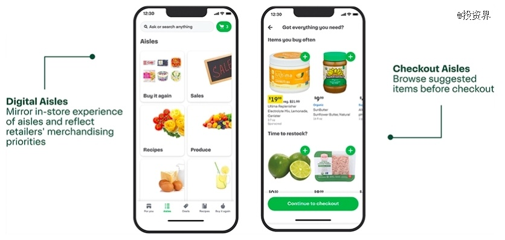
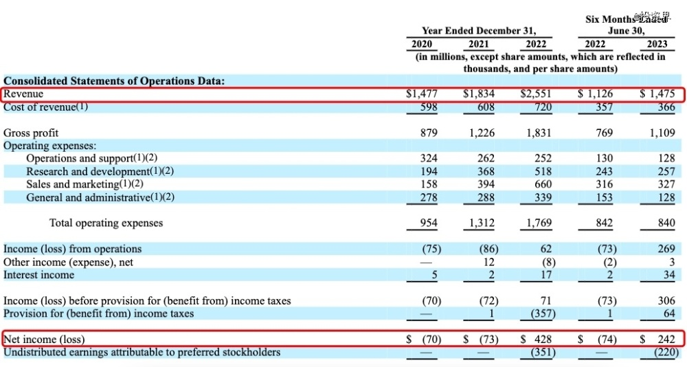

# 今年最惨IPO诞生了，Instacart估值砍了2000亿

这是最新一幕

投资界天天IPO获悉，昨晚（9月19日），美国最大的杂货配送平台Instacart正式登陆纳斯达克敲钟舞台。这一次，Instacart发行价30美元/股，首日收涨12%，市值93亿美元（约合人民币680亿元）

但依旧难掩尴尬比两年前390亿美元估值，目前整整跌去近300亿美元（约人民币2000亿元），缩水比例近七成，令人唏嘘。

成立于2012年，Instacart由一位80后印度裔加拿大人创立，凭借最快30分钟将食品杂货送上门的服务而崛起，并在疫情期间业绩暴涨，是美国最大的杂货配送平台，很多中国生鲜玩家都曾或多或少地借鉴其思路。在YC、红杉、A16Z、Coatue、Tiger
Global、D1 Capital等知名投资机构的加持下，Instacart估值水涨船高。

但泡沫很快破裂。去年，美股市场在加息周期之下迎来惨淡的一年，Instacart的IPO之路坎坷不断，甚至不惜多次主动降估值。目睹这一幕，海外风投机构们开始反思。

**女CEO带队**

**昨夜，680亿IPO诞生**

故事得从一位印度裔加拿大人说起Apoorva Mehta。

1986年出生于印度，Mehta从小生长在加拿大，毕业于滑铁卢大学的电子工程专业。学生生涯结束后，Mehta并不确定自己想要从事什么行业，但他着迷于技术，曾短暂地在高通和黑莓等科技公司任职过，甚至还有钢铁厂的上班经历。

2007年前后，Mehta进入亚马逊任职开发工程师，当时亚马逊正好在开拓生鲜版图。但在这家互联网巨无霸的创业机器中，年轻的Mehta只是一颗不起眼的螺丝钉，时常在公司电脑上编写一些与工作无关的小程序。

在亚马逊工作的两三年间，他愈发笃定要出去创业。为了了解行业知识，他常常出入各种投资人、创业者的论坛与聚会，也买来各种书籍学习创业相关的知识。作为技术开发人员，Mehta想要接受更多挑战，很快便辞掉了这份工作，搬到旧金山开始与搭档琢磨着创业。从2010年起的两年里，他想出了二十来个方向：广告网页、外卖团购、为律师开发社交网络等等。但无一例外，这些项目最后都夭折了。

也就是这段时间，一天工作十几个小时的Mehta每天几乎没有时间做饭，他也不喜欢去超市、食品杂货店买食材，“每天工作14个小时后，你最不想要的就是面对空空如也的冰箱。”他发现一个问题，2012年人们可以轻松地用手机完成大多数生活方式，却依然沿着古老且低效的方式进行每个家庭都要做的事买杂货，怎么才能更方便地买菜呢？

一个新的思路在Mehta脑海中迸发出来用共享经济Uber的模式，让每个拥有手机的普通人都可以申请成为一个shopper（即代购者），当顾客在平台上发出需求后，距离顾客最近的shopper即可在手机上接单，再以最快的速度将货物送到顾客家中，完成“最后一公里”的送货上门服务。

就这样，Instacart诞生了由instant和cart两个单词构成，意指“即时+购物车”。不到一个月，Mehta就把最初版的APP给编了出来，自己下单并接单，验证了这个模式做生鲜的可行性。可以将之简单地理解为“送菜版滴滴”，用户可以在一小时，后来（尽可能快）如30分钟之内收到他们在Instacart下单的商品。

在移动互联网爆发的那几年，Instacart凶猛崛起，很快晋升为瞩目的独角兽。后来疫情发生，生鲜上门需求爆发，Instacart更是势如破竹，每天的订单量突飞猛进。20202021年，Instacart完成了多轮融资，估值水涨船高。

令人意外的是，正值筹备IPO之际，创始人Mehta却突然选择隐退2021年7月，Mehta发布内部信宣布将辞任公司CEO一职，Fidji
Simo女士接任。进入Instacart之前，Simo曾是Ebay战略团队中的一员。2011年她加入Facebook，参与了公司历史上的每一个重大时刻，包括帮助公司从1000人发展到近10万人。

“作为渔民的女儿、孙女和曾孙女，她在成长过程中有着令人难以置信的职业道德，并对食物将人们团结在一起的力量深表感激。”Mehta在内部信中谈到将掌权移交Simo的原由，“七个月前，我邀请Fidji加入Instacart的董事会。从那以后，我被她作为领导者的能力所震撼。”

 _左：Fidji Simo；右：Apoorva Mehta；图源：Instacart官网_

这两年来，美股遭遇漫长的IPO干旱期，Fidji
Simo领导的Instacart上市之路一波三折。经历了暂缓IPO、降估值等，兜兜转转，女CEO终于迎来了最期待的IPO时刻。

**估值缩水2000亿，VC亏麻了**

看似超级IPO，究竟成色几何？

上市之际，Fidji
Simo发了一封公开信。她将Instacart定义为杂货技术公司，可以在任何地方提供最佳的消费者在线杂货体验。消费者可以根据自己的品味和偏好搜索他们喜欢的产品并发现新产品，与他们最喜欢的零售商建立更深层次的关系。

如今，Instacart与超过1400个国家、地区和当地零售品牌合作，覆盖超过8万家商店，400万家庭通过Instacart来完成他们的杂货需求，占领市场份额85%以上，是美国最大的杂货配送平台。

招股书中显示，自成立以来，Instacart
已为超过1000亿美元的GTV（为所有零售合作伙伴提供的在线销售）和超过9亿份订单提供支持，其中订购的商品数量约为200亿件。其中，770万每月活跃订购者在Instacart上平均每月花费约317美元。

整体来看，Instacart的主要收入来源包括送货上门、广告以及面向零售商的软件即服务（SaaS）解决方案等。招股书显示，Instacart在20202022年营收分别为14.77亿美元、18.34亿美元、25.51亿美元；净利分别为-7000万美元、-7300万美元、4.28亿美元，2022年实现了扭亏为盈。

2023
年上半年，Instacart业绩依然保持增长态势，营收为14.75亿美元，2022年同期营收为11.26亿美元；净利润为2.42亿美元，而2022年同期亏损7400万美元。

但是，随着疫情的减弱和消费者回归商店，食品杂货配送的增长有所放缓，Instacart的订单增速开始停滞不前。

一路走来，Instacart在美国VC界也是高光不断。公司一开始的融资对象是YC。2012年6月，当时的掌门人Apoorva
Mehta曾试图通过申请YC的创业营获得投资机会，不料错过了截止日期。

但他没有放弃，联系了各种人脉，希望能得到与YC合伙人见面的机会。事与愿违，虽然成功将Instacart引荐给了YC投资人，但起初没有人愿意投这家不起眼的公司。Mehta不甘心，直至转机出现：

“我打开应用程序并订购了一提6瓶的啤酒寄给了YC总部的Garry
Tan陈嘉兴，新加坡华裔，硅谷知名投资人。半小时后我接到了Garry的电话：‘这是什么？’我回答他，‘这是Instacart’。”

就这样，Instacart得到了与YC面对面聊投资的机会，最终获得YC领投的230万美元种子轮融资。后来，Instacart在美国风投江湖一骑绝尘，集结了红杉美国、A16Z、Coatue、Tiger
Global、D1 Capital等知名VC机构的投资。在上市前，Instacart累计融资额超26亿美元。

期间，Instacart的估值暴涨惊人，从2018年的76亿美元估值到2020年6月的137亿美元估值。2020年10月，Instacart获2亿美元融资，估值达到177亿美元。2021年2月最后一轮2.65亿美元I轮融资时，Instacart估值飙升至390亿美元，达到巅峰。

对比IPO首日112亿美元的市值，相比顶点时期堪称“脚脖子斩”，缩水超2000亿元人民币，跌到了2020年以前。这意味着，2020年6月之后进入的投资人或将面临亏损。

**IPO不赚钱**

**投资人集体反思**

一波三折。

其实有关Instacart计划IPO的报道已经流传了近三年，但因美国科技股遭遇强烈震荡，这项计划也一而再再而三地被搁置。冰冷的氛围下，Instacart曾无奈几次主动下调估值，几个月就砍掉了六成，但市场依旧不买账。

2022年10月，在一次主题为暂缓IPO的备忘录中，CEO Fidji
Simo写道：极度动荡的市场使得Instacart将取消于2022年进行首次公开发售。“市场对新股上市仍是关闭的，这就是为什么在过去10个月里没有科技类IPO。”并表示，这是过去25年里科技类IPO市场最长的干旱期。

Instacart轨迹惊心动魄，也是美国风投江湖收缩的一缕缩影。

经历了2021年投资与退出的短暂狂欢后，美国私募股权投资江湖在加息周期之下跌入冰点，估值与投资双双下降，企业的资产出售和IPO数量也急剧减少，科技股萧条景象令人揪心，由此导致的退出跌幅甚至超过了2008年那场全球金融危机。

要知道，IPO是VC基金为其LP带来回报至关重要的一步。PitchBook数据显示，2021年创纪录的退出价值中约有87%来自公开上市。但2022年初以来IPO骤减，导致等待上市的风投支持公司大量积压。

但上市了，情况也不容乐观。Crunchbase对过去15年来成立的20家由风险投资支持的美国公司在IPO市场上的表现分析得出，只有3家公司的交易价格高于其发行价。这表明许多参与其中的投资公司都没赚到钱。

即使是Airbnb、Pinterest和Snowflake明星公司的股价，也是远低于其首日交易收盘价。更糟糕的是电动汽车制造商Rivian，作为2021年美股最大规模IPO，其市值被抹去最多，自上市以来市值已蒸发超540亿美元，堪称惊悚。

IPO枯竭，VC/PE退不出去；成功IPO了，却要面临亏钱局面。美国风投市场同样风声鹤唳该如何向LP交代？

于是，我们目睹了海外VC/PE调整姿势求生存的一幕幕：一向凶猛的老虎环球基金罕见低头，打折卖资产；黑石、红杉、老虎等知名基金为从LP处募来新资金而不惜降低管理费；软银、老虎等多家机构开始贷款还钱给LP等等。

虽然上周孙正义掌舵的ARM成功上市，以及昨日Instacart为美股IPO市场带来了鼓舞，但IPO市场尚未走出困境，情绪也进一步传导至一级市场。

过去十年，投资人相对轻易地开出支票，为成长中的科技初创公司支付了超出预期的估值溢价，并愿意对项目的基本面和盈利能力视而不见。但现在情况变了，正如Instacart身后一位天使投资人的反思Instacart的IPO表明，做投资要警惕追逐热门项目。

冷静，冷静。这些残酷的教训即便是在今天，依然历历在目。

