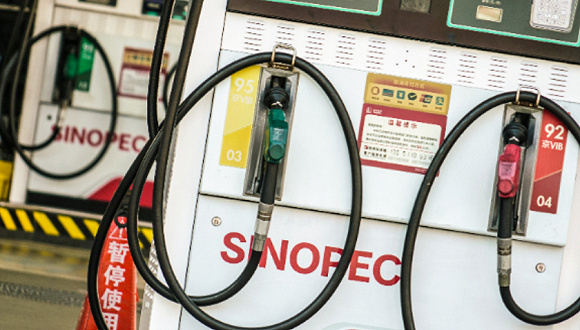

# 国内成品油价迎年内第十涨，部分地区95号汽油进入“9元时代”

加满一箱油将多花15元左右。下一轮成品油零售价继续上调的概率较大。

 _图片来源：界面新闻匡达_

界面新闻记者 | 戴晶晶

国内成品油价迎来年内第十次上调。

9月20日，国家发改委发布消息称，自24时起，国内每吨汽油上调385元、柴油上调370元。折合升价，92号汽油上调0.3元、95号汽油和0号柴油各上调0.32元和0.31元。

私家车主和物流企业的用油成本因此增加。以油箱容量50L的普通私家车计算，车主们加满一箱油将多花15元左右；对满载50吨的大型物流运输车辆而言，平均每行驶一百公里，燃油费用增加12.4元左右。

据各机构计算，调价后，全国大多数地区车柴价格8.1-8.3元/升左右，92号汽油零售限价在8-8.2元/升左右，广东、广西、四川、云南等部分地区95号汽油将进入“9元时代”。

虽然全国各地区都在严格执行国家发改委规定的成品油定价机制，但各地的成品油零售价并不完全相同。主要主要原因之一是成本差异，例如部分地区的成品油会有额外的添加剂，有些地方则是运输成本较高。海南、广东、广西、四川、云南等地炼油厂相对少，需要从其他地区输入，零售端的油价也会较高。

山东等部分地区的炼油厂多，当地优惠活动力度更大，零售端的实际成品油价格就相对低。

本轮是2023年第十九次成品油调价，也是年内第十次上调。本次调价过后，今年成品油调价呈现“十涨六跌三搁浅”的格局。

_图片来源：隆众资讯_

本轮计价周期内，国际原油价格持续震荡上行，且幅度不断拉大。

金联创成品油分析师王延婷对界面新闻表示，此前沙特与俄罗斯宣布将自愿减产期限延长三个月后，两国均表示期间将每月进行审查，以考虑进一步减少产量或增加产量的可能性，投资者对原油供应收紧的担忧情绪升温。

“需求方面，EIA在月度报告中将2023年全球石油需求增长预期上调至181万桶/日。投资者对原油市场将进入供不应求状态的预期持续升温，带动原油价格连续上涨。”王延婷分析称。

卓创资讯成品油分析师郑明亚对界面新闻指出，本计价周期以来，石油库存走低，市场对原油供应短缺的担忧情绪加重，也是导致国际原油价格震荡上涨的原因。

整体看，本轮调价周期内国内参考的原油变化率在正值范围内上行。据卓创资讯测算，截至9月19日收盘，国内第10个工作日参考原油变化率为8.03%。

截至北京时间9月20日凌晨收盘，WTI 即月原油期货结算价跌0.31%，报91.2美元/桶；布伦特即月原油期货结算价跌0.1%，报94.43美元/桶。

_图片来源：隆众资讯_

下一轮成品油零售价继续上调的概率较大。

“以当前的国际原油价格水平计算，下一轮成品油调价开局将呈现上调的趋势。”隆众资讯成品油分析师李彦对界面新闻表示，欧佩克+减产氛围支撑显著，且经济层面担忧情绪减弱，利好因素仍占据上风。

王延婷也认为，短期内国际原油价格或维持高位波动，新一轮零售价上调概率较大。

郑明亚分析称，在需求增加背景下，沙特和东欧某国将削减石油供应计划延长至年底，石油库存有进一步走低可能，这或支撑国际原油价格维持高位。

“由于国庆假期影响，下一轮调价周期时间跨度较长，成品油零售限价调整存在较大不确定性。”郑明亚同时指出。

按照当前成品油调价周期测算，下一次调价窗口将在2023年10月10日24时开启。

