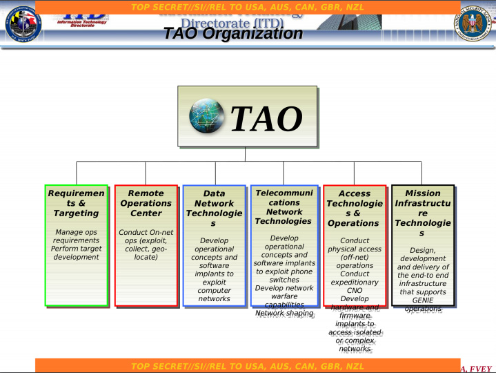

# 国家安全部：起底美国情报机关网攻窃密的主要卑劣手段

来源：国家安全部

近日，中国国家计算机病毒应急处理中心通报，在处置西北工业大学遭受网络攻击时，成功提取了名为“二次约会”的间谍软件样本。该软件为美国国家安全局开发的网络“间谍”武器，在遍布全球多国的上千台网络设备中潜藏隐秘运行。

美国在网络安全领域劣迹斑斑。国家安全机关破获的系列美国间谍情报机关网络攻击窃密案件中，“黑客帝国”维护“网络霸权”的卑劣伎俩浮出水面。

**招数一：建立网攻武器库**

美国情报部门凭借其强大的网络攻击武器库，对包括中国在内的全球多国实施监控、窃密和网络攻击，可谓无所不用其极。特别是美国国家安全局，通过其下属的特定入侵行动办公室（TAO）以及先进的武器库，多次对我国进行体系化、平台化攻击，试图窃取我国重要数据资源。

_美国国家安全局（NSA）总部_

2009年，特定入侵行动办公室就开始入侵华为总部的服务器并持续开展监控。2022年9月，又被发现长期持续地对包括西北工业大学在内的国内网络目标实施了上万次恶意网络攻击，控制了数以万计的网络设备，窃取大量高价值数据。

美国情报部门能够发动大规模网络攻击，自然离不开多样化网络攻击武器作为后盾。2022年以来，我国网络安全机构已披露多款美情报部门网络攻击武器，如“电幕行动（Bvp47）”“量子(Quantum)”“酸狐狸（FOXACID）”“蜂巢（Hive）”等。美国情报部门利用这些规模化的武器装备对中国、俄罗斯等全球45个国家和地区开展长达十余年的网络攻击、网络间谍行动，网络攻击目标涵盖电信、科研、经济、能源和军事等核心重要领域。

**招数二：强制相关科技企业开后门配合**

美国政府以国家安全为由，通过《外国情报监视法》等法案强制在相关科技企业的设备、软件、应用程序中植入后门，利用嵌入代码、漏洞攻击等方式，借助其全球性科技公司的影响力，实现对全球数据的监控和窃取。

2020年12月，美国位置数据公司X-Mode
Social被曝光通过在应用程序内置软件开发工具包获取位置数据，并将数据卖给与美国军方和情报部门关系密切的承包商。2022年4月，有美国军事情报背景的“异常六号（Anomaly
Six）”公司，被曝光将其内部跟踪软件开发包嵌入到众多移动应用程序中，从而跟踪全球数亿部手机的位置数据和浏览信息，并将这些数据汇总出售给美国政府。

**招数三：颠倒黑白贼喊捉贼**

美国一边大肆对全球各国开展网络攻击窃密，一边花样百出炮制各种版本的“安全报告”，将中国抹黑为“网络威胁主体”，渲染炒作所谓“中国网络窃密”问题，把“颠倒黑白”演绎得炉火纯青。

众所周知，美国长期凭借技术优势对世界各国包括盟友进行大规模窃听窃密，开展网络窃密活动，早已经是公开的秘密。自2013年“棱镜门”事件曝光以来，我国相关网络安全机构多次在针对中国的网络攻击事件中发现美国的身影。近年来，美国加紧推进“前出狩猎”行动，其行动目标明确，俄罗斯、伊朗、中国和朝鲜是其主要目标。美国网络司令部正成为一支远征部队，打着“前出狩猎”、主动防御的幌子，对他国进行网络攻击和窃密。

但与此同时，美国却极力把自己塑造成“网络攻击受害者”，打着“维护网络安全”的旗号，鼓动、胁迫他国加入所谓“清洁网络”计划，企图在国际网络市场上清除中国企业。事实上，“清洁网络”是假，打压对手、维护霸权才是真。对此，我国官方多次敦促美方应深刻反省，停止针对全球的网络攻击窃密行径，停止以各种虚假信息混淆视听。

当前，网络空间日益成为维护国家安全的新战场。没有网络安全就没有国家安全，就没有经济社会稳定运行，广大人民群众的利益也难以得到保障。让我们携起手来，强化安全防范意识，提升安全防范能力，共同维护好网络安全。

