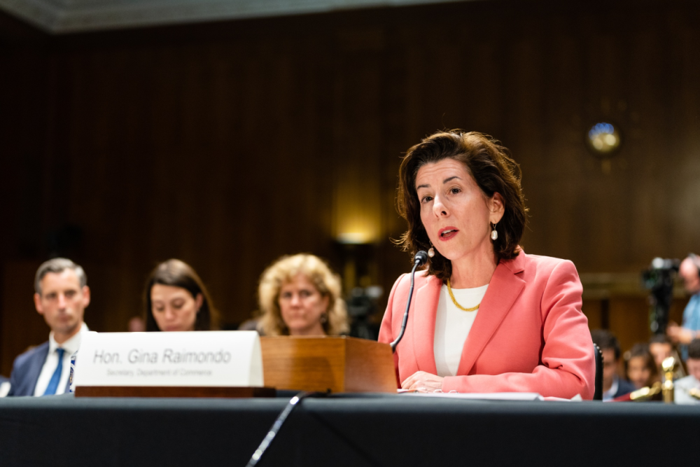
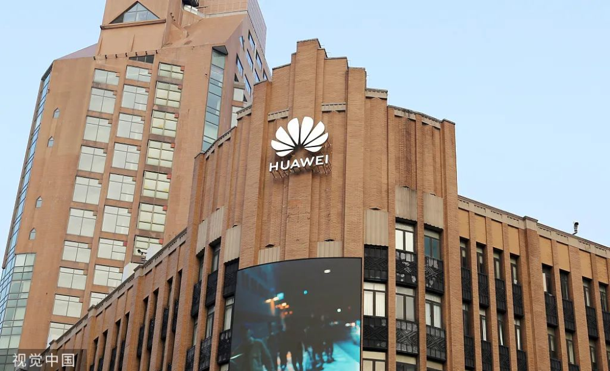

# 外媒：被议员询问访华时华为推出新手机，美商务部长回应了

【环球网报道】关于华为推出新手机，美国商务部长雷蒙多回应了。

据彭博社、路透社等多家外媒报道，雷蒙多当地时间19日在美国众议院听证会，被议员质询她访华期间华为推出新手机一事。雷蒙多回应称，她对华为推出采用先进芯片的智能手机感到“不安”，同时称美国没有证据表明中国目前有能力“大规模”生产采用先进芯片的智能手机。

 _图为雷蒙多 彭博社报道配图_

彭博社称，雷蒙多在听证会上表示，华为推出一款采用先进芯片新手机，这让她感到“不安”“我们正试图利用我们掌握的每一种工具，阻止中国以伤害我们的方式发展技术。”雷蒙多当天在听证会上声称，据路透社报道，雷蒙多还声称，“我们没有任何证据表明他们能大规模生产7纳米（芯片）。”

雷蒙多和美国国会这一番炒作正值搭载中国自研芯片的华为Mate 60
Pro手机在美国引发关注之际。《华盛顿邮报》9月2日的报道称，“一款手机的推出在华盛顿引发担忧，即美国的制裁未能阻止中国取得关键技术进步，”报道还称，“这似乎应验了美国芯片制造商的警告，即制裁不会阻止中国，而是会刺激中国加倍努力，打造美国技术的替代品。”

彭博社此前消息称，美国政府已开始对相关芯片进行调查。报道还称，市场研究机构TechInsights对Mate 60
Pro手机进行了拆解，称该手机中中国自产零部件的占比非常高，这表明中国在发展国内技术能力方面取得了进展。

_华为标志 资料图 图源：视觉中国_

关于美方调查用于华为最新手机的中国自研芯片，中国外交部发言人毛宁9月8日在例行记者会上表示，中方坚决反对美方将经贸科技问题政治化，反对滥用和泛化国家安全概念。美国滥用国家力量，无理打压中国企业，违反自由贸易原则和国际经贸规则，扰乱全球产供链稳定，损人不利己。“我想强调的是，制裁、遏制、打压阻止不了中国发展，只会增强中国自立自强、科技创新的决心和能力。”毛宁说。

