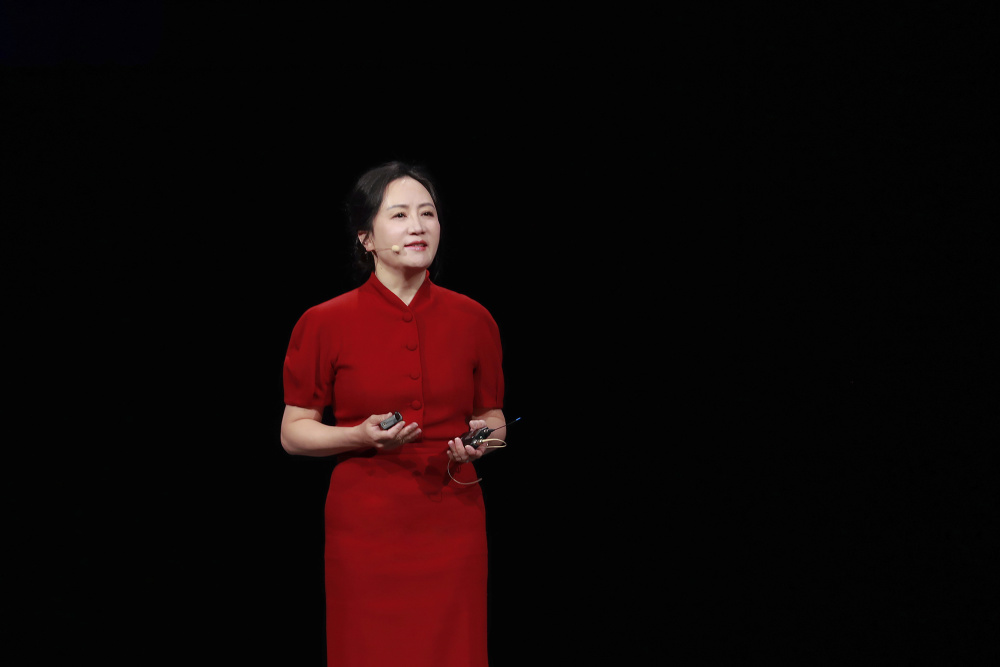

# 孟晚舟最新演讲：华为致力于打造中国算力底座，支持大模型百花齐放

_孟晚舟在全联接大会上发表主题演讲_

腾讯科技讯
9月20日消息，华为今日举办的全联接大会上，华为副董事长、轮值董事长、CFO孟晚舟发表主题演讲，介绍华为的智能化目标，并强调华为将致力于打造中国算力底座，为国产大模型提供算力、平台和开发工具等支持。

据了解，华为的全面智能化目标分为三个板块，包括让“所有对象可联接”、“让所有应用可模型”、“让所有决策可计算”。其中关于所有对象可联接，既包括物理实体，也覆盖逻辑和虚拟概念，而让所有应用可模型，即通过大模型，让智能应用服务用户，至于所有决策可计算核心是指让数据的潜力在计算中不断地释放与叠加。

孟晚舟表示，“在全面智能化战略的指引下，华为将持续打造坚实的算力底座，使能百模千态，赋能千行万业。”

据孟晚舟介绍，华为在AI技术的发展过程中将通过算力底座、AI平台、开发工具的开放，支持国产大模型的发展。“我们支持每个组织使用自己的数据训练出自己的大模型，让每个行业用自己的专业知识发展出自己的行业大模型。”孟晚舟说。

数字化的发展方面，在孟晚舟看来，过去30多年，在信息化、数字化的浪潮中，华为没有一天停止对未来世界的想象。

据介绍，从2003年开始，华为提出了All
IP战略，推动通信领域的各类技术制式和协议走向统一，支持了全球170多个国家和地区的1500多张网络的稳定运行，联接了全球超过1/3的人口。

2013年，随着云计算技术的加速发展，华为又提出了All
Cloud战略，加速数字化转型的升级，到目前为止聚合了全球4.2万家合作伙伴、500万名开发者，服务了全球300万家客户。

与此同时，华为还大力推动产教融合，通过ICT学院和“智能基座”项目，在全球已与2600多所高校共建了ICT学院，教师数量超过了11000人，每年培养学生20万人。

**以下为孟晚舟发言精简版：**

**华为提出全面智能化战略，加速行业智能化**

全面智能化（All Intelligence）的目标是“加速千行万业的智能化转型”。

首先，让所有对象可联接。不仅是物理实体的，也包括逻辑的、虚拟的；不仅包括数字化的设备，也包括传统的终端和装置；不仅使数据上得来，也让意图下得去。

其次，让所有应用可模型，通过大模型范式，让智能应用快速惠及每个人、每个家庭、每个组织。

第三，让所有决策可计算。以算力的无所不在，加速智能的无所不及，并让数据的潜力在计算中不断地释放与叠加。

在全面智能化战略的指引下，华为将持续打造坚实的算力底座，使能百模千态，赋能千行万业。

**打造中国坚实的算力底座，为世界构建第二选择**

人工智能的发展，算力是核心驱动力。大模型需要大算力，算力大小决定着AI迭代与创新的速度，也影响着经济发展的速度。算力的稀缺和昂贵，已经成为制约AI发展的核心因素。

华为致力于打造中国坚实的算力底座，为世界构建第二选择。我们将持续提升“软硬芯边端云”的融合能力，做厚“黑土地”，满足各行各业多样性的AI算力需求。

华为将充分发挥在计算、存储、网络、能源等领域的综合优势，改变传统的服务器堆叠模式，以系统架构创新的思路，着力打造AI集群，实现算力、运力、存力的一体化设计，突破算力瓶颈，提供可持续的澎湃算力。

**使能百模千态，做“百花园”的黑土地**

参数超过千亿甚至万亿的人工智能神经网络模型，正在加速进入千行万业，AI发展也正在跨越拐点。

从小模型时代到大模型时代，AI技术的实用性发生了质的飞跃。过去，不同的应用场景需要开发不同的模型。现在，大模型通过吸收海量知识，一个模型可以适配多种业务场景，大幅降低了AI开发与应用的门槛，缩短了技术到应用的周期，使AI从作坊式开发、场景化定制，走向工业化开发、场景化调优，依托大模型规模化解决行业问题成为可能。

在此过程中，通过算力底座、AI平台、开发工具的开放，华为支持大模型在智能化时代的“百花齐放”，努力做好“百花园”的黑土地。

我们支持每个组织使用自己的数据训练出自己的大模型，让每个行业用自己的专业知识发展出自己的行业大模型。

**从All IP到All Cloud，十年一个台阶**

过去30多年，在信息化、数字化的浪潮中，华为没有一天停止对未来世界的想象，更没有一天停下在现实世界里努力的脚步。在不确定中抓住主要趋势，基于客户需求和技术创新的双轮驱动，构筑产品领先优势，助力产业升级。

从2003年开始，CT和IT在网络基础设施技术中相遇，华为提出了All
IP战略，推动通信领域的各类技术制式和协议，从七国八制走向统一。“车同轨、书同文”，从而促进了联接的无处不在。华为支持了全球170多个国家和地区的1500多张网络的稳定运行，联接了全球超过1/3的人口。

2013年，随着云计算技术的加速发展，华为提出了All
Cloud战略，加速数字化转型的升级。如今，华为云成为了全球增速最快的主流云厂商之一，这得益于持续的研发投入和全球客户的认可。我们在全球部署了30个Region、84个可用区，聚合了全球4.2万家合作伙伴、500万名开发者，服务了全球300万家客户。

凡益之道，与时偕行。对历史能看得多深，对未来就能看得多远。

行业的每一次飞跃，都添加了时代的注脚。

从All IP，到All Cloud，十年一个台阶，我们从未停止努力。

**与高校联合创新，支持“无用之用”的研究和探索**

技术为根，人才为本。

过去数十年，华为一直围绕着自身所在产业，为高校师生、开发者和科研人才，量身定制培养体系。

面向高校师生，我们通过ICT学院和“智能基座”项目，实现了产教的融合。其中，华为在全球已与2600多所高校共建了ICT学院，教师数量超过了11000人，每年培养学生20万人。华为联合中国72所高校持续深化“智能基座”项目，我们已经开设了1600多门课程，覆盖了50多万学生。

未来的发展，还依赖基础技术的持续突破和人才的不断涌现。所以，华为不仅做“工程商用”研究，解决实际挑战，还依托“创新2.0机制”，与高校联合创新，支持“无用之用”的理论研究和前沿探索。

不忘初心，无问西东，方得始终。

