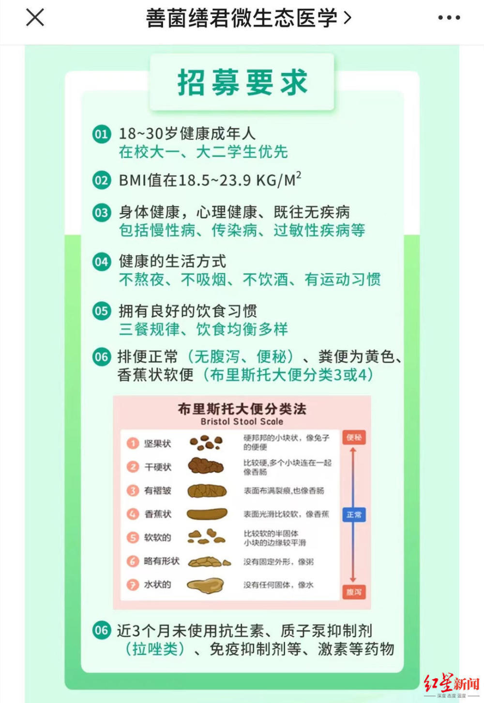
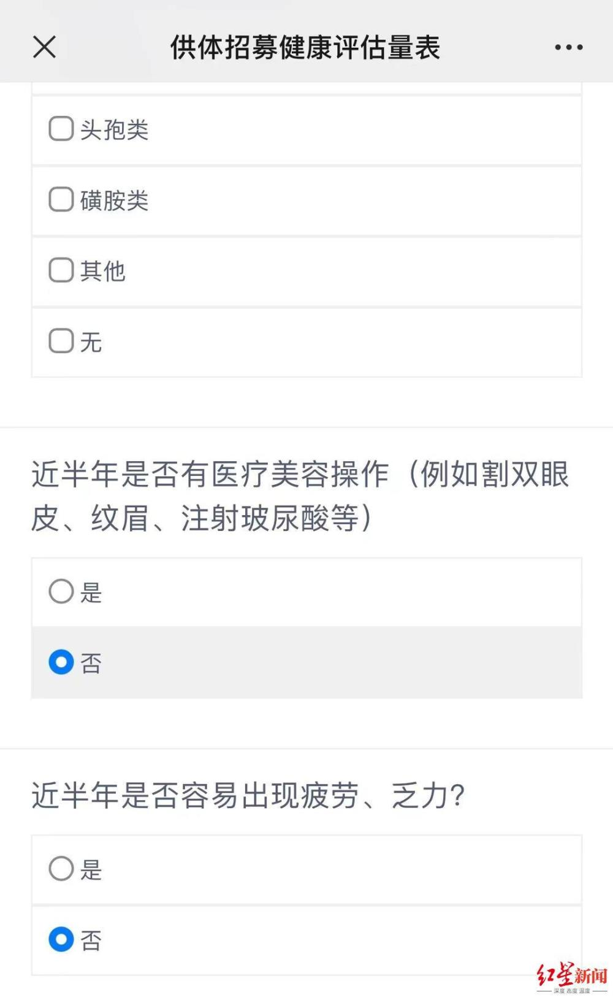
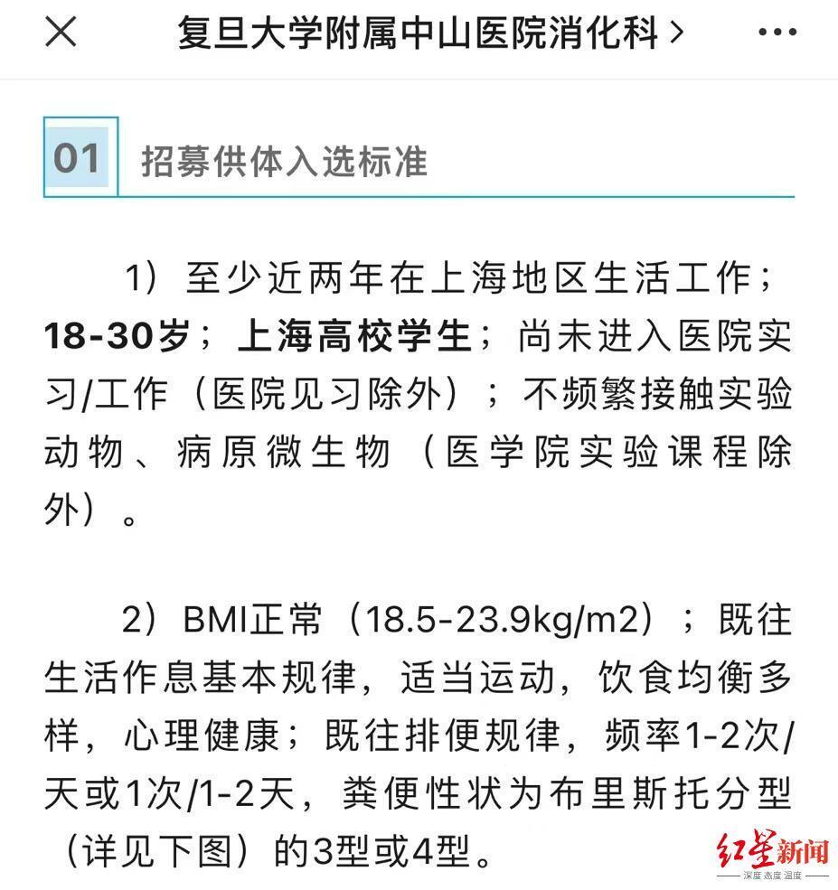

# 捐粪便月入6600元？西安一医疗企业回应：打耳洞有纹身难过检，合格率仅10%左右

“捐献粪便，日入3位数，月入6千多！”近日，西安菌佑医疗科技发展有限公司（下称“菌佑医疗”）联合西安交大一附院推出的“粪便菌群志愿者招募”通知引发社会关注。

红星新闻记者从菌佑医疗一名工作人员口中了解到，捐赠粪便一次补贴100～300元不等，且捐赠次数不受限制，每月最多可捐献22次，换算下来，通过粪便捐赠每月可收到约6600元的补助津贴。

但这名工作人员同时表示，诸如近期有纹身、打了耳洞或做了医美项目，服用了抗生素、甚至有心理疾病，往往都很难通过筛选。该工作人员回应红星新闻称，目前咨询和报名粪便捐赠的人数较多，但实际通过率却仅有10%左右。

**谁能捐粪便？**

**18~30岁健康成年人**

**近期打耳洞做医美等难过检**

“现在咨询和报名捐赠的人挺多的，不过通过体检筛选合格的捐赠者并不多。”菌佑医疗一名工作人员告诉红星新闻，自9月7日发布粪便捐赠招募公告以来，已有不少西安本地的年轻人前去报名咨询，但从目前来看，能通过身体检查，符合捐赠条件的合格率仅有10%左右。

红星新闻记者注意到，招募公告显示，粪便捐献者需为18～30岁健康成年人（在校大一、大二学生优先），同时BMI值在18.5～23.9kg/㎡。此外还要求无既往病史、不熬夜、不抽烟、不饮酒，且要有运动习惯，三餐规律，日常排便正常等。

“我们希望是在校大学生，但筛选只要年龄符合，并没有学历限制。”受访的工作人员解释称，希望招募在校学生主要是基于学生生活自律性高，身体状况良好的考虑，至于学历水平、性别等并不在考察项目之中。

根据通告中的招募流程，除了要通过身体体检，志愿者还需接受面谈。上述公司员工介绍称，面谈内容主要是了解其近期的心理健康状况，并询问既往病史或者家族遗传等。该工作人员解释，之所以要了解心理健康情况，是因为通过筛选的健康粪便菌群，未来将服务于对抑郁症患者的治疗，所以会格外强调这一检查项目。

_▲供体招募健康评价量表中，关于试验者健康情况的调查内容_

此外，记者还了解到，在报名粪便捐献之前，志愿者还需填写一份长达12页的“供体招募健康评价量表”。其中量表还会询问受试者近期有没有做医美、打耳洞、有无纹身等。这些因素何以会影响粪便捐献？上述工作人员解释称：“比如在3个月内有打耳洞或做纹身，那么就有可能存在感染的风险，因此不建议此类人群近期做粪便捐献。”

实际上，医疗领域招募粪便捐献并不鲜见，而在筛选项目上，红星新闻记者梳理发现，大多都对年龄、BMI、既往病史等有所考量。如复旦大学附属中山医院消化科在今年4月发布的招募通告中，入选标准中也要求年龄为18-30岁，BMI值在18.5～23.9kg/㎡，心理健康、排便规律。北京中医药大学深圳分院在今年7月发布的粪便招募要求则表明，年龄需为18-28岁，BMI值在18.5～24kg/㎡，无既往病史，3个月内未服用抗生素等。

上述招募信息均显示为长期招募，且均表明会给予捐献者一定经济补贴。

_▲复旦大学附属中山医院消化科此前发布的粪便招募通知截图_

**捐粪能日赚斗金？**

**一次捐献最高补贴300元**

**最多每月可捐赠高达22次**

红星新闻记者在菌佑医疗发布的招募公告中看到，对于符合条件的粪便捐献者，公司可提供免费体检（价值2000元/次）以及全年健康指导。而如果成为合格的粪便捐献者，每次捐赠还提供营养补贴和交通补贴（100元/次）。如果成为最佳粪便捐献者，还有额外奖励和爱心证书。

上述受访工作人员表示，即便最终未能通过筛选，上述体检费用也不需自行承担。而如果最终通过筛选成为粪便捐献者，那么每一次捐献都会给予补贴。

“筛选合格后，捐赠粪便次数不受限，捐赠越多补贴就越多。”菌佑医疗一名工作人员告诉红星新闻，由于合格的粪便菌群稀缺，因此志愿者只要愿意，每个工作日都能进行粪便捐献，且后续补贴价格会提高到最高300元/次。“如果是长期捐献者，每隔大概3个月还需重新进行体检和筛查。”这名工作人员说。

同时，这名工作人员还承诺，每一名捐献者的信息都会严格保密，不会有第三方知道捐献者的身份，甚至姓名都会用代号的形式出现。

而粪便捐赠由于补贴较高且不限次数，此前关于“捐粪月入过万”的话题就曾引发舆论关注。如此前深圳一家制药公司发布的招募粪便捐赠者通告就表明，合格的捐赠者每次捐赠粪便可获300元人民币补助，最多每月可捐赠高达22次，即每月最高收益可达6600元。香港中文大学医学院招募定期大便捐赠者，给予捐赠者的补贴每月最多可达7000港元。

**捐献的粪便用来干什么？**

**用于粪菌移植治疗**

**对消化系统疾病有一定疗效**

为何要搜集健康人群的粪便？根据复旦大学附属中山医院消化科给出的解释，招募粪便是为了进行粪便菌群移植（FMT），即将健康人粪便中的功能菌群，移植到患者胃肠道内，重建新的肠道菌群，实现菌群失调相关疾病的治疗。而既往国内外研究证实，粪菌移植对艰难梭菌感染、炎症性肠病、肠易激综合征等消化系统疾病有一定疗效，甚至在肥胖、糖尿病、自闭症、肿瘤、抑郁症等领域的治疗也有所突破。

根据西安菌佑官方微信公众号的文章介绍，该公司于今年8月在当地举办了菌群移植中心成立仪式，成为西北地区首家精准菌群移植中心。同时，该公司联合西安交大一附院，建立起西北地区首家GMP级别移植用肠道菌群制备车间、人体菌群和菌株宝藏库。

“粪菌移植是微生物疗法的一种，可使用健康人类的大便制备成药物对患者进行治疗，以达到帮助患者恢复肠道菌群平衡的治疗目的。”一位不便具名的某三甲医院消化内科医生告诉红星新闻，眼下大部分医疗机构进行粪便移植研究和制药，都依赖于“粪便银行”，而“粪便银行”向社会招募的优质粪便菌群，目前的空缺还较为明显。

这名医生解释，类似西安菌佑这样的粪便库，从捐赠的粪便中收集健康样本的机构在国内并不少见。红星新闻记者梳理也发现，国内“收购大便”的机构多达十多家，分布于北京、上海、广州、深圳、香港等地，中华粪菌库是目前国内最大的菌群移植平台。

另据凤凰网此前报道，目前国内至少有70多家医院、研究机构，尝试用粪菌移植治疗多种疾病，已经注册粪菌移植临床试验超过20项，累计治疗病例约一万多例。其中，广州于2019年将“粪菌移植”纳入医疗收费项目，目前，广东包括广州医科大学附属第二医院、广东药科大学附属第一医院、中山大学附属第六医院、广州市第一人民医院等多家医院都已开展粪菌移植治疗。

同时，上述消化科医生表示，我国目前的粪菌移植治疗还处于探索阶段，尚无统一标准，因此为确保粪便菌群移植的安全性，他也呼吁各大粪便收集机构能够进行严格筛查，行业尽快确定标准，以确保健康质高的粪便加入研究治疗当中。

红星新闻记者 杨雨奇

编辑 潘莉 责编 官莉

