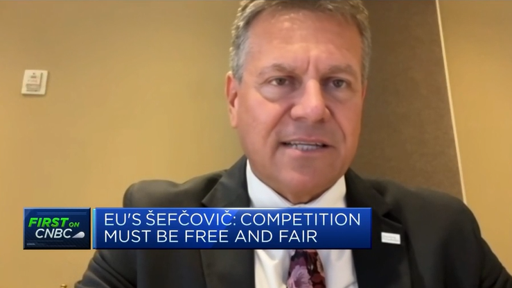

# 欧委会副主席：对中国电动汽车征税还很遥远，反补贴调查须公平得当

【文/观察者网
熊超然】当地时间9月13日，不顾欧洲汽车业界的大量反对声浪，欧盟委员会主席冯德莱恩仍旧宣布，将对中国电动汽车发起反补贴调查，此举随后引起轩然大波，中方对此表示高度关切和强烈不满。一周之后，欧盟一名高级官员再度就此议题发声。

当地时间9月19日，欧盟委员会副主席马罗什·谢夫乔维奇（Maroš
Šefčovič，负责能源事务）在接受美国消费者新闻与商业频道（CNBC）采访时表示，距离欧盟对中国电动汽车征收新关税“还很遥远”。他在解释这一说法时称：“我们距离对中国（电动）汽车征收进口关税还很遥远，我的意思是，这些调查要公平，必须进行得当。”

美国彭博社9月13日曾第一时间就发布评论文章称，欧洲对中国电动汽车的攻击是在“玩火自焚”，伤害了欧洲消费者，也影响了中企在欧洲的投资意愿。法国自认为有本钱强硬，但中方若反击，手中筹码也不会少。欧洲与其挥起调查大棒后担心招致中国反击，还不如专注自身，好好提高电动汽车竞争力。

 _欧盟委员会副主席马罗什·谢夫乔维奇接受CNBC采访 视频截图_

CNBC介绍称，根据欧盟委员会的说法，反补贴调查可能会持续长达13个月事件。具体而言，临时措施必须在不迟于9个月的时间点实施，然后在法律层面有必要的情况下，在4个月内实施最终措施。

谢夫乔维奇说：“与此同时，很明显，我们必须加倍努力，确保我们的汽车工业保持非常强的竞争力。我们一直为欧洲能够制造出最好、最安全、最清洁的汽车而感到自豪。”

CNBC称，今年中国制造的电动汽车在欧洲的销售份额已经上升到8%。欧洲官员们认为，到2025年，这一比例可能达到15%。此外，欧洲官员们指出，中国制造的电动汽车价格比欧盟制造的电动汽车价格低20%左右。

报道称，在2035年禁止销售新的柴油车的最后期限到来之前，欧盟越来越关注电动汽车市场的状况。路透社9月17日曾发文称，欧盟轮值主席国西班牙近期起草的一份报告显示，到2030年欧盟将高度依赖中国生产的锂电池和燃料电池。该报告要求欧盟采取“强有力措施”，减少“过度依赖中国的风险”。

谢夫乔维奇说：“我们与电池行业和汽车制造商有很多合作，我现在正在组织不同的工业圆桌会议，我想在那里与欧洲汽车工业更密切地讨论他们需要什么，我们可以在哪里提供帮助，这样我们就可以真正推出更多的电动汽车模型，不仅在欧洲，而且在全球市场上都很强大。”

就在中国汽车行业崛起，并在欧洲等市场刮起一股旋风之际，当地时间9月13日，欧盟委员会主席冯德莱恩在向欧洲议会发表年度“盟情咨文”时，宣布欧盟委员会将对中国电动汽车启动反补贴调查，声称以此保护自身免受受益于国家补贴的中国电动车生产商的影响。

 _欧盟委员会主席冯德莱恩当地时间9月13日发表欧盟年度“盟情咨文” 图自路透社_

冯德莱恩当天宣称：“全球市场现在充斥着便宜的中国电动汽车，由于国家的‘巨额补贴’，它们的价格被人为地压低了，这正在扭曲我们的市场。”“因此，我今天可以宣布，欧盟委员会将对来自中国的电动汽车展开反补贴调查。”她辩称，“欧洲对竞争持开放态度，而不是为了逐底竞争。”

事实上，在中国新能源汽车加速驶向全球之际，欧盟成员国之间对于是否向中国电动汽车行业发动“贸易战”已经产生了分歧。

根据此前报道，法国向欧盟委员会主席冯德莱恩施压，要求其在年度“盟情咨文”中宣布针对中国电动汽车启动反倾销调查。然而，这一提议遭到了欧洲最大汽车制造国德国以及欧盟行业官员的反对，欧盟多数成员国也表现出担忧，他们质疑此举会作茧自缚，伤及欧洲汽车产业，并害怕招致中国的对等反击。

冯德莱恩9月13日宣布决定后，当地时间9月14日，以德国为代表的欧洲汽车业界再度纷纷预警，提醒欧盟此举只会“玩火自焚”。奔驰、博世等德企也相继发声，称“贸易保护主义”和“关税战”的结果只会是双输。德国汽车工业协会（VDA）也呼吁欧盟谨慎行事，“在正式调查时必须考虑到整体利益以及中国的回应”。德国工商总会（DIHK）则表示，对欧洲来说，面对与解决来自中国的竞争很重要。

此外，德国《经济周刊》报道认为，欧盟此举不利于欧盟消费者，也不利于德国汽车制造商，而“法国在中国没什么可失去的”。德国《时代周报》则直指法国是欧盟此项决定的“发起者”，因为法国车企在中国只占很小的市场份额，若发起“贸易战”，“损失更少，收获更多”。有业内消息人士透露，冯德莱恩是“按照法国命令”行事，“巴黎不仅瞄准来自中国的竞争，还想削弱德国高端品牌”。

_比亚迪等中国车企在慕尼黑车展亮相 图自《纽约时报》_

9月13日，彭博社专栏作家、前英国《金融时报》记者克里斯·布赖恩特（Chris
Bryant）撰文称，长期来看中国电动汽车潜力巨大，但目前在欧洲的销量仍然相当温和，欧盟此时就对中国出手，可能招致反击。文章还指出，冯德莱恩宣称“全球市场充斥着便宜的中国电动汽车”的说法更加站不住脚，至少到目前为止，中国汽车制造商普遍避免在欧洲以非常低的价格销售电动汽车。

文章最后警告称，欧洲与其浪费时间调查中国的“补贴”，不如把重点放在提高竞争力和技术能力上。欧洲应该把中国企业的竞争视为提高自身电动汽车水平的催化剂，而不是（感觉到威胁就拉起不允许人们进入的）吊桥。

9月14日，中国商务部新闻发言人就欧盟领导人宣布即将对我电动汽车发起反补贴调查一事答记者问时表示，中方对此表示高度关切和强烈不满。中方认为，欧盟拟采取的调查措施是以“公平竞争”为名行保护自身产业之实，是赤裸裸的保护主义行为，将严重扰乱和扭曲包括欧盟在内的全球汽车产业链供应链，并将对中欧经贸关系产生负面影响。中欧汽车产业有着广泛的合作空间和共同利益，经过多年发展，早已形成“你中有我，我中有你”的格局。中方将密切关注欧方保护主义倾向和后续行动，坚定维护中国企业的合法权益。

“关于欧盟对中国电动汽车启动反补贴调查，中国商务部已经作出了回应。”9月20日，中国外交部发言人毛宁主持例行记者会时强调，中方一贯反对各种形式的贸易保护主义，欧盟方面拟采取的有关措施不利于全球汽车产业链供应链稳定，不符合任何一方利益。欧盟方面应当认真倾听业界的呼声，为各国企业提供公平非歧视、可预期的市场环境。

**本文系观察者网独家稿件，未经授权，不得转载。**

