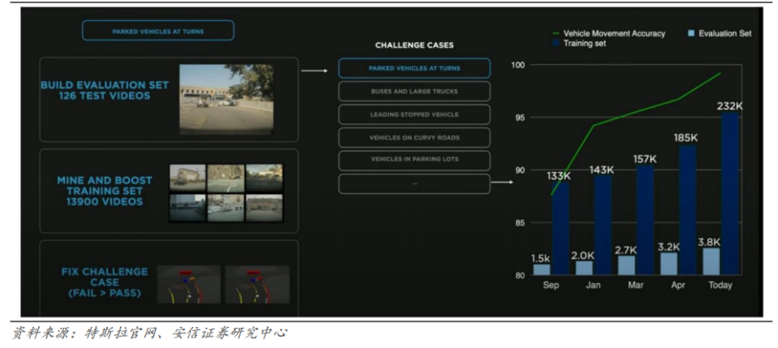
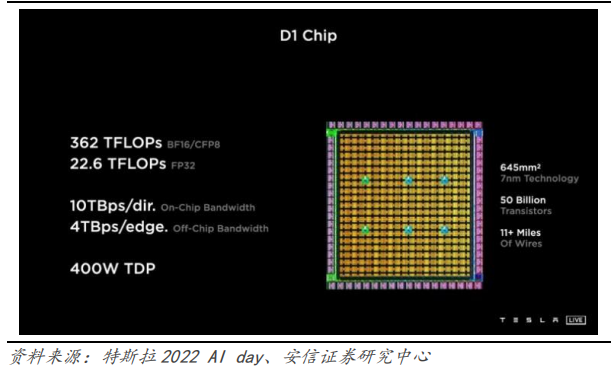
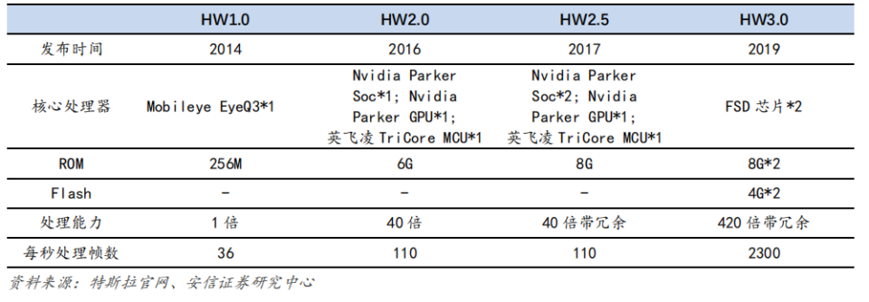
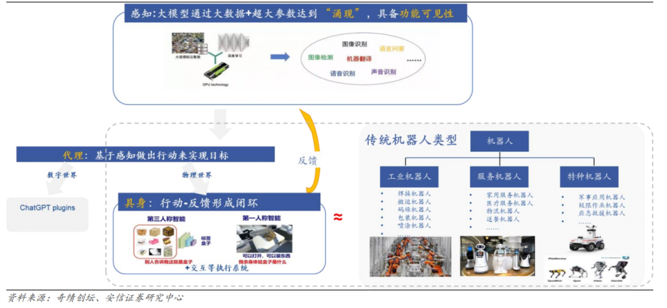
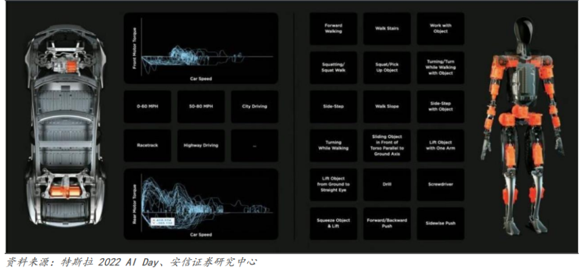

# 特斯拉全力以赴攻克算力“卡脖子”，超算突破路径适合中国企业学习

作者/安信元宇宙研究院院长、腾讯科技《AI未来指北》专栏作者 焦娟

编辑/腾讯科技 郭晓静

9月11日，一份摩根士丹利的研报引爆市场，研报认为特斯拉Dojo超级计算机将为特斯拉带来高达 5000 亿美元（约合人民币 3.6 万亿元）的市值增幅。

根据研报，Dojo为特斯拉带来的市值增幅主要来源于两个方面：首先是直接成本的降低，Dojo可以为特斯拉节省包括算力成本在内的高达65亿美元的成本。另外就是潜在增量和想象力，Dojo将加速特斯拉自动驾驶技术以及人形机器人的研发，这将为其在10万亿美元的潜在市场中，占据极高的份额。

Dojo在2021年8月的特斯拉AI
Day上首次亮相，它的意义主要是处理大量视频数据，以支撑特斯拉的自动驾驶业务以及自动驾驶系统（FSD)的升级迭代。今年七月，马斯克在特斯拉财报会议上宣布Dojo已经开始落地投产，用于训练自动驾驶AI大模型，同时也在考虑向其它汽车厂商授权其FSD硬件和软件，并计划到明年，在Dojo上投入超过10亿美元。

如今，Dojo的意义已经不仅仅在为自有的自动驾驶训练提供算力支持，更有以下几层意义：

①Dojo的背后，特斯拉正在实现的端到端突破、“决策”层面的突破。

②特斯拉之前拥有基于英伟达GPU的大型超级计算机，该超级计算机是世界上性能最强的超级计算机集群之一，Dojo的投产有助于减少特斯拉对英伟达的依赖。

③除了自动驾驶，Dojo还可以为人形机器人Optimus提供算力支持，拓展应用边界至机器人领域。

④Dojo让特斯来从“汽车公司”还是“科技公司”的争议中彻底走出，充分证明自己是一家科技公司。

**一、Dojo对特斯拉来说的意义是什么？**

在2022年的AI Day上，特斯拉Dojo团队的重要成员这样说：“从本质上来讲， **特斯拉是一家硬核科技公司，超算是我们想做的**
，我们有那么多数据需要进行相应的训练就需要有非常强的算力，算力是非常重要的，可以说算力是训练的根本，如果没有算力，那训练就是非常难执行的，或者训练效率非常低。”

**特斯拉自动驾驶自研方案经历了四次重要迭代，当前形成了“BEV+Transformer+时空序列+占用网络”的核心架构。**
特斯拉自动驾驶方案早期由供应商 Mobileye 提供，2016 年双方终止
合作后，特斯拉经历了与英伟达短暂合作后，转向全栈自研，从技术落后到引领行业发展， 特斯拉的技术方案主要经历了以下四次关键的技术迭代升级：

1、2018 年构建了多任务学习神经网络架构 HydraNet，相较于此前单一目标检测遵循一个通用的网络结构，HydraNet
能够完成多头共用的任务，减少重复计算；

2、2020 年特斯拉团队对底层代码进行重写及网络重构，引入了 Transformer 的架构，将 2D图像复原至 3D
视角，使得自动驾驶方案环境感知的能力有了质的飞跃，BEV+Transformer的架构解决了行车过程中大多数共通的场景，但驾驶的安全性仍受到很多长尾场景的挑战；

3、2021 年至今特斯拉 BEV+Transformer 架构输出的 3D 空间基础上使用视频信息作为训练模型的数据集，引入了时序信息，使 3D
空间转化为 4D 空间，这样能够很好的解决物体、行人被遮挡的场景；

4、2022 年 AI Day
上特斯拉引入了占用网络，环境中的物体无法用模型穷举实现识别，占用网络通过将空间分割为体积不等的体素，预测其是否被占用，从而解决通用障碍物的识别问题。

在这四次关键的自我迭代中，特斯拉收集了大量的数据，数据源包括车辆采集数据、仿真数据、影子模式三种，其中：自车辆采集数据是特斯拉自有车队及量产出售给用户的车辆上的摄像头实时采集的数据，是特斯
拉训练模型的主要数据来源；仿真模拟数据是为了补充通过车端摄像头所无法采集到的长
尾数据，以尽可能补全模型训练时所可能遇到的场景；影子模式，指特斯拉的自动驾驶模
型部署到车端后在后台运行，其执行输出与驾驶员操作时的不一致数据，这部分数据作为很珍贵的异常数据用于为模型纠偏，帮助模型训练结果更加类人。

最终，特斯拉获取了大量、便宜、质量高且具备多样性，构成了其最核心竞争的竞争壁垒。 **根据特斯拉 2022 AI Day
上披露数据，特斯拉将这些有价值数据按照场景种类进行存储，训练数据集达到 23.2 万帧，验证数据集达到 0.38 万帧。**

 _特斯拉数据仓库中包含大量、多元数据_

处理如此庞大的数据，强大且可控的算力支撑十分重要。 **在自动驾驶方案中涉及云端与车端算力， 其中云端算力主要用于训练大模型，**
包括感知、决策规划及控制算法模块，同时还需要训练离线大模型作为标注数据的工具以及进行仿真模拟训练，在训练模型时因为需要不断调整参数，
**导致算力的需求非常大，而且对于并行算力的要求会较高；车端模型是对已经在云端完成训练的模型进行部署，**
模型参数已经固定，仅对摄像头等传感器采集的数据进行运算即可， **对算力的消耗相对较小。**

在特斯拉的硬件迭代上，在 HW1.0 时代，特斯拉采用了来自Mobileye 的 EyeQ 系列芯片。进入 HW2.0 时代，特斯拉找到了英伟达作为
Mobileye 的替代， 采用定制版的英伟达 Drive PX2 自动驾驶计算平台（由 1 颗 Tegra Parker 芯片和 1 颗 Pascal
架构 GPU 芯片构成）。后来又升级为 HW2.5，增加了一颗 Tegra Parker 芯片。 **但无论是
Mobileye还是英伟达，都无法满足特斯拉对于性能、研发进度、成本、功率方面的要求。**
而且随着硬件量产出货所推动的算力需求增长，芯片供应链安全对于特斯拉的重要性愈发凸显， **2016 年前 AMD 首席架构师 Jim Keller
加入特斯拉，任职 Autopilot 硬件工程师总裁，特斯拉开始走上芯片自研之路。**

特斯拉在 2021 年发布 D1 芯片及 Dojo 超级计算机，具体的参数规格如下：

1）D1 芯片：制程工艺是 7nm，由台积电代 工， 设计参数为 645 平方毫米面积、500 亿个晶体管、11 英里的内部走线、400W TDP
（Thermal Design Power 热设计功耗，指正常工作环境的负载功耗），单颗芯片有 354 个节 点，实现了超强算力和超高带宽；

_特斯拉D1芯片参数_

2）Dojo POD 云端机柜：每个 Dojo 都集成了 120 个训练模块，单个训练模块包含 25 个 D1 芯片内置 3000 个 D1 芯片，拥有超过
100 万个训练节点，算力达到 1.1EFLOP，相邻芯片之间延迟较低，配合特斯拉自创高宽带、低延迟的连接器，是世界上首屈一指的超级计算机。

 _特斯拉云端机柜Dojo POD_

整体来看， **特斯拉的芯片虽然距离英伟达仍有一定差距，但得益于自身业务体系对AI 需求经验，其产品在 AI 训练应用上仍极具竞争力。**

**目前特斯拉使用的是基于英伟达芯片的超算集群，相当于 14000 块 A100 的算力。根据特斯拉首席工程师 TimZaman
对外表示，他们的计算集群仅有 0.3%的空闲时间，其中 84%的时间都在处理高优先级的任务，因此急需更多计算资源。**

2023 年 7 月特斯拉 Dojo 正式投产，到2024年2月，特斯拉算力规模将进入全球前五， **10月总规模将达到100 Exa-Flops
，相当于30万块英伟达A100显卡的算力总和。** （Tesla AI
Day）不过，摩根士丹利指出，目前有关Dojo的数据均来源与特斯拉自身的宣传资料，因此实际情况仍然有待验证。

_特斯拉Dojo投产计划_

在车端，以 HW3.0 提供 144TOPs 为主，预计未来将进一步提高算力。特斯拉硬件体系至今迭代四版至HW4.0，从 2019 年发布的 HW 3.0
使用的是特斯拉自研的 FSD 车端芯片，2019 年上线的第一 代 FSD 芯片由三星代工，制程为 14nm， **2023 年已经升级为 7nm
芯片。算力方面，单颗芯片 72TOPs，2 颗芯片算力共 144TOPS。**

_特斯拉历代 FSD 硬件版本_

对比国内自动驾驶车企的算力芯片，目前较为主流的是 NVIDIA Orin 芯片，其单芯片算力已经达到
250TOPS，而且如果未来决策规划模型化，可能占用更多的算力，因此硬件版本升级可能会给到更多的算力，来保证一定的硬件性能冗余以支持后续模型能力的迭代升级。

总结来说，基于特斯拉自动驾驶的迭代，围绕基于视觉的主路径，特斯拉Dojo也在不断迭代。在V12版本的感知层面，从数据采集端到车端，全部集合为一个大模型进行训练，Dojo的背后，特斯拉在实现端到端的突破。但是目前，
**Dojo还没有到最强大的状态，当自动驾驶的决策层也开始用大模型进行训练，这样会用到更大的算力，到那个时候，Dojo的能力会得到下一个跃升。**

二、基于特斯拉自动驾驶FSD和Dojo支撑，特斯拉人形机器人成为最具想象力的智能硬件

与现有机器人不同， **特斯拉人形机器人以自动驾驶 FSD 为支撑，实时获得环境信息并进行决策规划，最终输出行动指令，形成了“感知-决策规划-
运动控制”的实时交互反馈机制。** 为了增强机器人的普适性， 将其设置为人形，是因为现实物理世界是基于人的视角、交互习惯所设置的，采用人形能够
第一视角理解环境场景。

_具身智能之机器智能与物理世界交互反馈_

从 2021 年 8 月特斯拉在其首届 AIDay 上首次公开展示人形机器人的概念机 TeslaBot 至今，其研发迭代速度非常快：

✓ 2021 年 8 月，首届 AIDay 公开展示人形机器人概念机 TeslaBot；

✓ 2022 年 2 月，推出人形机器人原型机，并作为开发平台进行深度研发；

✓ 2022 年 8 月，第二届 AIDay，展示实体版本人形机器人，可以直立行走、浇花、搬运东西等，但灵活度相对较低，上下舞台时需要一定的人员协助；

✓ 2023 年 5 月，特斯拉 2023 年投资者大会发布人形机器人最新研发进展，其已经学会了缓慢前行。

_特斯拉人形机器人关键时间点_

人形机器人与智能汽车本质上都是具备实时感知能力的智能交互硬件，可以直接复用自动驾驶模型及数据体系。自动驾驶为人形机器人搭好了“场”，人形机器人可以复用的部分包括：1、感知模块的
4D 重建、占用网络；2、数据及自动标注工具；3、仿真模拟环境； 4、共享强大的云端算力设施及芯片能力。

_人形机器人与自动驾驶动力系统比对_

**在以上可复用的部分，只需要针对人形机器人场景采集相应的数据训练即可，不存在技术性的难度，难度在于工作量的积累。**
两款产品的不同是因为所处的场景及面对的任务不同导致规控体系差异，特别是机器人高达 200
多个自由度导致其规控更加复杂，但是自动驾驶所积累的工作是地基，0-1 的工作很难，而扎实的基础将使 1-10 的工作加速迭代。根据 2023
年股东大会上马斯克透露信息， **特斯拉已经打通了FSD 和机器人的底层模块，实现了一定程度的算法复用。**

_特斯拉人形机器与自动驾驶方案关系_

自动驾驶汽车出货量增长使得当前特斯拉超算中心达到了较高的占用，
**而人形机器人的感知、规控模型均比自动驾驶更复杂，可能在训练期间消耗更多的算力，因此对特斯拉目前的超算中心的算力提出了更多要求。Dojo
的推进进度，也将对人形机器人的进度造成比较大的影响。**

_2023-2030 年人形机器人落地节奏及市场规模预测_

**三、 海外公司中，只有特斯拉，真正适合中国企业当下去学习**

关注特斯拉Dojo，还有一个算力、算法、数据的国内外对比的视角：

海外的算力相对国内充足得多，格局虽然清晰但仍将上演“超越与被超越”的传奇故事，NVIDIA也不会是永远的霸主；国内的算力由于众所周知的原因，则相对是最大的短板；海外的算法先进，且历来格局清晰；国内的算法有一定的根基，格局也相对明朗，集中在龙头及个别创业公司；海外的数据结构化程度高；国内的数据结构化仍存在发展机遇。

特斯拉在上述算力、算法、数据三维度的框定下，在海外众多公司中，相对特殊：

1）最有优势的反而是结构化数据——自动驾驶引领全球，所采集、结构化处理的数据自成一派，且优势愈发凸显；

2）特斯拉在算法上并无惊艳之处，贵在持久坚持去做正确的事；

3）算力相对算弱势，曾一度夹缝中（卡脖子中）持续优化，自研芯片已突破且逐步释放，Dojo的背后，关乎特斯拉算力的持续释放，但更重要的与自动驾驶的V12版本、端到端的越阶有关——端到端的越阶成功后，特斯拉将全力聚焦于“决策”层面的模型突破，也意味着“数据采集”层面已阶段性“登顶突破”，“决策”层面再突破后，自动驾驶将正式走向成功。

算力、算法、数据的国内外对比的视角，引申出来3个关键结论：

1）Dojo的背后，特斯拉正在实现的端到端突破、“决策”层面的突破；

2）自动驾驶的FSD算法，平移到人形机器人的AI算法中，再优化改善（主要在应用层，基础层可以共用比例较高），可加速人形机器人的产业化进程，人形机器人进入家庭c端后，又会强化特斯拉的数据优势；

3） **特斯拉的“闯关”经验，非常契合中国企业的学习跟进——数据结构化的优势先确立、算法上瞄准正确方向再精进、算力上全力以赴攻克“卡脖子”：**

数据及标注体系上，特斯拉领先之关键，已建立强大自迭代体系——特斯拉自动驾驶方案的数据源包括车辆采集数据、仿真数据、影子模式三种。数据标注已从2D走向4D标注，标注效率大幅提升——在4D向量空间中可以对建模后的场景进行拖拽、旋转等数字化的操作，为自动标注打好了基础。数据结构化是国内的机遇之所在，特斯拉的经验值得对齐。

**目前国内车企的自动驾驶方案，正陆续对齐特斯拉的方案，特斯拉在并不惊艳的算法上，长期、持续坚持优化迭代下去。**

算力之于特斯拉，过去、当下、未来均需持续突破：先自研（值得国内借鉴）、再提升契合“决策端”模型训练的需求（Dojo当下正在被关注的根源之所在）、再持续高要求以契合人形机器人这一难度系数提升的产业化进程的需求。

