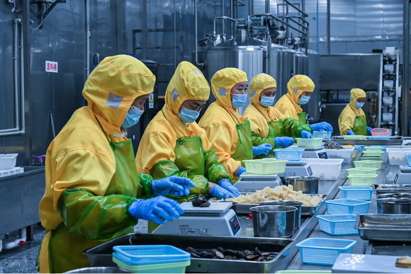
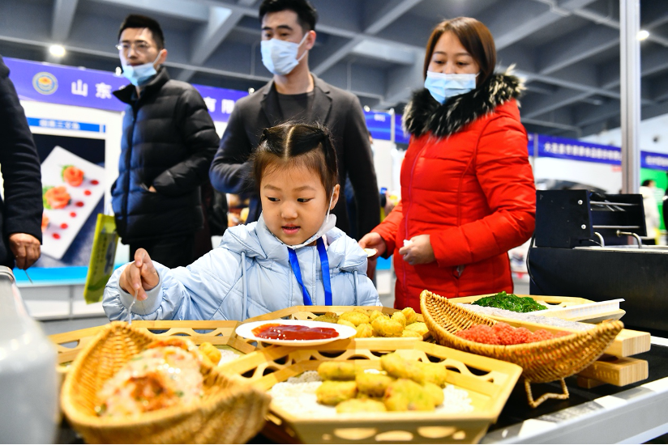
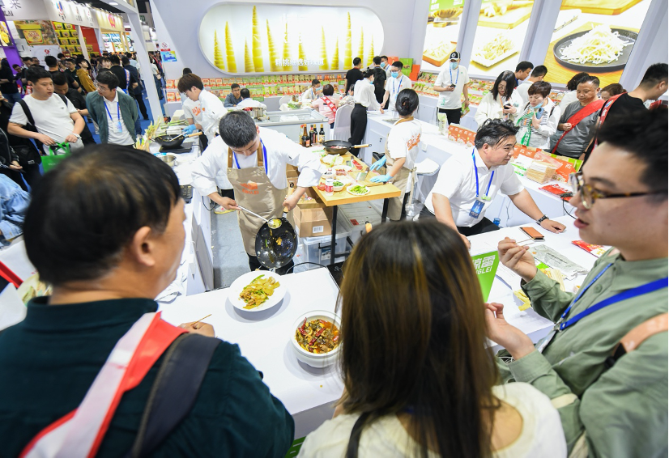

# 知情权不能被“预制”

这几天，有关“预制菜”的话题持续火爆。

起因是国内个别学校食堂，准备引进或正在引进预制菜。由于和关注度比较高的学校食堂连在一起，预制菜受到了口味如何、是否安全、营养怎么样的拷问，网上个别家长甚至发出准备辞职，专门给孩子送饭的言论。

作为今年中央一号文件提出培育发展的预制菜，既有相关协会的行业标准，又有主管部门的监督管理，在安全和营养方面是可靠的。但为什么一说“进校园”，就成了全民关注的热点？是谁把预制菜推上了热搜榜？预制菜的正确打开方式，应该是什么？

这些年来，预制菜一直处在发展的快车道。

数据显示，2022年，我国预制菜市场规模达到4196亿元，预计今年将达5100亿元，到2026年将突破1万亿元规模。目前，国内从事预制菜的相关企业超过6万家。

预制菜是工业化时代的产物，具有统一采购、批量生产、标准管理、成本可控等优势，兼顾了效率、口感、安全和营养等多方面需求。

在快节奏的今天，其因上菜速度快、等餐时间短等特点，赢得不少餐厅的青睐。对忙碌的年轻人来说，下班之后冲到超市，买几样预制菜赶回家，简单烹饪就能上桌，该是何等的方便快捷！

_8月24日，在福建省福清市元洪国际食品产业园，工人在水产品预制菜加工生产线作业。新华社记者 周义 摄_

对于预制菜产业，国家也是积极支持的。今年的中央一号文件明确提出“培育发展预制菜产业”，不少地方也相继出台相关标准，促进预制菜规范发展。

预制菜是厨房的工序简化和效率升级的发展方向，也是消费者在家吃饭的更优解决方案。所以，预制菜本身不是问题，推动相关产业发展，全社会都应该支持。

预制菜不是问题，为啥“预制菜”+“校园食堂”就成了热议的问题？

原因固然复杂，但有一点是明确的，即社会公众对预制菜的了解还比较粗浅，由此对进校园产生安全担忧。

按2022年中国烹饪协会发布的预制菜团体标准，预制菜分为即食/即热预制菜、即烹预制菜、预制净菜等三个大类。

_2月24日，2023中国（日照）海洋食品预制菜发展大会在山东日照举行。图为市民在品尝预制菜。新华社记者 郭绪雷 摄_

按这个标准，我们熟知的罐头八宝粥、罐头午餐肉等，属即食类；我们常买的速冻水饺、自热米饭等，属即热类；加了佐料拌好的牛排、鸡肉等半成品，属即烹类；洗净切段、用保鲜膜包装好运输销售的蔬菜，则是预制净菜。

为了称呼方便，有人把预制净菜称为即配类。这样，从四个“即”上来说，预制菜也可说分为即食、即热、即烹、即配四个大类。

显然，大家担心预制菜不安全，担心调味料、防腐剂等过量添加，主要是针对即食、即热、即烹三类。对于即配这一类，主要是是否存在营养流失、新不新鲜等问题。

所以，在口味方面，预制菜可能和现制菜的确会有一定差别，但只要按标准严格执行，营养和安全是有保障的。一谈到预制菜就担心安全、营养，把预制菜笼统地与不健康、不营养画等号，就有点简单粗暴，自己吓唬自己了。

孩子是祖国的未来，学校食堂受到社会高度关注。一些学校教师和学生长期分开就餐，加重了家长对预制菜进校园的疑虑。

许多网友留言，有的学校是孩子吃盒饭、教师吃食堂，预制菜进校园后，会不会也是只给孩子吃，不给教师吃？

还有一些网友说，既然预制菜没有问题，为什么只进学校食堂，不进政府机关食堂？

此外，不时发生的校园食堂食品安全事件，也屡屡刺激着家长们的神经，加重了人们对校园食堂安全的担忧。

这些问题，不是家长们的杞人忧天。在预制菜进校园之前，必须作出回答，打消家长们的疑虑。

_4月12日，在四川省成都市中国西部国际博览城，客商在品尝预制菜产品。新华社记者 王曦 摄_

公开是疑虑最好的解药。对学校来说，引进预制菜，不管是前期的意见征询，还是后期的准备工作、实施情况，都要和家长及时沟通。只有工作做足了，才会得到家长的理解和支持。无视家长的知情权、监督权，遮遮掩掩，只会让误解滋生，让不信任和非议蔓延。

其实，教育部、国家市场监督管理总局、国家卫生健康委员会等早在2019年就出台了《学校食品安全与营养健康管理规定》，要求学校应当建立集中用餐信息公开制度，利用公共信息平台等方式及时向师生家长公开食品进货来源、供餐单位等信息，组织师生家长代表参与食品安全与营养健康的管理和监督。

显然，掌握孩子在学校的用餐相关情况，监督学校食堂的有关做法，是家长的权利。让家长了解相关情况，让家长参与监督，是学校的义务，是必选项，不是可选项。

预制菜没有错，预制菜进校园也不是不可以，但这些都要建立在家长和学生的知情同意之上，不能把家长和孩子的知情权也给“预制”了。（记者：段续、李双溪）

（题图漫画：潘红宇）

