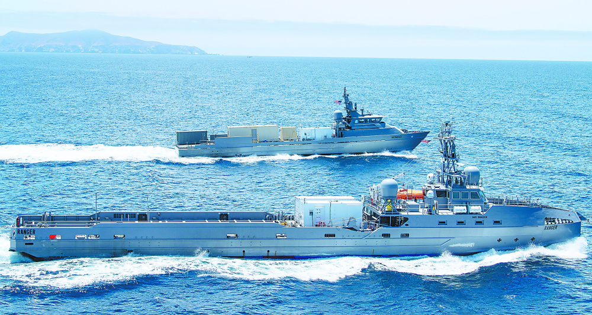
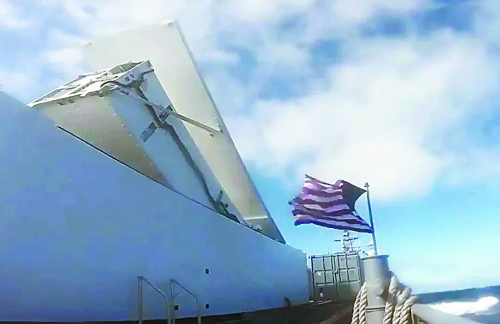

# 美“幽灵舰队”罕见现身日本，专门为中国量身打造？

【环球时报特约记者
晨阳】低成本无人舰艇已被列为美国海军未来舰队计划的核心之一，为此五角大楼正通过所谓“幽灵舰队霸主”计划加紧展开无人舰艇自主行动的测试。据美国《海军新闻》网站18日报道，美国海军两艘高度保密的无人舰艇——“水手”号和“游骑兵”号出现在驻日美军第七舰队所在的横须贺基地。有分析称，这是“幽灵舰队”非常罕见地进驻东亚海域，它们可能是为准备与中国的冲突而适应环境。

**参加演习的频次越来越高**

报道称，社交媒体上流传的视频显示，两艘无人舰艇在没有人工干预的情况下在横须贺基地靠港。据介绍，由于全部由大型有人驾驶舰艇组成的舰队的成本急速上升，再加上担心在“可能的大国冲突”中，美国海军容易遭到对手“区域拒止/反介入”战略的打击，因此美国海军规划未来将由77艘到140艘大中型无人舰艇作为现役有人舰艇的补充。从2018年开始，美国海军在“幽灵舰队霸主”计划的名义下，将多艘商业快速补给船改装成无人水面舰艇，包括“游骑兵”号、“游牧民”号、“先锋”号和“水手”号等。这些无人舰艇可搭载多个集装箱，其中安装有航行和执行任务相关的核心设备与传感器。该项目由五角大楼战略能力办公室与美国海军合作执行。

印度《欧亚时报》称，尽管美国在日本有许多军事基地，驻扎在横须贺的“里根”号还是美国唯一前沿部署的航母，但美军无人舰艇在该地区的出现并不常见。此前，美军这些无人舰艇主要在本土和夏威夷海域进行测试。美国海军太平洋舰队于今年5月举行了第二次多域无人能力演习，即所谓的“无人系统一体化战斗问题”演习。这场演习旨在测试和开展“舰队中心”概念和能力。随后，美国海军的四艘无人水面舰艇——“水手”号、“游骑兵”号、“海上猎人”号和“海鹰”号于8月现身夏威夷珍珠港。相比于中途改造的前两艘无人舰艇，“海上猎人”和“海鹰”号是美国海军专门研制的无人作战平台，能够连续航行数周，在大洋上追踪对手潜艇。报道称，“这些无人艇越来越多地参与军事演习，表明了它们在未来作战中的效用和战略重要性”。

_“游骑兵”号、“游牧民”号无人船_

**可执行的使命日益丰富**

《欧亚时报》强调说，美军现有航母等大型水面舰艇造价高昂，如果被击沉将给美国带来财政等方面的沉重压力。相比有人的航母或护卫舰艇，无人舰艇成本更低且更容易操作。无人化的“幽灵舰队”是美国海军分布式海上作战等作战理念的组成部分，这些廉价无人舰艇不但可以大幅降低建造成本，而且还能避免执行高风险任务时的人员损失。

从2018年开始，美国海军的这些无人舰艇接受了广泛测试。2019年，美国海军成立水面开发第一中队，负责提出新的战术、作战能力和作战概念，包括如何运用这些无人水面舰艇。除了最基本的无人航行、自动避障等功能外，它们的潜在用途还包括执行电子战任务、收集情报、反潜和扫雷作战等。2022年9月，五角大楼公布了一段“幽灵舰队霸主”计划的无人舰艇发射“标准-6”远程防空导弹的视频。后者的最大射程超过240公里，可以拦截多种空中与海上目标，包括巡航导弹、固定翼飞机和直升机，甚至有潜力拦截高超音速导弹。美国海军学会网站称，这些无人舰艇可以安装MK70集装箱式导弹发射系统，从而快速地获得导弹发射能力。同时，它们还配备了洛克希德·马丁公司开发的“宙斯盾”作战系统，可与舰队中的其他“宙斯盾”战舰连接，以获得必要的目标作战数据。美国海军设想，未来将“标准-6”导弹装载在无人舰艇的储存发射一体装置中，充当海上分布式武器平台，并分散在相距很远的距离上。在“环太平洋2022”多国联合演习中，美国海军演练了有人和无人平台联合发射导弹打击水面舰艇的课目。

_可在集装箱中携带“标准-6”导弹_

美国海军官员去年还透露，计划在2023年进行海上加油测试，以评估无人参与情况下的补给能力。随着无人舰艇技术的日益成熟，美国海军无人驾驶和小型战斗舰艇项目负责人凯西·莫顿少将表示，现在美军可以出动两艘无人舰艇执行联合行动，而不再需要动用昂贵的驱逐舰来执行这类任务。

**专门为中国量身打造？**

《欧亚时报》称，军事观察人士认为，美军这些神秘的无人舰艇抵达日本非常罕见，因为它们主要用于提升美军在海上对抗中国等对手的能力。报道称，中国发展的“区域拒止/反介入”战略迫使美国海军远离中国海岸线，而旨在分散部署、通过网络化指挥实现联合打击的分布式海上作战等新概念本身就是美国海军为在西太平洋与中国作战而提出的，廉价和使用方便的无人舰艇更有利于美军的新战略。随着未来这些无人舰艇的大量服役，它们不但可解决美军舰艇数量相对不足的问题，还能执行反潜、濒海作战支援以及有限的对地攻击、反舰和防空等常规使命，从而让美军昂贵的驱逐舰、护卫舰等腾出手来执行更大、更复杂的任务。

报道还提到，除了协助美国海军外，无人舰艇有望在美国其他军种的新作战概念中发挥作用，例如美国海军陆战队的“远征前进基地作战”概念。报道称，日本和菲律宾等国岛屿密布，小型、敏捷、难以探测的美国海军陆战队特遣分队战时将负责在东海和南海的这些岛屿上对中国海军进行反舰火力攻击，因此美国无人水面舰艇抵达日本后将受到密切关注。

虽然无人舰艇具备建造和维护成本低等优点，但美国国内对是否需要大规模建造无人舰艇的争议很多。有分析人士认为，美国海军的“幽灵舰队霸主”计划面临诸多技术和指挥方面的难题。例如目前“游骑兵”号等无人舰艇最大航程约4400海里，仍远远无法满足长期海上部署的要求。一旦它在海上发生故障，在维修人员赶到之前，将难以自行恢复功能。虽然美国海军一再强调，无人舰艇主要以自主操控为主，但如果面对威胁，仍需要人工远程下达指令。但如果通信系统遭受攻击或联络中断，美海军将失去对“幽灵舰队”的控制。

