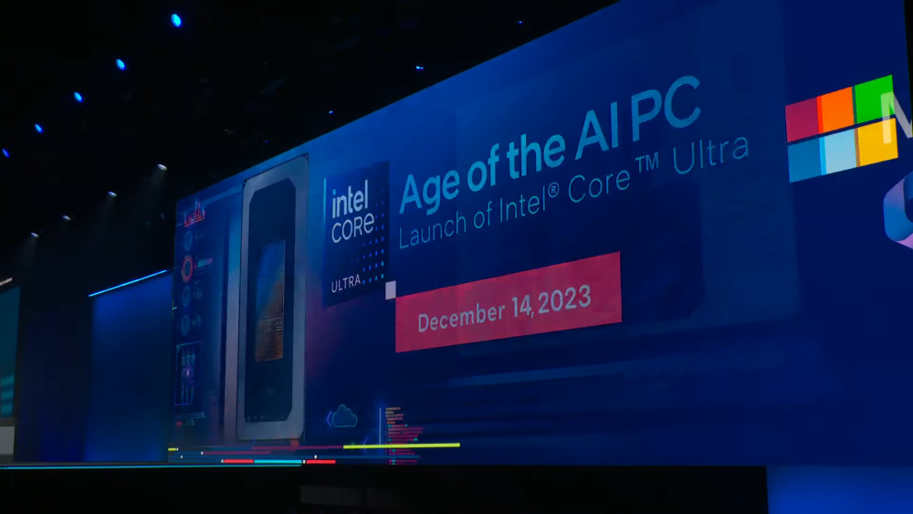
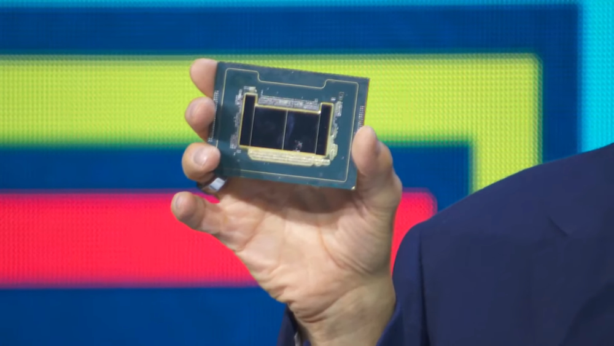
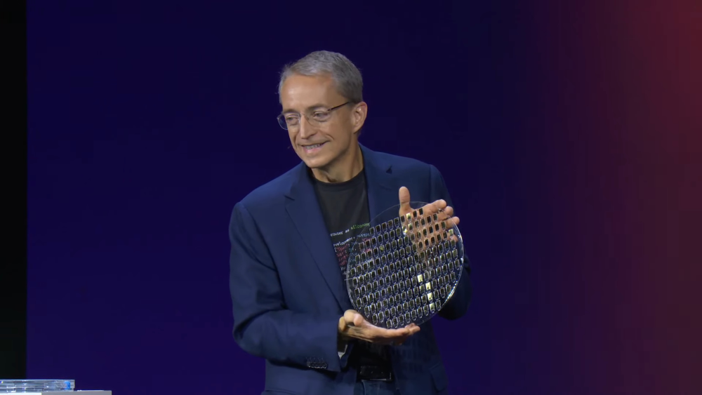

# 英特尔晒AI“全家桶”，目标2025年成芯片代工“世界第二”

文 / 腾讯科技 苏扬

英特尔也要为AI时代写下自己的注脚。

北京时间9月20日，英特尔举办“ON技术创新峰会”，定位为AI
PC的酷睿Ultra处理器、AI计算芯片Gaudi2和Gaudi3、第五代至强处理器、先进制程工艺以及先进封装技术进展逐一公开亮相。

开场的演讲中，英尔特CEO帕特·基辛格介绍了半导体产业和科技经济的规模，并强调了算力在其中扮演的价值。

_帕特·基辛格演讲中提出“硅经济”的概念_

根据英特尔公布的数据，半导体产业市场规模达到5740亿美元，而基于芯片的全球科技经济规模则达到了8万亿美元，由此也提出了“硅经济”的概念。

帕特·基辛格认为，AI代表着新时代的到来，创造了巨大的机会，更充足、更强大、更具性价比的处理能力，是未来经济增长的关键组成。“未来5年联网设备数量将增加4倍，未来10年将提升至15倍。”

**酷睿Ultra 12月14日上市**

今年6月份，英特尔对外公布品牌升级策略，“酷睿Ultra”定位为旗舰级，从高到低分为酷睿Ultra 9、酷睿Ultra 7、酷睿Ultra
5三个子系列，而传统的“酷睿”则定位主流级，从高到低分别是酷睿7、酷睿5、酷睿3。

 _英特尔宣布酷睿Ultra处理器12月14日上市_

“英特尔ON技术创新峰会”上，代号Meteor Lake的酷睿Ultra处理器正式揭开面纱，采用Intel 4工艺和3D
Foveros封装技术，集成英特尔锐炫显卡，12月14日上市，宏碁Swift笔记本首发这款全新的处理器，并且配有基于OpenVINO工具包开发的宏碁AI软件库。

官方在峰会上未公布酷睿Ultra处理器的详细信息，根据此前的资料，这款处理器将同时采用Intel
4工艺和台积电5nm工艺打造，使用第二代混合架构技术，P核心会采用全新Redwood Cove架构，E核为Crestmont架构。

另外，以酷睿Ultra 7
155H处理器为例，根据跑分曝光的信息，其拥有6颗性能核心和10颗能效核，共16核22线程，基础频率为3.8GHz，最高睿频为4.8GHz，还有着4MB的二级缓存和24MB的三级缓存。

英特尔还现场演示了利用基于Luna Lake处理器的AI
PC演示生成式AI的处理能力，在本地离线的情况下，在几秒内即通过文本生成“AI泰勒·斯威夫特”的歌曲。

据悉，Luna Lake将于2024年发布，首发英特尔的18A工艺，与酷睿Ultra处理器采用相同的3D Foveros封装技术。

另官方透露，第五代英特尔至强处理器将于12月14日发布。

_英特尔展示288核心的Sierra Forest芯片_

具备更高能效的能效核（E-core）处理器Sierra
Forest将于2024年上半年上市。与第四代至强相比，拥有288核的高能效处理器预计将使机架密度提升2.5倍，每瓦性能提高2.4倍。

具备高性能的性能核（P-core）处理器 Granite Rapids，将在Sierra
Forest之后发布，与第四代至强相比，其AI性能预计将提高2到3倍。

英特尔还介绍称，代号为 Clearwater Forest 的下一代至强能效核处理器将基于 Intel 18A 制程节点制造。

**Gaudi2牵手Stability AI**

今年5月份，英特尔基于7nm工艺的Gaudi2 AI计算芯片，并在随后的7月份面向中国市场推出，英特尔旗下Habana Labs首席运营官Eitan
Medina在发布会上介绍，基于MLPerf基准测试结果，Gaudi2是为数不多能替代英伟达H100进行大模型训练的方案。

_基于英特尔Gaudi2 AI计算芯片打造超级计算机_

峰会上，帕特·基辛格也透露这款处理器的应用进展。据了解，Stability AI基于英特尔至强处理器和4000个英特尔Gaudi2
AI计算芯片，打造了一台大型AI超算，性能排名可进入全球TOP15。

Gaudi2拥有24个可编程Tensor处理器核心（TPCs），96GB HBM2e 内存和 24 个 100GbE
端口，官方公布的数据显示，其在RestNet50 Training Throughput和BERT Tralning
Throughput等视频及自然语言处理的模型测试中，性能都达到了NVIDIA A100的2倍左右。

_帕特·基辛格介绍英特尔AI路线图_

除了回顾Gaudi2的进展，帕特·基辛格表示，下一代AI计算产品Gaudi3将基于更先进的5nm工艺，相比着一代产品，Gaudi3的BF16性能将提升4倍、计算性能提升2倍，网络带宽提升1.5倍，HBM容量提升1.5倍。

**2025年，芯片制造“全球第二”**

2022年，美国推出《芯片法案》，大力推动先进工艺芯片制造回流，在此之前，英特尔就已经提前展开部署。

2021年，英特尔公布了IDM
2.0战略，推动晶圆代工业务，提出4年量产5个制程节点的目标，并预期2025年成为全球第二大晶圆代工厂，帕特·基辛格也回顾了代工业务的进展，相关目标也在逐一落地。

到目前为止，Intel 7已实现大规模量产，基于Intel 4制程的酷睿Ultra即将上市，Intel 3也正按计划推进中，而埃米级工艺节点Intel
20A和Intel 18A分别于2024年上半年和下半年量产。

官方表示，Intel 20A将是首个应用PowerVia背面供电技术和新型全环绕栅极晶体管RibbonFET的制程节点。

 _基辛格展示18A工艺晶圆_

今年3月，英特尔就对外表示，Intel 20A和Intel 18A已成功流片，即规格、材料、性能目标等均已基本达成。

此外，英特尔的代工服务已经有43家潜在合作伙伴正测试芯片，其中至少7家来自全球TOP10的芯片客户，其中包括ARM、爱立信等。

先进封装工艺方面，除了支持不同工艺、结构共存的Foveros 3D封装技术外，英特尔也公布了半导体玻璃基板封装材料技术的开发进展。

官方表示，与目前业界主流的有机基板相比，玻璃具有独特的性能，在平坦度、热稳定性和机械稳定性当面都有更好的表现。这也使得芯片架构师将能够在一个封装里封装更多的Chiplet，同时实现性能、密度、灵活性提升，以及成本和功耗的降低。

_基辛格展示英特尔的玻璃基板_

英特尔称，其玻璃基板技术能够将单个封装中的芯片区域增加50%，从而可以塞进更多的Chiplet。

据了解，玻璃基板也可以与传统的有机基板一起使用，以提高结构完整性。

