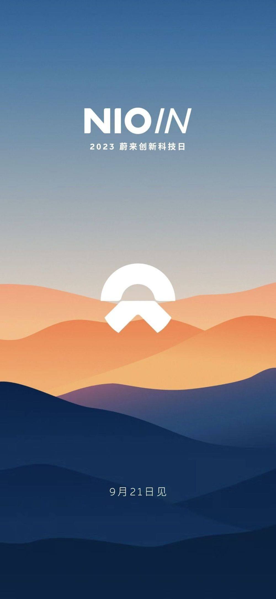

# 蔚来首款智能手机将于9月21日发布

新京报贝壳财经讯（记者张冰）9月20日，贝壳财经记者从多个独立信源处获悉，蔚来首款手机将于明日上午发布。

9月21日，蔚来将举行科技创新日，将首次介绍全栈技术布局，并发布全新移动互联产品。

今年8月，在2023年第二季度业绩电话会议上，蔚来创始人、董事长、CEO李斌曾透露，手机的推出将有利于增加车的竞争力，计划9月下旬交付手机产品。

编辑 宋钰婷

校对 柳宝庆

