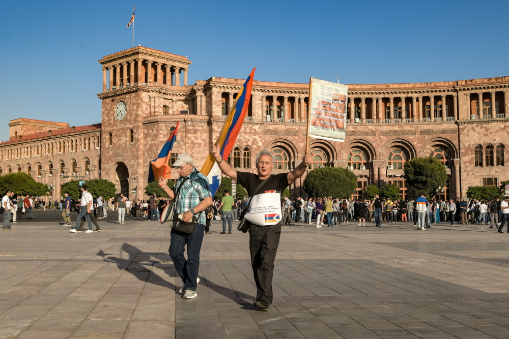

# 阿塞拜疆总统：若亚美尼亚军队放下武器，我们就停火

【文/观察者网 熊超然】近段时间以来，纳戈尔诺-
卡拉巴赫（纳卡地区）的“剑拔弩张”之势，终于在当地时间9月19日彻底爆发。正值美国和亚美尼亚联合军演之际，阿塞拜疆于当天宣布在纳卡地区驱逐亚美尼亚武装部队，发动所谓“反恐行动”。

冲突爆发后，尽管俄罗斯和美国这两个大国都呼吁双方保持冷静并停止武装行动，法国、德国、欧盟以及联合国等各方也发出同样声音，但阿塞拜疆方面20日仍对亚美尼亚控制的纳卡地区发动猛烈攻击。

阿塞拜疆总统伊利哈姆·阿利耶夫（Ilham
Aliyev）表示，本方在此次“反恐行动”中打击的是军事目标，而非平民和基础设施。此外，他还在同美国国务卿布林肯通电话时表示，如果亚美尼亚军队放下武器，那么阿塞拜疆军队将停止“反恐行动”。

而亚美尼亚外交部长则指责称，阿塞拜疆是在纳卡地区公开使用武力以实现“种族清洗”，并呼吁欧安组织紧急启动相关机制，制止当前冲突。

_视频截图：当地时间2023年9月19日，纳卡地区，阿塞拜疆国防部宣布在纳卡地区发起军事行动。图自澎湃影像_

路透社报道称，阿塞拜疆国防部9月20日表示，其军事行动“继续取得成功”，亚美尼亚方面的武器和军事装备正被摧毁。而在纳卡地区的亚美尼亚人则称，战斗仍在以不同的强度继续进行，当地至少有27人死亡，200人受伤，一些村庄的居民已经被疏散。

亚美尼亚总理尼科尔·帕希尼扬（Nikol
Pashinyan）表示，纳卡地区遭到密集炮击，阿塞拜疆企图挑起战争，他要求俄罗斯维和部队履行职责。纳卡地区的亚美尼亚族人也称，阿塞拜疆对居住在当地的12万人发动了一场新的战争。

路透社指出，纳卡地区的动荡局势可能会破坏南高加索地区的地缘政治平衡，俄罗斯、美国、土耳其和伊朗正在该地区争夺影响力。

冲突发生后，俄罗斯呼吁保持冷静，但也有一些俄罗斯官员指责亚美尼亚与西方“走得太近”，并表示这可能导致严重的问题。“我们敦促冲突各方立即停止流血冲突，停止敌对行动，消除平民伤亡。”俄罗斯外交部在其“Telegram”账号上发布的一份声明中表示。

美国国务卿布林肯也与阿塞拜疆总统阿利耶夫同电话，敦促其“立即停止敌对行动”，并对亚美尼亚总理帕希尼扬表示，美国支持亚美尼亚的主权和领土完整。

根据布林肯在社交媒体“X”（原推特）上的推文，他称阿塞拜疆不可接受的军事行动或将使纳卡地区的人道主义形势恶化，他呼吁阿塞拜疆应“立即停止对亚美尼亚纳卡地区的敌对行动，并开展直接对话”。

塔斯社报道称，在同布林肯通电话时，阿塞拜疆总统阿利耶夫表示，如果亚美尼亚军队放下武器，阿塞拜疆方面将停止“反恐行动”。他表示，这一行动的意图是“解除亚美尼亚武装部队的武装并确保其从阿塞拜疆领土撤出，使其军事基础设施中立化”。

_资料图：阿塞拜疆总统阿利耶夫 图自澎湃影像_

阿利耶夫强调，其政府多次邀请纳卡地区的亚美尼亚民众代表进行对话，但都遭到拒绝。他还表示，他的国家被迫在该地区开始采取“反恐行动”，“以镇压亚美尼亚方面的挑衅和煽动行为”。

与此同时，亚美尼亚外交部长阿拉拉特·米尔佐扬（Ararat
Mirzoyan）则在纽约会见了欧洲安全与合作组织（欧安组织，OSCE）现任主席、北马其顿外交部长布贾尔·奥斯马尼（Bujar
Osmani），呼吁紧急启动该组织机制以制止当前冲突。

亚美尼亚外交部新闻处表示，米尔佐扬指出，阿塞拜疆“在有罪不罚意识的指导下”，将国际结构缺乏威慑措施视为纵容，并寻求通过使用公开武力实现纳卡地区的“种族清洗”。

根据此前报道，阿塞拜疆国防部于当地时间9月19日宣布，在纳卡地区发起“反恐行动”，以恢复“宪法秩序”，并驱逐亚美尼亚军队。

在当天未经证实的社交媒体视频中，纳卡地区“首府”斯捷潘纳克特（阿塞拜疆称汉肯迪）可以听到巨大的炮击声。阿塞拜疆外交部称，在该国军队发动攻势前几个小时，至少有6人（4名士兵和2名平民）在两起不同的事件中，因亚美尼亚安全部队设置的地雷爆炸而丧生。

亚美尼亚方面则表示，其武装部队并没有出现在纳卡地区，其国防部发表声明称，该国与阿塞拜疆边境地区的局势是稳定的。同时，亚美尼亚外交部呼吁俄罗斯在该地区的维和部队进行干预，并阻止阿塞拜疆对当地居民的“全面侵略”。

_当地时间9月19日，亚美尼亚首都埃里温，纳卡地区局势升级，大批民众聚集在政府大楼前进行抗议。图自澎湃影像_

伴随着局势的紧张，该地区国家同俄美两国的关系也发生了“微妙变化”。此前，亚美尼亚总理尼科尔·帕希尼扬（Nikol
Pashinyan）曾公开抱怨俄罗斯“正在放弃南高加索地区”，而后又称“亚美尼亚应最大限度减少对他国的依赖，寻求俄罗斯保护是不可持续的”。

与此同时，亚美尼亚和美国于9月11日至20日期间在亚美尼亚境内举行联合军事演习，此事被认为会“激怒俄罗斯”，而19日这场冲突的爆发时间点也正好在这一军演即将结束之时。

纳卡地区位于阿塞拜疆西南部，居民多为亚美尼亚族人。苏联解体后，阿塞拜疆和亚美尼亚因纳卡地区归属问题爆发战争。虽然两国1994年达成全面停火协议，但一直因纳卡问题处于敌对状态，武装冲突时有发生。

2020年，亚美尼亚和阿塞拜疆为争夺纳卡地区的控制权，再度爆发冲突，此后双方在俄罗斯的斡旋下停火，俄罗斯维和部队进驻了该地区。

然而，该地区冲突最近再次激化，激进分子在阿塞拜疆政府的批准下封锁了“拉钦走廊”，而亚美尼亚呼吁俄罗斯对此采取行动，但迄今徒劳无果。9月7日，亚阿两国互相指责对方向两国边境调动军队。路透社认为，9月19日发生的军事事件，可能预示着该地区即将爆发一场新的战争。

**本文系观察者网独家稿件，未经授权，不得转载。**

