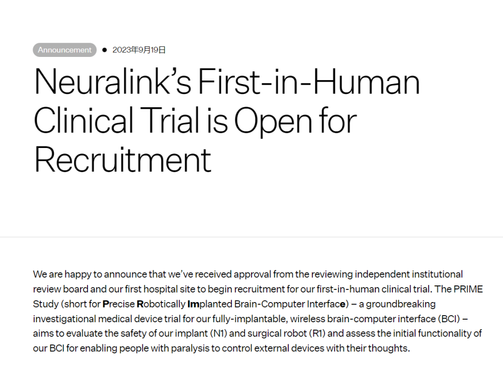

# 马斯克旗下脑机公司 Neuralink 准备开展首次人体试验

IT之家 9 月 20 日消息，今年 5 月，马斯克旗下脑机接口创业公司 Neuralink
获得了美国食品和药物管理局（FDA）的人体临床试验许可，可借助其脑部植入物和外科机器人进行试验。

当地时间周二，Neuralink 宣布获得审查批准以及医院站点的批准，其首次人体临床试验开放招募。Neuralink 表示，因颈脊髓损伤或肌萎缩侧索硬化症
(ALS) 导致四肢瘫痪的患者可能符合测试资格。

这项为期六年的初步试验被 Neuralink 称为“PRIME 研究”，意为“精确机器人植入式脑机接口（Precise Robotically
Implanted Brain-Computer Interface）”。

据介绍，该项目旨在评估其完全可植入的无线脑机接口的安全性和功能，重点包括三大部分： N1 植入物、R1 机器人、N1 用户应用。

该研究将使用手术机器人将 N1 植入物植入大脑控制运动意图的区域（放置好后在外观方面与常人无异），然后用这款 App 连接到 N1
并将神经信号转换为计算机动作。

我们 BCI 的初步目标是让人们仅凭思想就能控制电脑光标或键盘。

实际上，研究人员长期以来一直在测试让瘫痪患者也能控制计算机和其他设备的植入物，例如最近发表的两项研究表明，脑机接口可以帮助 ALS
患者通过在电脑上打字进行交流。

Neuralink 表示，参加 PRIME 研究的人将首先参加一项为期 18 个月的研究，其中包括 9
次研究人员的访问。之后，他们每周至少将花两个小时参加脑机接口研究会，然后在接下来的五年内再进行 20 次访问。

尽管 Neuralink 没有透露它正在寻找多少受试者，也没有透露它计划何时开始这项研究，但它也证实会补偿“与研究相关的费用”，比如往返研究地点的交通费用。

