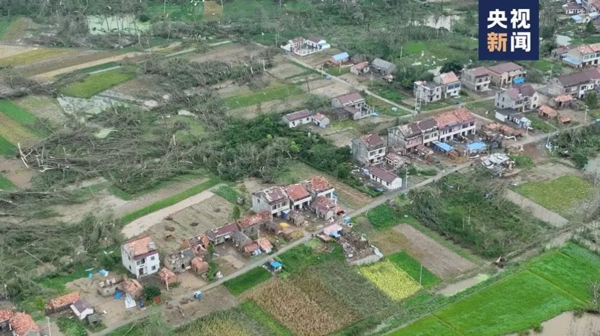

# 龙卷风为何专挑苏北下手？遇到龙卷风如何紧急应对？专家解读

19日晚，江苏省多地遭遇龙卷风，截至目前共造成10人死亡，8人受伤。

 _盐城市阜宁县受EF3级龙卷风袭击_

**龙卷风为何专门挑江苏北部？**

龙卷风这种灾害的形成机制，说简单也简单，说复杂也复杂。垂直向冷热剧烈交汇，水平向切变作用形成漩涡，问题是这个水平向的作用复杂，有地球自转作用的影响（跟台风一个道理），但是更多的应该是地形风力的作用。北美大陆每年发生龙卷风可达1000次以上，为什么龙卷风这么多，一来北美大陆东西部均临海，暖湿气流升腾条件好，二来贯穿北美大陆西部的落基山脉，包括南美的安第斯山脉，都是南北走向，便于低纬度的湿热空气和中纬度的干冷空气产生水平向的流动，形成水平风切。

而中国大陆就条件不同了，中国的大尺度山脉，以东西向为主，北线的阿尔泰山、天山、阴山，中线的昆仑山、秦岭、大别山，南线的南岭都是偏东西向，当然，还有不可不提的喜马拉雅山脉，高耸入云的西南高山阻挡了南部印度洋暖湿气流向北行进的路径，客观上降低了龙卷风生成的条件。

还有一点至关重要，北美中部地区大片平原，便于龙卷的快速推进，而中国西高东低的落差地形，山地丘陵密布，不适合龙卷的自由发挥。不过，一堆烂桃子里挑一挑，也有条件好的，比如苏北平原，毗邻黄海，海洋暖湿气流升腾快，碰到冷气团容易产生强对流雷暴云，而沃野千里的平原环境又给龙卷风快速推进提供合适的温床。

由此可见，和绝大多数自然灾害一样，龙卷风的发生是有规律可循的，并不是任何地区都容易发生，苏北平原刚好符合龙卷风生成的大气和地形条件。了解特定自然灾害的分布区域，是应对灾害的基础。就好比你不需要在闽浙丘陵地带考虑龙卷风应对的问题。

**遇到龙卷风如何紧急应对？**

在我国为数不多的龙卷风灾情分布上，江苏排名第一。但是，不见得江苏民众对龙卷风这种灾害就有防御和避险意识，这方面的科普宣传还不如地震呢。

在所有极端对流天气中，龙卷风是最难预测的。既然龙卷风难以预测，那么还是掌握一些必要的避险常识吧。

**如果在户外，龙卷风避险第一招：跑。**
怎么跑？撒开腿百米冲刺跑！往什么方向跑？与龙卷风路径垂直的方向！因为龙卷风的移动速度很快，一般不进行急转弯，所以要沿着垂直于风的移动方向拼命跑，才能最大程度避开风灾的破坏力。

**龙卷风避险第二招：趴**
。怎么趴？龙卷风速度很快，秒速可以超过100米，人类是跑不过它的。在龙卷风快要接近时，低洼处就地卧倒，身体紧紧贴住地面，脸也要埋进土里屏息几秒。

如果在开车，合适的做法是： **弃车逃跑。**
汽车对龙卷风的防御能力几乎为零，龙卷风的龙卷中心气压可以小到400百帕以下，而我们地表一个标准大气压是1013百帕，汽车陷入龙卷中心最糟糕的情况，是内外巨大的气压差也许能把汽车整爆。

**如果在家里，** 理论上地下室最安全，可是这个条件难实现，没地下室况且时间也来不及。赶紧裹上被子跑进卫生间厨房等小开间蹲下，远离门、窗和外围墙壁。

