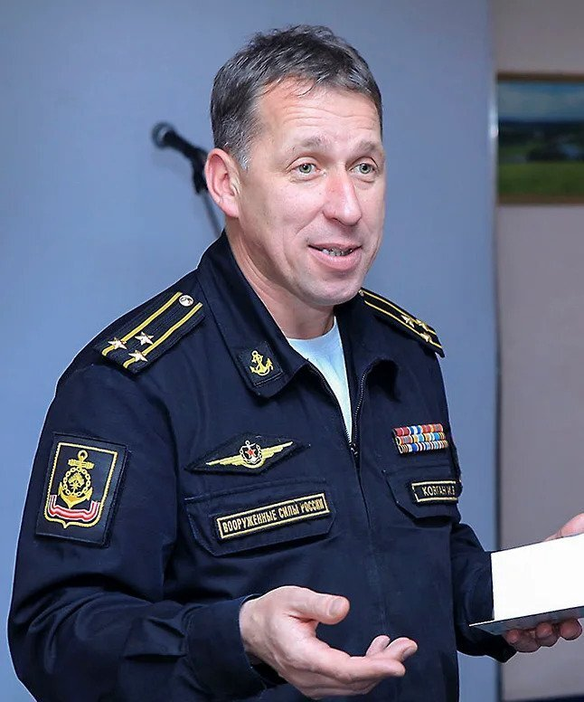

# 俄罗斯维和部队副司令等遇袭身亡，阿塞拜疆总统向普京致歉

（观察者网讯）综合俄罗斯卫星通讯社、塔斯社等俄媒9月21日报道，克里姆林宫新闻局发布消息称，阿塞拜疆总统阿利耶夫就20日纳戈尔诺-
卡拉巴赫（纳卡）地区有俄维和军人丧生向俄罗斯总统普京道歉并表示慰问。

俄媒称，遇难者名单中有俄罗斯驻纳卡地区维和部队副司令、俄北方舰队潜艇部队副指挥官伊万·科夫甘上校。

21日，俄罗斯安全机构的一名消息人士称，阿塞拜疆军队指挥官已被停职，其下属对俄维和人员丧生的事件负有责任，第一批犯罪嫌疑人已被拘留。

_资料图（图源：俄罗斯卫星通讯社）_

克里姆林宫在声明中称，普京应约与阿利耶夫通电话。阿利耶夫就俄罗斯维和部队军人9月20日在纳卡地区不幸丧生一事道歉并表示慰问。

此外，阿利耶夫强调，将对该事件进行彻底调查，所有责任人会受到应有的惩罚。两国总检察机构就此保持密切联系。阿利耶夫同时表示愿意向死者家属提供经济援助。

普京则强调要尊重纳卡地区亚美尼亚族裔的权利，确保他们的安全。“阿塞拜疆方面愿就上述事宜与俄罗斯维和部队保持合作。”

俄罗斯国防部9月20日表示，一辆载有俄罗斯维和人员的汽车从贾尼亚塔克居民点地区的观察站返回时，遭到“轻武器射击”，多名军人当场死亡。

俄国防部20日补充道，俄罗斯和阿塞拜疆调查机关代表正在现场开展工作，但未透露具体死亡人数。

俄罗斯“第一频道”称，4名俄罗斯维和人员在袭击中丧生。而RT总编辑玛格丽塔·西蒙尼扬透露，此次袭击导致5名俄罗斯维和人员死亡。

据俄罗斯《生意人报》9月21日报道，多方消息称，俄罗斯驻纳卡地区维和部队副司令、俄北方舰队潜艇部队副指挥官伊万·科夫甘上校在此次袭击中丧生，事发时他就在被击中的汽车里。

俄罗斯摩尔曼斯克《北方邮报》称，伊万·科夫甘在其53岁生日的前三天去世。另一家摩尔曼斯克当地媒体称，伊万·科夫甘自5月11日以来一直在纳卡地区执行任务。目前还没有关于其葬礼何时举办的消息。

_资料图：伊万·科夫甘（图源：俄罗斯北方舰队新闻处）_

据塔斯社21日报道，俄罗斯安全机构的一名消息人士称，阿塞拜疆军队指挥官已被停职，其下属对俄维和人员死亡一事负有责任，第一批犯罪嫌疑人已被拘留。

纳卡地区位于阿塞拜疆西南部，居民多为亚美尼亚族人。苏联解体后，两国曾因纳卡地区归属问题爆发战争。虽然两国1994年达成全面停火协议，但一直因纳卡问题处于敌对状态，武装冲突时有发生。分析人士指出，纳卡问题被称为“高加索火药桶”，牵涉多方利益，因此除了亚阿两国，外部力量博弈将对纳卡局势走向发挥重要作用。

2020年，阿塞拜疆为夺回纳卡地区的实际控制权，与亚美尼亚和纳卡地区武装再度爆发冲突。此后交战双方在俄罗斯斡旋下停火，俄罗斯维和部队进驻纳卡地区。

今年9月19日，阿塞拜疆宣布在纳卡地区启动“反恐行动”，以恢复当地“宪法秩序”。20日，经俄方斡旋，阿塞拜疆宣布已与纳卡地区当局就停火达成共识，停火条件包括纳卡地区武装放下武器。

俄罗斯国防部21日表示，俄维和人员从纳卡地区疏散了5000人。

俄国防部指出，俄罗斯维和人员正继续在纳卡地区执行任务，“同时在保持与巴库、埃里温和斯捷潘纳克特的不间断互动，旨在防止流血，保障安全和遵守对平民的人道主义法准则以及确保俄罗斯维和人员的安全。”

**本文系观察者网独家稿件，未经授权，不得转载。**

