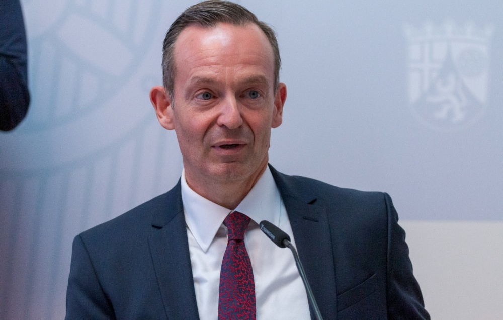

# 德国政府谋划禁用华为、中兴，运营商：不切实际，保留索赔诉讼权利

（观察者网讯）“北溪”管道泄漏事故一周年之际，德国内政部被曝正以“防止第二起北溪事件”为由，谋划分阶段禁用华为、中兴等中国电信供应商设备。

据《经济周刊》、《时代周报》等德媒9月20日报道，截至目前，该计划尚未在联邦政府达成一致。然而，此事已经引发德国电信运营商的激烈反对。

其中，德国电信直言该计划“不切实际”，且有损用户利益。西班牙电信德国公司则表示，若计划施行，将向德国政府索赔。

**德国电信运营商：不切实际，保留索赔诉讼权利**

德国电信（Deutsche
Telekom）是欧洲最大的电信运营商。该公司认为，联邦内政部针对中国电信运营商的计划无法实施，若施行，德国用户将不可避免地面临产品质量损失。

在一份声明中，德国电信表示，考虑到审批程序、可替代供应商的容量，以及联邦政府进一步扩张移动通信的目标，内政部提出的分阶段禁用华为、中兴等中国电信供应商设备的计划“不切实际”。

西班牙电信德国公司（Telefónica Deutschland）同样对上述计划持反对意见。

该公司发布声明称，内政部应该拉长计划的时间表，因为这对保持网络的质量和性能至关重要。声明表示，如果被迫更换5G网络设备，该公司或将对德国联邦政府提出索赔要求，并“保留在法庭上审查（德国政府）有关禁用零部件或供应商决定的权利”。

此前一天（19日），多家外媒援引消息称，南希·费泽（Nancy
Faeser，社民党）领导的联邦内政部正在起草一项关于进一步限制在该国电信网络中使用华为、中兴等中国设备的新计划。

_德国内政部长南希·费泽，图自德媒（下同）_

根据泄露的政府战略文件，上述计划分阶段完成：第一阶段涉及核心网，预计在2026年1月1日前要求国内运营商停止在核心网使用中国供应商设备；第二阶段涉及接入和传输网，要求国内运营商在2026年10月1日之前将中国供应商设备份额限制为平均25%。

德国《明镜周刊》此前预测称，这一计划将导致已经使用了华为技术的运营商感到恼火，毕竟单个运营商的成本就可能高达十亿美元。

据悉，德国目前共有8.2万个移动通讯站，其中约一半配备了华为技术。有业内人士透露，从德国现有的通讯网络中移除华为设备不仅会带来高达50亿欧元（约合人民币391.165亿元）的巨大成本，还将使德国移动通讯技术的发展倒退数年。

_西班牙电信德国公司在德国的电信基站_

**德国联邦政府内部再现分歧**

与此同时，由德国社民党、绿党和自民党组成的“红绿灯”执政联盟内部，也对内政部提出的有关禁用中国电信运营商设备的计划意见不一。

贝尔伯克（绿党）的外交部支持内政部。但福尔克·维辛（自民党）领导的数字化和交通部认为该计划过于激进。美媒“Politico
EU”称，有知情官员透露，数字化和交通部担心这项禁令会影响该部门的高速网络布局，且可能导致德国更加依赖华为的主要竞争对手——瑞典的爱立信和芬兰的诺基亚。

德国《经济周刊》表示，尽管内政部希望在本月底找到共同立场，但截至目前，内政部、外交部及数字化和交通部并未就此计划达成一致。德国总理朔尔茨或许对此问题拥有最终决定权，而他可能会考虑到德国企业界的利益和立场。

 _德国数字化和交通部长福尔克·维辛_

当地时间9月20日，德国数字化和交通部发言人表示，鉴于德国本就存在关于关键组件的高标准和严格规定，联邦政府目前正在讨论是否有必要采取进一步措施。该发言人还强调，重要的是，联邦政府必须保证可以在全国范围内提供稳定、快速和可负担的移动网络。

同日，德国内政部发言人在新闻发布会上示，目前，联邦政府对电信系统的审核“尚未完成”，内政部与其他部门就有关问题的讨论“仍在继续”。

我驻德国使馆发言人此前就相关议题回应称，中方坚决反对德在对华合作中泛化国家安全概念、滥用国家力量干预市场，这不仅违背经济规律和公平竞争原则，而且损人不利己。

中方注意到，有关德欧企业已表示，德政府做法将延误德5G网络建设推广并造成额外成本。德政府应认真倾听其国内的理性声音。中方坚决反对任何将企业投资经营政治化、泛安全化的做法。希望德方为中国企业营造公平、公正、开放、非歧视的营商环境，多做促进双向互利的事，而不是相反。

**本文系观察者网独家稿件，未经授权，不得转载。**

