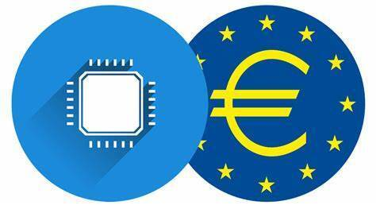

# 欧洲芯片法案生效：到2030年芯片产量占全球份额应从目前的10%提至20%

**划重点：**

  * _1_ 《欧洲芯片法案》周四正式生效，其目标是到2030年将其目前所占的全球市场份额翻一番，达到20%。
  * _2_ 《欧洲芯片法案》主要由三大支柱组成，分别是《欧洲芯片倡议》、芯片行业投资框架以及各方协调机制。
  * _3_ 《芯片联合承诺条例》也在周四生效，它允许开始实施《欧洲芯片倡议》的主要部分。此外，“芯片基金”也将展开活动。

腾讯科技讯 当地时间9月21日，《欧洲芯片法案》正式生效。这部法案中包括了许多措施，以确保欧盟在半导体技术和应用方面的供应安全、弹性和技术领先地位。

半导体是数字和数字化产品的基本组成部分，从智能手机和汽车，到医疗、能源、国防、通信和工业自动化的关键应用和基础设施，半导体都是现代数字经济的核心。它们也处于强大的地缘战略利益和全球技术竞赛的中心。

具体而言，《欧洲芯片法案》将加强欧盟的制造业，刺激欧洲设计生态系统，并支持整个价值链扩大规模和创新。通过《欧洲芯片法案》，欧盟的目标是到2030年将其目前所占的全球市场份额翻一番，达到20%。

**《欧洲芯片法案》的三大支柱**

《欧洲芯片法案》由三个主要支柱组成：

第一个支柱是所谓的《欧洲芯片倡议》（Chips for Europe
Initiative），即通过促进知识从实验室转移到工厂，弥合研究、创新和工业活动之间的差距，并通过促进欧洲企业创新技术的工业化，加强欧洲的技术领导地位。欧洲芯片倡议将主要通过《芯片联合承诺条例》（Chips
Joint Undertaking）实施。

“欧洲芯片倡议”项目将得到33亿欧元的资金支持，预计各成员国也将提供相应的资金。具体来说，这笔投资将支持以下活动：建立先进的试点生产线以加速创新和技术发展、开发基于云计算的设计平台、建立能力中心、开发量子芯片，以及创建芯片基金以促进债务融资和股权融资等活动。

第二个支柱是鼓励公共机构和私人投资于芯片制造商及其供应商的制造设施。

第二个支柱是建立一个框架，通过吸引投资和提高半导体制造业的生产能力来确保供应安全。为了实现这个目标，《欧洲芯片法案》为综合生产设施和开放式欧盟代工厂制定了一个框架，这些工厂在欧盟是“首创的”，有助于保障供应安全和建立一个符合欧盟利益的弹性生态系统。欧盟委员会在提出《芯片法案》提案时就已经表示，根据《欧洲联盟运作条约》，成员国可以向第一类设施提供援助。

在其第三个支柱中，《欧洲芯片法案》建立了成员国与欧盟委员会之间的协调机制，以加强该机构与成员国之间、各成员国之间的合作，监测半导体供应，估计需求，预测短缺，并在必要时启动危机应对机制。作为第一步，欧盟已于2023年4月18日建立了半导体警报系统，它允许任何利益相关者报告半导体供应链中断情况。

**接下来的行动**

同样在周四，《芯片联合承诺条例》生效，它允许开始实施《欧洲芯片倡议》的主要部分。此外，“芯片基金”也将展开活动。随着《欧洲芯片法案》的生效，新成立的欧洲半导体委员会的工作也将正式启动，这将成为欧盟委员会、成员国和利益相关者之间协调的关键平台。

在第二个支柱下，芯片行业将能够申请计划中的“首创”设施，以获得“综合生产设施”(IPF)或“开放式欧盟代工厂”(OEF)的地位。这一地位将使这些设施能够在联盟内建立和运作，从而简化行政申请和许可证发放的流程。同时，这一地位还将要求这些设施符合标准，以确保它们对欧盟设定的目标做出贡献，并在危机时期提供稳定的芯片供应。

早在2021年的国情咨文演讲中，欧盟委员会主席乌苏拉·冯德莱恩（Ursula von der
Leyen）首次宣布了欧洲半导体行业的共同战略。2022年2月，与《欧洲芯片法案》一起，欧盟委员会发布了一项有针对性的利益相关者调查，以收集芯片和晶圆需求的详细信息，以更好地了解芯片短缺如何影响欧洲工业。

2022年2月，欧盟委员会提出了《欧洲芯片法案》。2023年4月，欧洲议会和欧盟成员国就《芯片法案》达成了一项政治协议。所采取的措施将有助于欧洲实现其“2030年数字十年”目标，即建设一个更绿色、更包容、更数字化的欧洲。（文/金鹿）

