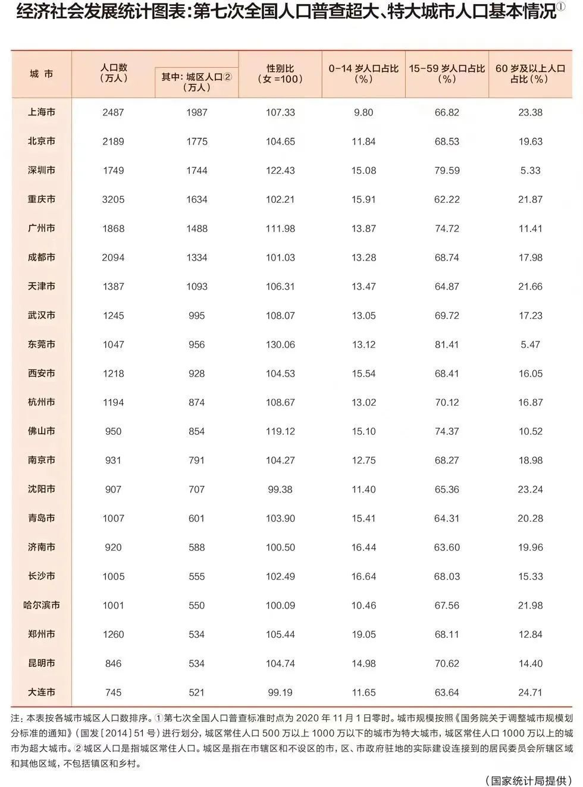

# 江苏苏州晋级特大城市，意味着什么？专家解读

中国特大城市迎来扩容。

**苏州晋级特大城市**

苏州近日发布情况说明指出，近期国家统计局对全国城乡（含开发区）分类代码进行了更新，苏州城区的统计口径包括苏州工业园区，其下辖社区的城乡代码由镇中心区（121）改为主城区（111）。娄葑街道、胜浦街道、唯亭街道、斜塘街道、金鸡湖街道下辖各个社区的城乡分类代码都已改成了：111。此调整并非是区划调整，只是统计口径的调整。

按照此次调整的统计口径，以2020年第七次全国人口普查公布的常住人口数据来算，苏州城区常住人口为512.51万人。

根据国务院2014年发布的《关于调整城市规模划分标准的通知》，城市规模划分标准以城区常住人口为统计口径，将城市划分为五类七档。其中，城区常住人口500万以上1000万以下的城市为特大城市；城区常住人口1000万以上的城市为超大城市。

苏州城区常住人口超过500万，这意味着，苏州跻身特大城市行列。

**特大城市有哪些？**

2021年9月，国家统计局根据2020年全国人口普查数据，通过《求是》杂志发布了全国超大和特大城市名单。

上述名单显示，彼时，全国共有7个超大城市：上海、北京、深圳、重庆、广州、成都、天津；共有14个特大城市：武汉、东莞、西安、杭州、佛山、南京、沈阳、青岛、济南、长沙、哈尔滨、郑州、昆明、大连。

因此，在苏州跻身特大城市行列后，我国特大城市也将由此扩容。

**晋级特大城市有什么意义？**

国务院发展研究中心研究员冯文猛对中新财经记者表示，特大城市对于城市来说是一个重要的门槛，晋级特大城市对于城市发展来说可以带来积极的影响，享受更多的政策势能。

以正在推进的城中村改造为例，2023年7月21日，国务院常务会议审议通过《关于在超大特大城市积极稳步推进城中村改造的指导意见》。会议指出，在超大特大城市积极稳步实施城中村改造是改善民生、扩大内需、推动城市高质量发展的一项重要举措。

是否为超大特大城市，还关系到都市圈的建设资格。根据国家发改委2019年公布的《关于培育发展现代化都市圈的指导意见》，都市圈是城市群内部以超大特大城市或辐射带动功能强的大城市为中心、以1小时通勤圈为基本范围的城镇化空间形态。

_资料图：航拍苏州太湖湖滨国家湿地公园，蓝天碧水生态美。泱波 摄_

在冯文猛看来，苏州成为特大城市既是在区域人口增减分化大背景下人口集聚的结果，同时也将进一步提升苏州对于人口人才的吸引力。苏州产业发展基础好，包括高端制造、生物医药等进行了精心布局，产业发展带动大量就业。

冯文猛表示，成为特大城市，城市人口聚集会带来规模效应，公共服务配置起来更加有效率，苏州公共服务水平较高，这让居民生活更加舒适、环境更加宜居、生活更加安心，这是吸引人口流入并且长期定居下来的一个重要因素。另外，城市可以聚合更多的创新要素，引发新一轮创新，形成螺旋效应，有助于推动新模式不断涌现、产业不断升级。

“成为特大城市，意味着城市吸引力更强，辐射带动能力也将更强。”冯文猛认为，但同时不只是有好处，也有挑战，包括要考虑防止出现大城市病的问题，防止资源要素价格飙升，避免相对竞争优势被削弱，城市管理有必要做好规划和应对准备。

**谁会成为下一个特大城市？**

目前来看，南宁具有成为下一个特大城市的潜力。

近年来，南宁市常住人口持续增加。根据南宁市统计局发布的数据，2022年末，南宁市常住人口为889.17万人，比2021年末增加5.89万人，人口总量居全区第一。

虽然南宁常住人口接近900万，但城区常住人口是否达到500万才是决定是否为特大城市的指标。

根据《中国人口普查分县资料—2020》，南宁市城区常住人口为456.75万人，距离500万人的特大城市门槛不远了。

中新网首席财经记者：李金磊

编辑：王伊萌

