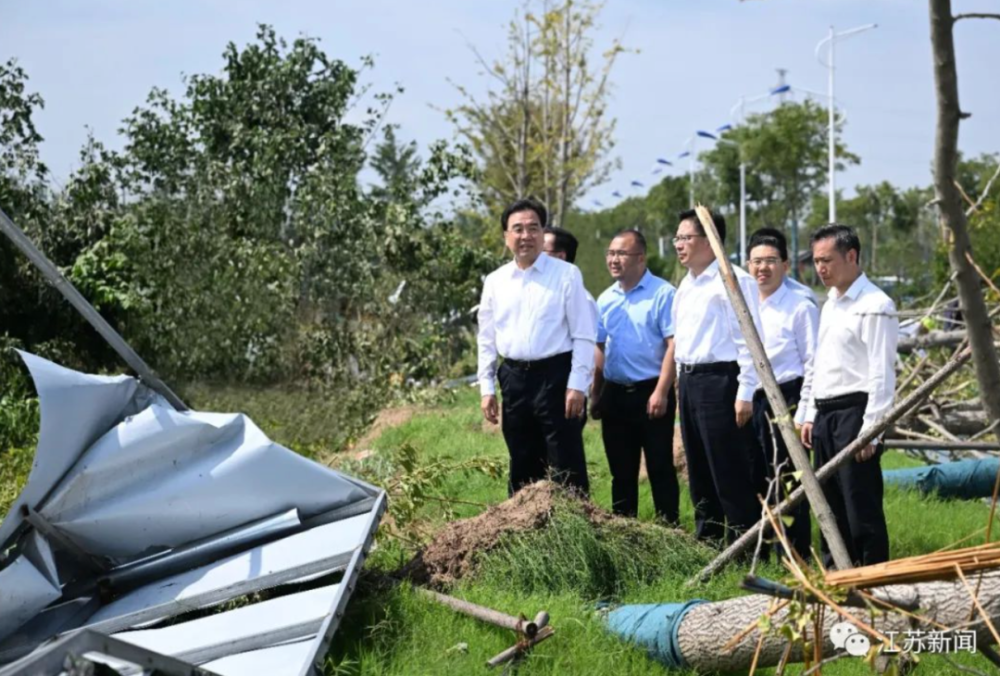
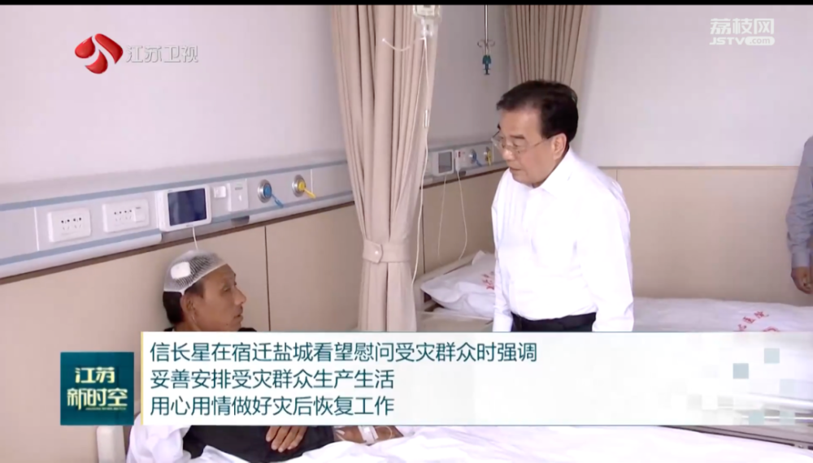
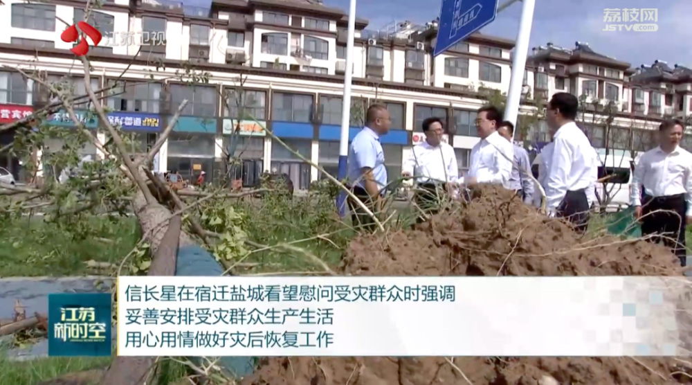
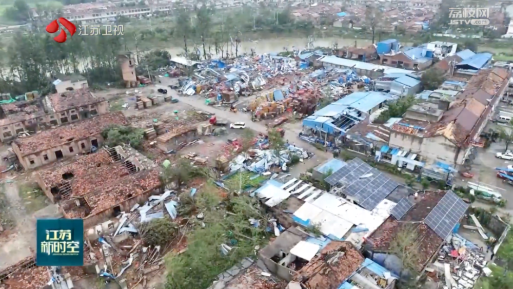

# 江苏龙卷风10人遇难8人受伤 正在调研的省委书记调整行程赶赴受灾现场

**撰文 | 董鑫**

日前，江苏省发生罕见强龙卷风，已致10人遇难、8人受伤。

据《新华日报》9月21日报道，江苏省委书记信长星第一时间作出批示，并调整了正在苏北地区进行的调研行程，赶赴现场看望慰问受灾群众。

此前报道显示，9月17日至19日，信长星正在江苏盐城射阳、滨海、响水等地调研。

此次龙卷风灾害主要发生在江苏宿迁和盐城。

9月19日17时20分许，宿迁市宿豫区大兴镇、市经开区南蔡乡局地陆续发生强龙卷风，等级判定为EF2级。灾情主要发生在乡镇镇区，人员稠密、建筑结构复杂，发生时段恰逢下班时间，造成5人死亡，4人重伤。

据初步统计，两地受灾人口5512人，1646户房屋一般受损，倒塌房屋137户，农作物受损41.8公顷，临时转移安置405人，2000余平方米猪舍部分墙体倒塌、顶部塌陷。

9月19日20时30分，盐城市阜宁县受EF3级龙卷风影响，发生极端天气灾害，造成5人死亡、4人轻伤。

当日17时至22时，阜宁县芦蒲、板湖两镇降雨量分别达202.7毫米、171毫米，受灾严重。据初步统计，两镇受灾人口1364人，房屋受损614间，树木倒伏1800余株，农作物受损199公顷，临时转移安置129人。

**据《新华日报》报道，在大兴镇，信长星实地察看了受灾情况，并前往大兴中心医院看望救治、安置群众。**

**他说，突如其来的极端天气让大家身体受伤、财产受损，党委政府一定帮助大家渡过难关、建设家园。广大党员干部要带领群众尽快恢复正常生产生活秩序，同时做好救灾政策的宣传、解读和落实，让受灾群众安心安全。**

**在芦蒲镇，信长星详细了解抢险救灾、房屋受损、群众安置等情况后，要求细致周全安排好群众住宿、吃饭、就医、子女上学等大小事情，抓紧抢修房屋和基础设施，最大程度减少农业损失。**

**看到干部群众正在清理受灾现场、供电部门全力抢修受损线路，他还叮嘱大家注意安全。**

龙卷风是一种破坏力极强的强对流天气。按藤田级数（量度龙卷风强度的标准），强度分为EF0级至EF5级6个等级，EF0级别最低，EF5为最高级别。

EF2级龙卷风会产生相当大的破坏，可能导致树木被连根拔起；EF3级龙卷风会造成严重破坏，最大风速可达17级以上(60.5米/秒-74米/秒)，火车都有可能被刮倒。

此次江苏遭遇的是一次罕见龙卷风事件。

我国春季和夏季为龙卷风多发季节，4月至8月龙卷风个数占全年的92%，其中7月占比最高，约占3成。

据国家气候中心1991—2020年统计数据，我国江苏、广东、湖北、安徽等省发生龙卷风次数较多，其中江苏省最多，年均发生龙卷风4.8个。

气象专家解释说，江苏地处长江中下游平原，地势较为平坦，而境内滨江临海，湖泊水系纵横，在这样平原和水系众多的情况下，非常有利于强对流的产生和强对流的触发。因此，江苏是全国强对流最高发的区域，也是全国龙卷风最高发的省份。

今年8月，江苏盐城市大丰区部分镇就出现了EF2级龙卷风自然灾害。

通常在9月的中下旬，江苏已经不太容易发生龙卷风。但近期由于气温较高，而且受江淮气旋的影响，带来了比较强的动力条件。

据江苏媒体报道，目前，抢险救援、灾情统计、善后处置、现场清理、灾后重建等工作正在进行中，社会秩序平安稳定。

**在此次看望慰问中，信长星指出，极端天气时有发生，各地各部门要坚持底线思维、极限思维，保持“时时放心不下”的责任感，加强监测预报预警，完善应急联动机制，把防灾减灾工作做在前面。**

**【版权声明】本文著作权归政知新媒体独家所有，未经授权，不得转载。**

