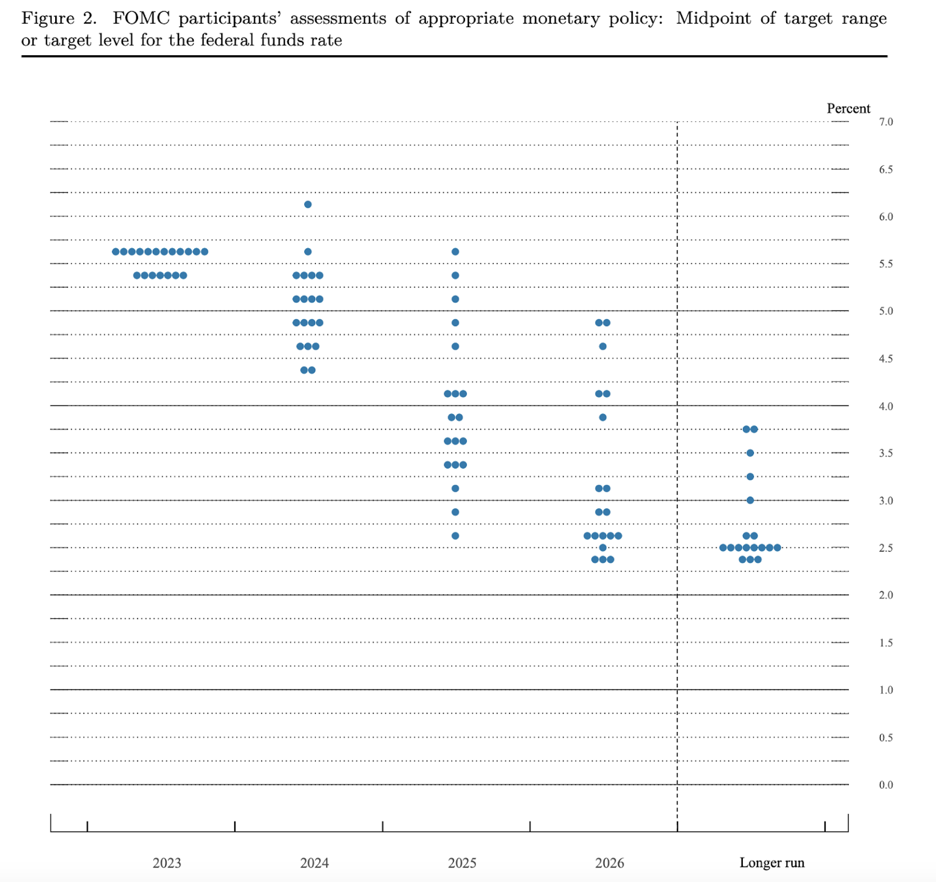
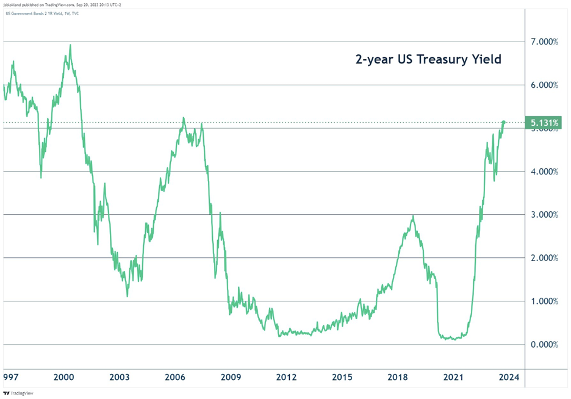
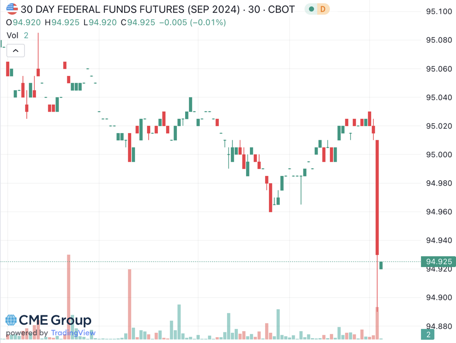
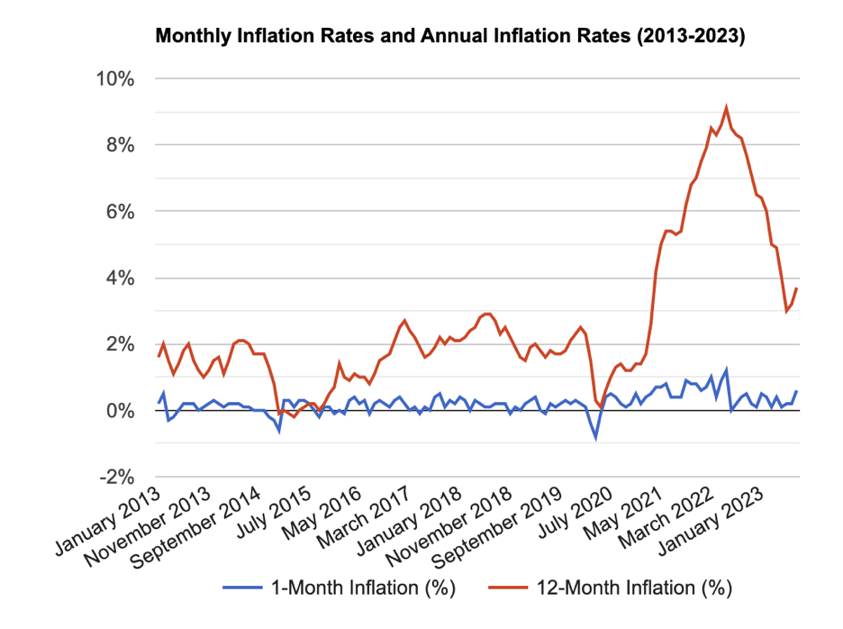
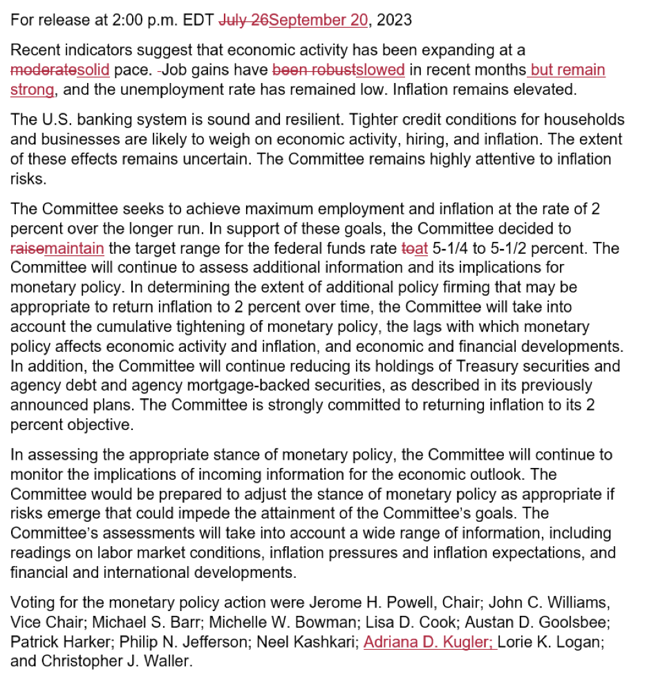

# 油价上涨、汽车工人罢工，美联储“鹰派”暂停加息，美股重挫

腾讯新闻《潜望》 纪振宇 发自硅谷

美国时间9月20日，美联储在结束了为期两天的货币政策会议后公布，维持目前5.25-5.5%的基准利率水平不变。但市场并没有为此欢呼雀跃，反而掉头向下，主要原因在于，当天的利率决议并不是重点，不加息已经大概率被市场所提前消化，但美联储在此次会议后再次强调，坚持达成2%的长期通胀目标不变，对抗通胀的“战斗”还远未结束，这在很大程度上打击了市场此前对于美联储可能即将转变货币政策走向的乐观预期。

一家宏观策略对冲基金的美股权益市场负责人在当天对腾讯新闻《潜望》表示，市场短期内会有过度乐观和过度悲观的反应出现，但总体上他对美联储的表态并不感到意外。

“美联储在控制市场预期方面十分谨慎，”这位人士说，“对于美联储来说，（货币政策）过早转向的风险，目前要远大于过度紧缩的风向。”

他表示，鲍威尔（美联储主席）最近几次的公开表态基本没有出现大的变化，总体上还是要坚持把通胀降下来。“从这个角度看，市场今年以来有一些‘自满’（complacent)。”

全球规模最大的对冲基金桥水在上个月的一份研究报告中也提出，美联储对抗通胀还远未结束，工资增长和预期是潜在风险。从历史数据来看，只有在失业率上升2%以上时，才会对工资增长带来明显拖累，但这一切目前并没有发生。

支持美联储继续紧缩性货币政策的还包括近期一系列的短期事件扰动，例如欧佩克对原油减产的决定令油价再度飙升，以及美国大规模汽车工人罢工事件等，都进一步增加了通胀上行的压力。

**加息“暂停”而非“结束”**

当天美联储宣布暂停加息的消息已经完全被市场提前消化，监测市场对美联储未来政策活动的工具显示，美联储当天会议之前，市场预期暂停加息的概率为99%。

当天美联储公布的货币政策声明称，美国经济活动步伐坚实，就业增长近期有所放缓但依然强劲。

值得注意的是，美联储此次决定不加息，并不意味这次轮加息周期已经终结，实际上美联储也在当天明确释放了信号：加息还远未结束。美联储货币政策委员会19名成员中，有12名认为年内仍应再加息一次，只有7名成员认为年内不再需要加息。

此外，美联储预期到2024年，美国通胀水平仍将达到2.6%，距离美联储2%的长期通胀目标仍有一步之遥。基于此，此次美联储货币政策对外释放的最重要的信息，依然是高利率水平要维持更长的时间。

在当天声明发布后的新闻发布会上，美联储主席鲍威尔也再次明确强调：美联储将坚持通过限制性政策工具措施，达成2%的长期通胀水平。

“达到2%的通胀目标还有很长的路要走。”鲍威尔在新闻发布会上说。

**点阵图显示美联储内部分歧很大**

按照过往的惯例，美联储在每个季度末的货币政策会议上除了公布货币政策决定外，还会同时对外公布对未来经济的预期展望，此次货币政策会议也不例外。当天发布的美联储经济展望，实际上是市场最为关注的信息。

在最新的这份报告中，美联储货币政策委员会成员总体上上调了对短期未来经济增长的预期，例如对2024年经济增长预期中位数由6月份的1.1%上调至1.5%，与此同时，对2024年失业率的预期也由6月份的4.5%下调至4.1%。

报告中同时呈现的联邦基准利率点阵图显示，对于2024年适宜的基准利率水平，联储委员会成员之间的分歧依然较大，10名成员认为依然需要维持5%以上的高利率水平，其中有一名成员认为应维持在6%以上，是最为“鹰派”的观点，同时有9名成员认为应下调至5%以下，其中持最为“鸽派”观点的两名成员认为应降至4.5%以下水平。

对于2025年的基准利率水平，成员平均认为应在4%左右，但分歧依然很大，最为“鹰派”的观点认为应维持在5.5%以上，而最为“鸽派”的观点则认为应下调至2.75%以下。

对于更长期的基准利率水平，大多数货币政策委员会成员认为，维持在2.5%左右的利率水平是适宜的，这也与美联储所设定的2%的长期通胀目标相一致。

**美股跳水 市场重新调整预期**

在美联储向市场释放明确信号后，美国国债收益率走高，两年期美国国债收益率创下2006年以来新高。

_2024年9月到期的30天联邦基准利率期货也在盘中出现大幅跳水（价格与利率预期相反）_

美股市场当天也出现大幅下挫，在美联储货币政策决议公布之前，美股三大股指震荡不前没有明确方向，但在决议公布后，尤其是美联储新闻发布会召开后，美股开始出现明显跳水，三大股指全面下挫，其中纳斯达克综合指数下跌超过1.5%，跌幅显著的权重股包括苹果下跌2%，谷歌下跌3.05%，微软下跌2.4%。

当天出现的市场激烈反应，并非与美联储当天公布的暂停加息决定直接有关，而是对未来预期的重新调整所导致：美联储进一步强调要将高利率水平维持更长的时间，打消了部分市场此前过于乐观的2024年可能下调利率的预期。

**通胀持续走低 美联储为何坚持“鹰派”论调？**

自从去年开始这一轮加息周期后，美联储已经将通胀从9%以上的水平一路拉低至3%以下，距离美联储所设定的长期通胀目标已经近在咫尺，但美联储方面不仅没有透露半点“偏鸽”信号，相反依然不断强调目前的加息周期仍未结束，这主要是出于以下几个方面的考量：

首先，尽管通胀水平从去年以来持续下滑，但距离美联储长期通胀目标2%的水平仍有显著距离，因此此时货币政策转向依然为时过早。美联储主席鲍威尔在当天的新闻发布会上在回答相关提问时也表示，“过去3个月的通胀相关数据很好，我非常了解这一情况，但是我们需要比3次数据更多的证据”。

此外，美国的就业市场依然强劲，工资增长与工资增长预期仍居高不下，这是美联储目前最为担心的、可能影响未来控制通胀水平的重大隐患，再加上近期美国汽车工人大规模罢工等事件，进一步增加了短期不确定性和复杂性。

全球规模最大的对冲基金桥水在上个月发布的一份研究报告称，工资增长仍持续在4.5%左右水平，和2%通胀水平所需要的2%-2.5%的温和增长相比仍较高，名义消费增长尽管相比2022年初的水平有所降温，但仍维持在5.5%-6.5%的高位，仍显著高于3%-5%的维持长期2%通胀的水平。从历史上来看，只有在失业率增长2%以上的情况下，才会对工资增长带来显著影响，但目前失业率上升的情况并没有发生。

当天美联储发布的货币政策声明中也明确强调了这一点。尽管相比7月份的声明，9月份会议声明只改动了两处，但正是这改动的两处，反映了美联储基于当前经济状况，对未来预期的变化。

美联储在上一份声明中称，经济活动温和增长，但在最新的声明中改为了“坚实”增长，意味着美联储认为目前经济增长更为稳固，短期陷入衰退的可能性减少，这也与前一段时间高盛将2024年美国经济衰退的概率下调至20%的判断一致。此外，美联储还将上一次声明中提出的“就业增长在近期强劲“改为了”就业增长在近期有所放缓，但依然强劲”。

以上措辞的细微改动，正是美联储继续坚持“偏鹰”派货币政策观点的基础。一方面经济增长维持稳定，给了美联储进一步实施紧缩性货币政策更多的空间和灵活度，另一方面，就业市场放缓，也进一步增强了美联储持续紧缩的信心，最终的目标依然是将通胀水平压低至2%。

