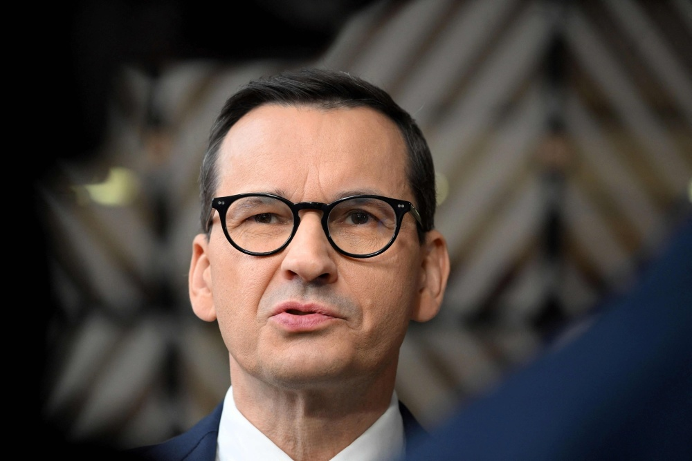

# 波兰总理：将停止向乌克兰提供武器，但不会干扰其他国家运送武器

（观察者网讯）据彭博社报道，当地时间9月20日，波兰总理莫拉维茨基接受当地媒体采访时宣布，波兰将暂停向乌克兰提供武器。美媒称，波兰政府这一决定很可能与两国之间的粮食争端有关，波兰多次指责乌克兰农产品的滞留扰乱当地农产品市场，并宣布将继续执行对乌克兰农产品的禁令。

在被问及波兰是否会继续支持乌克兰时，莫拉维茨基回应说，“我们不会再向乌克兰输送武器，因为我们正在用更现代化的武器武装波兰军队。”

他补充说，波兰政府无意“拿乌克兰的安全冒险”，也不会干扰其他国家通过波兰东南部城市热舒夫的军事枢纽向乌克兰运送武器，波兰从武器过境运输中获得了经济利益。

_资料图：波兰总理莫拉维茨基 图自视觉中国_

波兰政府的决定可能与两国之间的粮食争端有关。自俄乌冲突爆发以来，乌克兰农民一直依赖通过邻国出口粮食，但波兰等国认为，乌克兰农产品滞留扰乱了当地的农产品市场，压低了当地粮食价格，给农民造成了损失。

9月15日，欧盟宣布不再延长对乌克兰粮食的进口禁令，但波兰、斯洛伐克和匈牙利均表示，出于对本国农民利益的保护，将继续执行禁令。此外，波兰宣布对乌克兰面粉和肥料实施额外禁令。匈牙利则更进一步，禁止进口另外25种乌克兰产品，包括各种肉类、家禽、鸡蛋、蜂蜜、蔬菜和葡萄酒。

东欧三国的举动引起乌克兰政府不满。9月18日，乌克兰经济部副部长塔拉斯·卡奇卡表示，乌当局计划将波兰、匈牙利、斯洛伐克诉至世界贸易组织。他威胁称，除非三国在9月22日前撤销禁令，否则乌克兰可能通过禁止从波兰进口水果和蔬菜等手段回应制裁。

彭博社称，这起争端还引起波兰和乌克兰两国领导人的相互攻击。当地时间19日，乌克兰总统泽连斯基在联大发表讲话，指责部分欧盟国家“假装声援乌克兰，安抚俄罗斯”。

尽管泽连斯基没有直接点名波兰，但他的言论引发波兰当局的强烈反应。波兰总统杜达当天在纽约作出回击，他形容乌克兰对粮食禁令的反应与“溺水者”相似，“溺水者可能非常危险，因为他可以把你拖到深水处，害死救援人员”。

报道还提到，在莫拉维茨基宣布暂停武器供应的几个小时前，波兰召见了乌克兰大使，威胁要将对乌克兰粮食的禁令扩大到其他商品。

彭博社分析称，随着波兰大选临近，粮食争端已经成为波兰国内的一个政治问题。援助乌克兰成本的持续增长助长了波兰国内的不满情绪，在这一背景下，执政的波兰法律与公正党不愿意放弃农村选民的支持。

智库“新美国安全中心”研究员、前美国中情局分析师彼得·施罗德表示，波兰是西方武器装备运往乌克兰的重要转运点，现在还无法判断这场争端会对冲突形势产生多少影响。但他认为，基辅与其支持者的矛盾将向俄罗斯释放一个信号，“从长远来看，欧洲对乌克兰的支持并不是确定的。”

**本文系观察者网独家稿件，未经授权，不得转载。**

