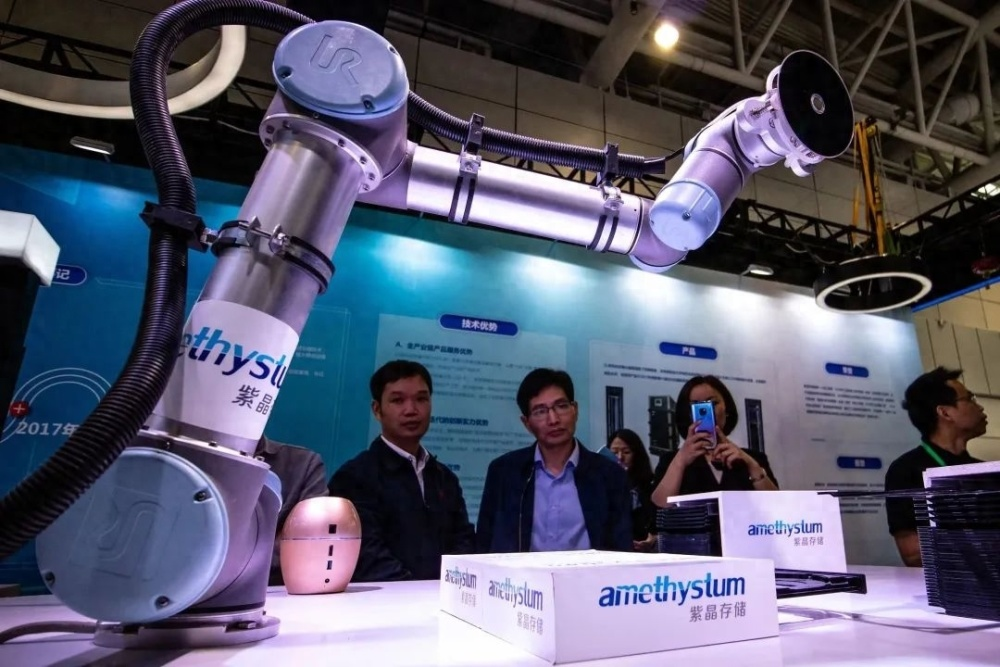

# 科创板退市第一股，148亿市值没了

“科创板退市第一股”紫晶存储，终于赔偿完了自己的投资者。

8月25日，紫晶存储发布公告称，给投资者的先行赔付专项基金已进入清算及审计阶段。截至6月30日，已经有约1.7万适格投资者与专项基金出资人达成有效和解，占总人数的97.22%；支付的赔付金额为10.86亿元。

此前，一位投资者在股吧里发帖感慨说：“赔付款到账了，差价损失57万，赔付率35%，是我赔得最多的一支股。”

在2023年7月终止上市后，紫晶存储沉寂了一段时间，又开始活跃起来。当初它曾在新三板挂牌，自9月起，根据规定，公司的股票又再次进入全国中小企业股份转让系统，挂牌转让。

自8月31日至9月15日，紫晶存储密集发布了15份公告，对公司章程、董监事会议事规则、股东大会议事规则等进行重新发布；宣布将自己的2023年上半年财报从原定的8月31日延迟到10月9日；并决定公司2023年第三次临时股东大会将在9月26日召开现场会议。

紫晶存储的动态引起了不少投资者的关注。有人在猜测它的财报内容，有人在股吧里提问公司是否有重组的可能。一位业内人士则表示，作为当初因违规欺诈退市的公司，它想再上市恐怕是不太可能了。

三年前，紫晶存储登陆资本市场时，头顶着“光存储第一股”的光环，上市首日股价曾一度大涨近300%。但在后来，这个头衔被“首批科创板退市公司”所代替，它也成为科创板欺诈发行“第一案”的当事公司。今年6月8日进入退市整理期后，公司的股价已经跌至只有几毛钱，市值不到1亿元。

但作为曾经的一家百亿市值公司，它在“翻车”后留下的余波，现在也仍在持续。

“光存储第一股”的风光

2023年4月，紫晶存储“暴雷”事件靴子落地。证监会下发《行政处罚决定书》(下称《处罚决定书》)，紫晶存储正式被认定存在欺诈发行及违规信披两项违法事实，并由上交所依法启动重大违法强制退市。

而此时，距离紫晶存储的上市，仅仅只有三年的时间。

根据公司简介，紫光存储的主营业务是海量光存储设备（新型智能光盘库）和高端可刻录蓝光光盘的研发、生产和销售。其创始人郑穆是广东梅州人，在上世纪90年代，他进入当时流行的音像业，任广州永通音像制作有限公司的工程师，后来又曾在一家光盘制造企业任职。

计算机行业中，光盘和磁带、软盘、硬盘等，同属于外部存储器（外存）。静态随机访问存储器(SRAM)、动态随机访问存储器(DRAM)和可编程只读存储器(PROM)等，则是大家常说的内存。闪速存储器（FLASH闪存）作为新型芯片存储器，则既可以用作内存，也可以用作外存。

随着移动互联网逐渐普及，以及个人电子设备的技术发展，这一行业也发生了变化。磁带机、软盘和硬盘逐步被取代。FLASH闪存、DRAM内存和光盘，成为存储器领域的“三大金刚”。2005年左右，日本索尼公司率先开发出了蓝光存储技术，在国内当时很少有企业能够生产。

郑穆从其中看到了机会。2010年，他回到老家，创办了紫晶光电，这就是紫晶存储的前身。

紫晶存储主要生产的产品是一次性记录蓝光光盘（简称“BD-R”）。那时，“光盘”在C端消费中已经逐渐衰落，很多年轻人甚至对它都已经有些陌生。

但在企业级市场，随着数据量的飞速增长，有观点认为，80%的数据都会沉淀为冷数据。一般在企业中，大量较少被访问的数据，被称为“冷数据”，存储这类数据时，光盘就独具优点了：它存储成本低、安全性高，存储寿命较长，还更节能。BD-
R也开始受到重视。

有机构也给这一市场的发展给予了肯定。东方证券在2020年的一份研报中曾表示，未来，随着单张1TB容量的蓝光介质的量产，以及全息存储技术的落地，光存储介质的性价比有望进一步提升，从而拉动光存储的市场空间。而当时全球共9家企业底层编码策略通过国际蓝光联盟认证，其中仅有紫晶存储一家是中国企业。紫晶存储，也就冠上了“光存储”的高科技概念。

 _▲（2019年的某展会上，紫晶存储进行光盘展示）_

市场开始对紫晶存储投去关注的目光。在IPO前，从2016年至2019年，紫晶存储获得了5轮融资。值得一提的是，在2017年，紫晶存储的前十大股东里，还悄然出现了王思聪的身影。紫晶存储在那一年6月定向增发1.64亿元，认购价7.1元/股。其中，王思聪的天津普思资本一号资产管理合伙企业认购了704万股，花了5000万元，成为公司第四大股东。

趁着这阵东风，紫晶存储拿出了一份靓丽的成绩单，准备冲刺上市。公司招股书显示，2016年至2019年，紫晶存储全年营收总额分别为1.49亿元、3.13亿元、4.02亿元、5.16亿元，净利润分别为3308万元、5364万元、1.04亿元、1.38亿元。

业绩“节节上升”，紫晶存储获得了资本市场的青睐。2020年初，紫晶存储登陆科创板，发行价21.49元，发行4759.61万股，募集资金合计10.23亿元。紫晶存储上市首日，可谓风光无限。当日股价收报78.24元，大涨264.08％，总市值达148.95亿元。作为创始人的郑穆，身家也接近30亿元。

但在一片欢腾的气氛里，也出现了异样的音符。此前，紫晶存储曾在新三板挂牌。2018年7月，公司从新三板摘牌时，其交易价格仅为7.54元，总市值不到9亿元。因此，当时也有质疑称，紫晶存储突然业绩腾飞，背后是否存在猫腻？

毕竟，企业级市场一般对大容量存储的需求较高，知名海外厂商如三菱、松下、索尼等，均拥有100G以上大容量存储的BD-
R产业化生产线。紫晶存储量产的BD-R，容量还是25G。直至退市前，紫晶存储在大容量BD-
R方面还未实现量产。换句话说，紫晶存储确实存在前端技术，但优势实际上并不明显，而且实际应用产品也未落地。

但在当时，市场已经被“光存储”概念的狂欢所淹没，并没有注意到这些声音。

果然，在上市一年后，紫晶存储业绩就“变脸”了，彻底被打回原形。但令外界大跌眼镜的是，事实的真相比他们之前想象的还要劲爆。

爆雷始末

紫晶存储在2020年，交出了一份和之前大相径庭的财报。公司全年营业收入5.63亿元，同比增长8.97%；净利润1.04亿元，同比下滑24.71%。归母净利润仅有685.55万元，同比大幅下滑了93.39%。

在2021年，紫晶存储干脆出现了大幅亏损。公司实现年营收4.58亿元，较上年同期下降6.69%，净利润亏损2.29亿元，较上年同期下降379.85%。对此，公司的解释是，这是报告期内公司光存储业务收入下滑导致的。

2021年初，限售期一过，紫晶存储就遭到了多家机构的多次减持。达晨系（包括达晨创通及达晨创联）和天津普思投资等多个股东，纷纷减持套现。

大股东“逃离”，紫晶存储的股价也跟着跳水。2021年12月31日，紫晶存储收盘价仅为22元/股，较上市首日的高点下跌了75%。

等到了2022年上半年，公司实现营业收入1.40亿元，较去年同期下降32.96%，净利润亏损1.33亿元，同比下降
673.15%。第三季度营业收入仅为1405.83万元，同比下降91.79%，净利润亏损5409.91万元，同比下滑了2464%。这样的业绩，可以用“惨不忍睹”来形容。

公司业绩大幅波动，早已引起了监管的注意。

实际上，自紫晶存储2020年年报发布后，上交所就相继对其进行了多次监管问询。在主要涉及的几个问题中，首先，在2020年的这份财报中，紫晶存储报告期内预付账款余额达1.36亿元，较上年大幅激增2.53倍，其中，预付技术开发费达7823万元。截至2020年底，公司相关坏账准备余额为4480.75万元，合并资产负债表的坏账准备余额为6485.98万元。

而在“预付技术开发”一项里，涉及9家供应商，均系紫晶存储首次合作，且集中在2021年3月解除合同并收回预付款项。对于这样新合作、合作期限短的厂商，紫晶存储却一下子100%支付了预付款。

这里边还有个小插曲。从上市后到2021年1月，紫晶存储一年内一口气连换了三家会计师事务所。第三家立信会计师事务所看到了这样一份财报后，出具了“保留意见”的审计报告，让紫晶存储成为科创板首家被出具“非标”审计意见的公司。同时，这也引来了监管的问询。

另外，公司的招股书中还表示，公司发生过核心业务模式的更改：在2020年以前，公司的主要核心业务为光存储产品以及解决方案，而在2020年2月上市后，公司转变为通过设立参股或控股项目公司，再经项目公司或其关联方具体开展业务。随着业务模式改变，在2020年的财报中，公司主要客户也做出了相应调整。

这一变化也被监管关注到了——公司2020年的主要客户中，数莲紫宸、紫晶天众、大地紫晶、中弘紫晶4家，均由同一家公司“广州达豪企业管理有限公司”直接或间接持股。巧的是，数莲紫宸、紫晶天众还是紫晶存储前五大应收账款欠款方。

上交所就此发函，要求公司详细披露与广州达豪合作洽谈的过程及合理性，各个参股公司的业务模式、财务状况、资金来源详情等。

第三，也是非常重要的一个问题是：在账上不缺乏货币资金的情况下，2020年年末紫晶存储长期和短期借款合计达到2.13亿元，较上年增长了88%，2021年上半年末又增长了17%。为此，上交所要求其补充披露借款的银行、期限、利率、资金用途等，尤其关注了，披露是否存在因质押、担保等出现资金受限的情形。

监管持续关注，以及业绩下滑的压力下，紫晶存储的种种问题终于“藏”不住了。

2022年2月，紫晶存储突然发布公告称，已被证监会立案调查。3月13日，紫晶存储发布《关于公司自查涉及违规担保事项》公告表示，已在监管要求下进行自查，从2021年3月至2022年3月，公司发生多笔违规担保，截至3月10日，共涉及13张存单质押，为第三方担保金额3.73亿元。

此后的三个月内，监管的7封问询函接踵而至，对紫晶存储的违规担保、资金流向等问题连连发问。2022年5月，紫晶存储被实施退市风险警示，披星戴帽，变成了*ST紫晶。2022年6月，因涉嫌信息披露违法违规，证监会决定对公司实际控制人郑穆和罗铁威进行立案调查。

紫晶存储的财务造假和违规担保事件，彻底浮出水面。

“欺诈发行首案”，罚款9000万

根据证监会的调查结果，紫晶存储在招股书和多份年报中，接连利用过虚构销售合同、伪造物流单据和验收单据入账、安排资金回款、提前确认收入等方式虚增营业收入、利润。调查结果显示，包括南京叠嘉、江西叠嘉、菲利斯通等20多家紫晶存储的核心客户，虚构业务，参与了造假；其中多家企业系紫晶存储前外部董事曹强、姚杰参股及兼职的同一控制下企业。

从2017年-2019年，紫晶存储三年间累计虚增营业收入超过4.3亿元，虚增利润总额超过2.1亿元。而根据招股书上的数据，这三年的净利润合计也不过才2.96亿元。去除虚增部分之后，以紫晶存储的营收和复合增长率，只怕难以符合科创板上市要求。

为了上市，紫晶存储虚构业务“注水”了自己的业绩。尤其是在紫晶存储提交IPO申请的2019年，公司虚增营收2.71亿元，虚增利润1.45亿元，占当期记载的利润比例为94.55%，其中有超过九成的利润都是“不存在”的。

但造假是会形成惯性的。到了2020年，已经上市的紫晶存储，造假力度居然变本加厉，更上一层楼——该年度公司虚增营收3.28亿元，虚增利润1.69亿元，占当期记载的利润比例为150.21%。这也就意味着，从2020年起，紫晶存储就已陷入了亏损泥沼之中。

面对这样的造假“勇气”，业界哗然。

同时，在招股书里，紫晶存储也隐瞒了高达1.35亿元的对外担保；上市后的三年中，其未按规定披露的对外违规担保余额也像滚雪球一样逐年增加，合计达到7.38亿元。

而上市公司若利用违规担保，是可以增加其财务造假隐蔽性的。一位审计人士向「市界」表示，例如，上市公司可用银行存款抵押，对外部公司A提供担保。被担保方A公司取得借款后，将资金流转给上市公司的客户，再作为销售回款支付给上市公司，通过这种方式，虚增销售和利润。“中间可能还多转了几层，就更加隐蔽了。”

紫晶存储最早的自查中提出，其违规担保涉及银行4家，涉及被担保方14家。从被担保人来看，多为紫晶存储客户和客户关联方。而紫晶存储的供应商和客户之间，也有着千丝万缕的联系。

也就是说，兜兜转转，其实就是同一批人在虚假贸易，套取资金，虚增营收和利润。紫晶存储的坏账准备和应收账款，自然也就居高不下。

证监会直接指出，时任董事长郑穆、时任董事罗铁威安排办理对外担保，组织、指使紫晶存储虚增营业收入、利润行为，参与洽谈相关项目，安排、筹措资金虚构收回客户应收账款，是直接负责的主管人员。

这一注册制下首例涉欺诈IPO案件，一度震动了科创板。在今年4月正式发布的《处罚决定书》中，证监会对公司和一众高管13人，总计罚款9071万元。紫晶存储被责令改正，给予警告，并处以3668.52万元罚款；实控人郑穆、罗铁威分别被处以2164.26万元、1803.55万元罚款。此外，郑穆被采取终身市场禁入措施，罗铁威被处10年市场禁入措施。

今年4月21日，紫晶存储停牌时，股价已下跌至2.4元/股，总市值仅4.61亿元；并在7月7日公司正式宣布终止上市。

但这起事件带来的影响，一直持续到了现在。

中信建投是紫晶存储的保荐人、主承销商。紫晶存储上市时，发行费用为1.39亿元，其中，仅保荐及承销费用就达到1.19亿元。

在2021年，上交所发函曾要求紫晶存储披露是否存在因质押、担保等导致资金受限的情形。紫晶存储在反馈中，否认了存在资金受限情况。而作为其保荐机构，中信建投发表的核查意见也称，“该公司披露情况与核查了解情况相符。”但随着调查结果的披露，紫晶存储有4笔违规担保就是发生在2021年3月至4月期间，
涉及金额2.325亿元。

中信建投也为此付出了代价，今年5月，其牵头出资并设立了10亿元资金规模的先行赔付基金，用于赔付适格投资者遭受的投资损失。目前，这一赔付终于告一段落。

在调查紫晶存储案中，证监会也对中信建投、容诚会计师事务所、致同会计师事务所，以及广东恒益律师事务所等中介机构启动了相关调查工作。它们后续是否面临继续追责问题，仍然是业界关注的对象。

紫晶存储背后的“光存储”企业市场，也被这场风波所影响。据报道，包括证通电子、奥飞数据等上市公司的部分旗下子公司也存在配合紫晶存储的现象。直至现在，业内仍然有人在质疑，是否有其他蓝光存储技术产研机构和企业，参与到了其中。

紫晶存储“带病闯关”，成为科创板上的负面案例。但对于整个资本市场来说，能够形成有进有退、优胜劣汰的合理机制，却未必是一件坏事。蓝光存储产业在这一波折腾之后，是否会迎来良性发展？

作者 | 杨 洁

编辑 | 孙春芳

运营 | 刘 珊

