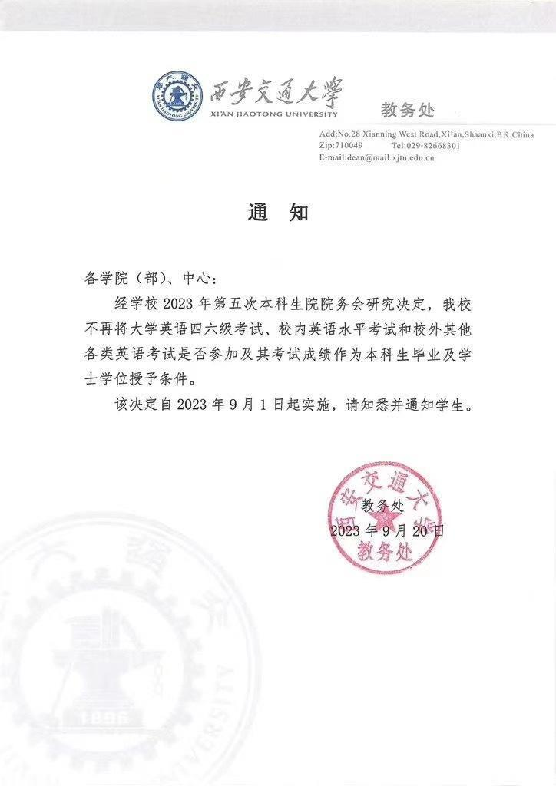

# 西安交大教务处回应“取消英语四六级与学位挂钩”：相关通知属实

近日，网传西安交通大学不再将大学英语四六级考试成绩作为学位授予条件。9月21日，该校教务处工作人员向红星新闻记者证实了这一消息的真实性。

网传西安交大教务处通知文件显示，经学校2023年第五次本科生院院务会研究决定，该校不再将大学英语四六级考试、校内英语水平专试和校外其他各类英语专试是否参加及其考试成绩，作为本科生毕业及学士学位授予条件。该决定自2023年9月1日起实施。

 _↑网传西安交通大学教务处通知文件_

上述消息传出后，在网上引发关注。9月21日上午，西安交大教务处工作人员告诉红星新闻，网传西安交大不再将大学英语四六级考试成绩作为学位授予条件的文件属实，但其他具体细节不方便透露。

红星新闻实习记者 胡闲鹤 记者 任江波

编辑 张寻 责编 李彬彬

