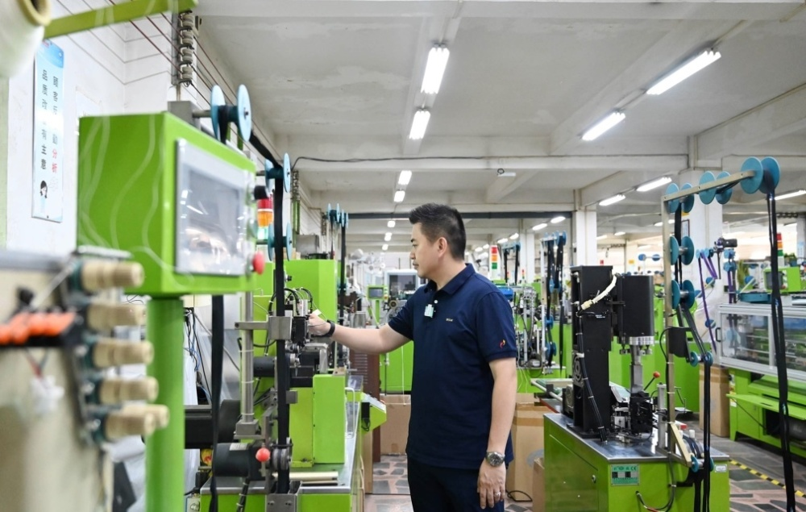

# 中国厂二代：把董明珠、马斯克当偶像，年赚千万却被老爸嫌弃

特约作者 | 别茕 实习作者|冯晔

编辑 | 陈弗也

出品 | 棱镜·腾讯小满工作室

一个月前，Ken和Leo在社交平台上正式官宣他们的社群。令他们没有想到的是，不足一月，已有百余名志同道合的朋友加入这个社群。这一百多人身上都有一个共同的标签：厂二代。

34岁的Ken生于在深圳发展的台商家庭，而30岁的leo则是潮商子女。因工作业务所需偶然相识的两个年轻人，看到身边很多厂二代都有关于“接班”的烦恼。两人一拍即合，创办厂二代公益社群——厂二代同学会。

“大家都想来找机会。”Ken介绍，在他们社群中，大湾区的厂二代偏多，他俩通过自己的人脉资源，举办过几期线下的企业走访活动，让更多不同行业的厂二代拜访知名企业，与相关负责人面对面交流。

在他们发出的活动照中，一群二三十岁的青年们脸上看不到普通职场社畜的疲惫与谦卑，他们自如地捧起酒杯与企业管理人员交流。

与讲究“闷声发大财”的父辈相比，年轻一代更愿意向外界展示自己。他们明白今天的商业社会能够吃独食者少之又少，互利共赢才能共生共荣。

无论是中小企业，还是国内外知名的巨头，在第一代、第二代企业家逐渐老去的时候，很多选择下一代接班，继续“家族企业”的风格，如碧桂园、海澜之家、格兰仕、万和等，他们的二代、三代已经全面或者逐步接班；有的则选择相信职业经理人，如美的。

如今，更年轻的95后厂二代们开始登上中国民营经济的舞台，他们生活优裕，接受过优质教育，但能否顺利传承民营企业家的风骨，成为了一个值得关注的话题。

“希望父母再坚持几年”

在《棱镜》接触的厂二代中，真正能全面接过工厂接力棒的人仍属少数。

“很多厂一代是闲不下来的。”1995年出生的James家住广东佛山市里水镇，父母白手起家经营一座50人规模的家具厂。他的父亲今年58岁，在接近退休的年纪，仍毫无退意。

彬彬用“精力旺盛”评价她的“厂一代”父亲。她的父亲都是重庆人，早年从家乡来到广东江门打工。那个时候，江门开平县的脚手架比较出名，父亲在工厂打工十余年后找到一个创业机会，开始自己办厂。

她的父亲今年已经56岁，也没有退休的计划，至今也没明确提及究竟什么时候让子女接手家业。虽然她的哥哥已经负责管理家里的分厂，但大多数重要的决定还是由父亲来做。

一代不放权，除了自身有精力看顾外，还因为刚刚步入职场的二代需要更多的磨砺，争取到父母或工厂老员工的认可。

彬彬毕业后，父亲让她在其他企业工作一段时间积累经验，回到家里的工厂后跟正常管培生一样进行轮岗，先后待过行政、财务、法务等各个岗位，父亲还会给她的工作刻意制造困难，以此锻炼她解决问题的能力。

“一方面让我快速熟悉工厂，另一方面也是让底下员工信服。”彬彬事后体会出父亲做事背后的两重深意。

有一段时间，彬彬常与父亲发生冲突。想做点事情，父母认为做得不够好，员工也理解不到她的用意，两边不讨好，她还要顶着多方压力咬着牙继续备考所需的资格证书，“很多厂二代因此与父母争吵不断。”

James有时也会与父亲吵架，但吵归吵，父亲也愿意听取他的意见。他曾建议父亲增加全屋定制板块，正好跟父亲的想法不谋而合，想法也得以顺利推进。

董月家的工厂在广东惠州，主要做塑料、纸质的工艺制品。还差三年，她的父母就快60岁了，身体欠佳的长辈能够卸下重担，董月也足以成长为独立接手工厂的管理者。

“说实话我还没想过三年就接班。”董月目前为工厂所做的所有规划都离不开父母，她评估或许需要个5到10年。

她私心希望父母再坚持几年，但父母等不了，尤其是“每次经过公园看到老人带娃的画面，他们就会焦急催我赶快接班。”

年赚两百万美金，却被嫌弃

Ken在社群中遇到的厂二代们，普遍困惑是如何在工厂获得更多话语权或资源，他们在意自己能否超越父母做出更好成绩。

尽管父辈没读过太多书，仅靠着对商业的敏锐和魄力挣出一份家业，从几十人的小团队到几千人的大工厂，这份成就在厂二代们看来依然望尘莫及。

Ken的哥哥曾有过三次创业经历，他的父亲问一年能挣多少钱？哥哥回答：两百万美金。这在厂二代中已经属于佼佼者。但父亲轻描淡写地说，“我一个月就挣到这个钱了。”Ken的父亲经营着电子组装厂和电池工厂。

很多厂二代都希望能够超越父辈们，但是，这并不容易。

在一次与朋友聊天中，James提到：你“很难在父辈擅长的地方超越他，只能弯道超车。”

在James的家里，父亲擅长的是车间生产，而他可以发力前端，帮助家里拿到更多的订单。过去老一辈办厂从不注重营销宣传，James花了三个月时间整理工厂资料。父亲看着他整日坐在电脑前，说他只知道玩电脑。

忙了一年，他果真通过自己的方式拉回第一笔订单，金额十六万，父亲再也没说过什么。今年开年，James告诉父亲，“我还是会主攻营销这块。”

在一些厂二代们看来，厂一代们能够在行业中突出重围，必然已形成一套他们认为被市场验证过的模式或方法，吃到红利的厂一代因循守旧是常事，很难主动寻求变革。

一场疫情改变了董月父母的观念。他们开始正视工厂的现状，接受新事物，尤其是看到董月在职场的工作表现后，逐渐认可董月在企业管理方面的看法及判断。

董月回家的第一件事，就跟父母沟通管理意识的问题。她关注到工厂有明显的淡旺季，人力供给会出现问题，需要有专门的的人力资源负责招聘，储备核心岗位的员工，“赶货压力大时碰上核心员工出‘幺蛾子’很容易被拿捏。”此外，她还建议增加工厂的员工关怀。

目前，董月和父母的分工是，父亲负责抓具体业务，母亲负责财务，她逐渐参与到管理事务中。

彬彬则是建议父母，要让工厂不同岗位的生产流程规范化，通过数据化的形式将生产经验固定下来，而不是像过去那样只是存留在某些员工的脑子里。

外界会不自觉地对比两代人的成就，子女急于自我证明的焦虑感在所难免。

但厂二代们清楚自己的优势，尤其是在接受过比父母更好的教育，获得更高的学历，有更广阔的视野后，没有人只想单纯地守住家业，要么选择跳出家里创业，要么是在家业基础上二次创业。

《棱镜》接触的人中，董明珠是很多女性厂二代心中的企业家偶像。在对董明珠的评价中，女性厂二代们经常提到的是：敢想敢干，在员工管理方面有手段有魄力。而在男性厂二代心目中，偶像企业家是埃隆·马斯克，原因是他注重产品，理性果决，把商业做得有趣、有价值。

自由选择人生的机会

按照电视剧的套路，厂二代往往拿的是被父辈安排好的人生剧本，人生每一个脚印无不是为了有朝一日“接班”。

但在《棱镜》接触的厂二代中，他们有的人所学习的专业大多与家里工厂主营业务大相径庭。有的厂二代家里是做塑料工艺制品，他却读的是播音主持专业，还有的厂二代家里开服装厂，他却选择了室内设计。

姜海粼读大学时本想着学化学，毕业后可以回家帮衬父母，但母亲却让他依着自己的兴趣选了游戏编程。

她今年24岁，上海人，父母从事重化工行业，工厂设在厦门。海外留学归来后，她至今无法忍受拿着七千多工资却日日加班至凌晨三、四点的社畜模式，父母也没有让她进入自家工厂。“因为他们之前在这行受过苦，让我过得开心快乐就好。”

初中以后，姜海粼就被父母送到英国读书。迄今为止，她曾有两次试探性跟父母提起未来接班的事，都被父亲拒绝。

第一次是在高中的一个假期，她回国看牙，父亲到机场接她。坐在车上的时候，是她与爸爸难得的独处时光。趁这机会，她聊起自己未来可否回家里工作，父亲明确表态，“不要想了，跟你没有关系，你走自己的路。”

第二次是在毕业半年后，她再次询问是否能回家里工作。爸爸在短信中做了解释：“公司是夕阳产业，很多人都坚持不下去，爸爸不想你受累。”他的爸爸告诉她，他身边已有同行把厂子转让出去了，未来自己也打算把厂子转让或关掉。

由于不甘心，姜海粼把爸爸的短信分享到社交平台，引来大量相近行业厂二代的宽慰。“但凡有一点可能让你接班的行业，家里人都不会说关掉就关掉。”一位网友评论她。

James本硕都毕业于美国，学习应用经济与金融。按照这样的脚本，作为留美金融精英的他，要么留在美国闯荡华尔街，要么出现在国内某栋高档写字楼从事金融工作。

但他在留学时就跟身边的朋友说起：“以后一定是会回去的（接班）。我回来的话，还是想带来不一样的东西。”

James的父亲告诉《棱镜》，接不接班还是看孩子的意愿，如果愿意接就接。他身边有很多朋友的工厂，转的转，关的关，孩子不愿意接，只能收档，真正能传下去的还算少数。

《棱镜》发现，在厂二代的群体中，愿意进入大厂打工的不多，他们非常清楚大公司打工人的螺丝钉角色，作为短期的观摩学习倒是有益。选择进入公职单位则是凤毛麟角。

Ken和Leo都跳出了家族自己创业，“家里也没有所谓的（接班）时间表。”他们在自己的主营业务上，已能反哺到家里的产业。

Leo认为他现在的事业更有价值，他曾经遇到外国人嘲笑中国产业，萌生通过拍摄视频向海外推介国内出色制造业工厂的念头，希望以此改变中国工业的海外形象。而Ken则致力于为大陆优秀企业对接台湾以及海外市场。

有了自由选择的机会，厂二代的焦虑还更多体现在自我价值的寻找及实现上。

“优秀职业经理人可遇不可求”

七年前，原本计划着退休就把厂子卖了的父母开口让晨晨回工厂上班，这也是父母第一次向她提起接班的话题。“真正到放弃（工厂）的时候，他们还是不舍。”

留学归国刚到工厂上班时，晨晨不过是个26岁的女孩。父母在青岛有一座服装加工厂，有相对稳定的外贸加工订单。尽管父母创业艰辛，但作为家里的独女，从小生活无虞的环境让她比大多数同龄人过得轻松。

26岁的晨晨到公司一开始只是“打打酱油”，真正进入角色是在29岁左右。这一年她也成为了孩子的母亲，更能明白父母办厂肩上背负着全体员工的期待，“如果厂子一卖，这些跟着爸妈干了几十年的工人，就突然失去了工作，以后他们怎么办呢？”

在26岁之前，父母不曾干涉她的职业规划，她按照兴趣选择成为一名室内设计师，在国外工作的几年里，她累并快乐着。

接班则是父母的“套路”，趁着她回家休假，父母开口让她接手家里的工厂。现在想想，能接班何尝不是幸事，她去打工肯定是挣不到办厂能挣的钱。

接触到工厂工作后，她才得知，父母在工厂年轻一代中培养过一位接班人。对方各方面能力突出，但最后还是计划离开工厂另立门户。“好不容易遇到这么一个人，他要走你能怎么办？”

这是无数规模不大的中小型工厂都可能会面临的问题：选择职业经理人还是让自家人接棒？

“他们（父母）也在权衡，但凡有更好的选择，他们都不会找我。”如今的晨晨站在企业家的角度完全理解父母的做法，企业家都希望工厂能走得更远更稳健，但是优秀的职业经理人则是可遇不可求，这个人可以是外聘也可以是自己人。

同样是管理着规模不大的家具厂，James和他的父亲都认为是否请职业经理人还得看企业发展阶段。在中小规模时，一方面没有能力高薪聘用职业经理人，另一方面行业利润薄，门槛不高，职业经理人本身对行业足够了解，“为啥不自己干，还要给人打工？”

不论是否真正接班，家族工厂的发展都是厂二代们心系之事。

晨晨也在为父母的服装厂找新的出路，她想到可以做直播，推出自己的品牌——虎虎妈妈，为工厂带来更多国内的C端客户。

Leo家里的文具厂主要在汕头，宏观环境和疫情双重影响下，工厂求稳已是不易，但在商人看来，没有增长就意味着潜藏的危机。“我们曾往美妆方向靠，做眉笔、化妆笔，但只能解决燃眉之急。”

这几年，Leo常常会与父母探讨新的商业模式，以期能让工厂焕发新生。“实体企业像是一头巨牛，转变方向需要过程，也要给父母时间。”他的父母已尝试他的建议，转向C端。

（应受访者要求，彬彬、姜海粼为化名。）

