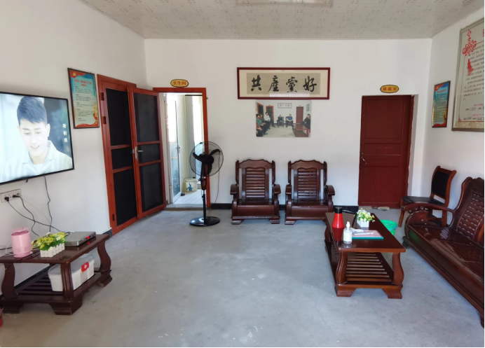
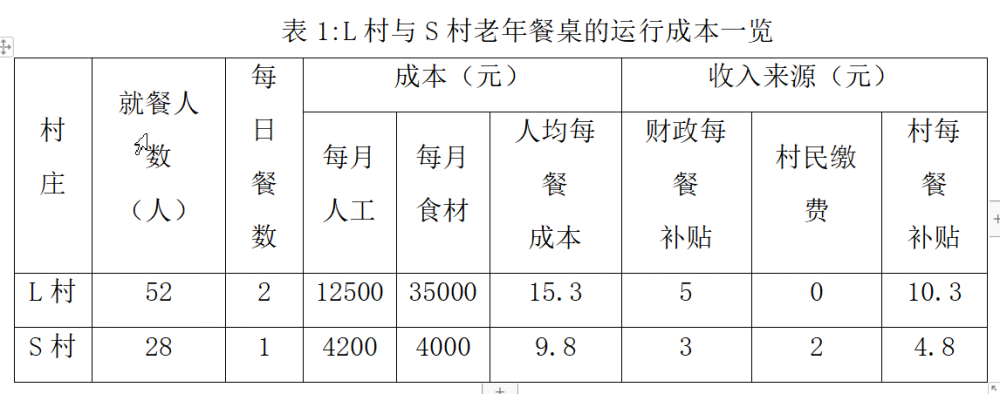
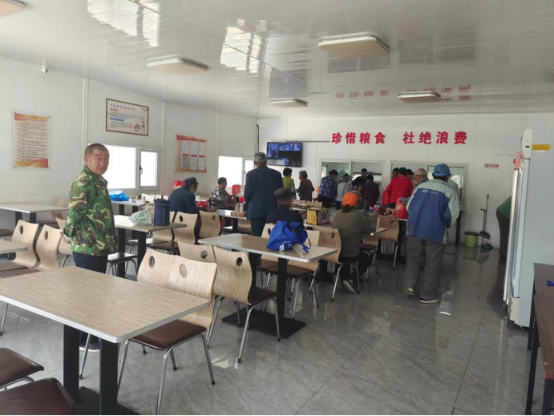
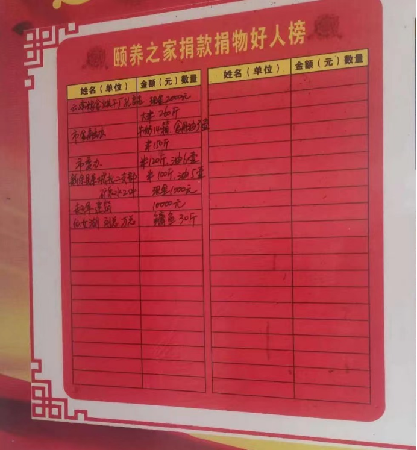

# 北京农村提供免费食堂，很多老人觉得难吃，饭菜打回家又喂给了狗和鸡

**核心要点：**

  * _1_ B村的养老驿站从2017年开始运行。目前共有14位老人在此接受服务，包括5个入住老人，6个送餐老人，3个自己来吃的老人。这14位老人平均年龄都达到了70岁以上，其中5位入住老人分别为88岁、84岁、83岁、78岁、81岁，他们都没有老伴，子女也都在外打工。
  * _2_ J村严格遵循了不允许向老人额外收取费用的要求，不仅增大了村里的经济负担、也没办法保证送餐员获得稳定的送餐报酬、还没办法保证送餐是否能及时按时，整个送餐运转的非常艰难。在此情形下，村干部的积极性更不强了，老年餐桌成为了该村极大的思想负担和经济负担。
  * _3_ L村老人爱吃面食，但相比于米饭，面食更耗费人工和时间，要以较为合适的价格雇佣一个负责用心的面食师傅并不是非常简单的事情。很多老人打了饭菜回去后觉得难吃，又将食物都喂给了家里的狗和鸡，带来了食物资源的一种隐性浪费。
  * _4_ S村采用2元/顿的收费标准。收费后不仅村民们比之前吃得好了，“原来两个菜一凉一热、现在都是热菜，光是肉钱一个月就需要差不多800元。以前买菜一买就是半个月以上，现在买菜最多一周，保持菜的新鲜。”

（相关阅读：[银川300多亩农田变垃圾场，为何多年无法解决？多部门踢皮球，谁该担责？
](https://new.qq.com/rain/a/20230921Q010C600)）

**何盼**

**（武汉大学社会学院博士生）**

“根据国家统计局发布的数据，截至2020年底，我国60岁及以上老年人口达到2.49亿人，占总人口的17.9%。其中，农村老年人口占比高达44.5%，达到1.11亿人。”

这生动地反映在我们每一次调研里，无论是发达的北京京郊、浙江等地村庄，还是条件更差一点的中西部村庄，本村人口都大量外流，常住在村的村民以一老一小为主（伴随着教育进城，在村庄里连小孩也很不常见了）。

这次暑假我和同学前往的江西某村庄，全村600人左右的常住人口里，60岁以上老年人占比70%，在村人口平均年龄达到了55岁。可见，在城市化高速发展的今天，村庄高度老龄化已经成为全国绝大多数农村的普遍情况，老人成为村庄里最大比例的一批人。

在此背景下，如何安顿好老年人在村的生活，建设老人友好型村庄，是值得深思和探讨的问题。

在传统的农村，村庄里自有一套循环机制，可以将很多潜在的风险向内消化。如养老，在过去似乎根本称不上风险或问题，“儿子养老子，天经地义”，村庄的流动性也较弱，以家庭为单位的养老可以通过家庭人口的简单再生产实现有序的继替，而且在自给自足的村庄，再不济也能有口饭吃、有口汤喝。

而在城市化的不断冲击下，市场的经济理性不断冲击伦理、文化与情感，家庭也不再以稳定的姿态停留在村庄中，而是在城乡间流动、变形、撑开，土地倒还仍保留了一定的社会价值，但也可预见“末代农民”的老去与退场。可见，农村家庭养老的文化、结构、功能，三个层面都在城市化的进程中被弱化与冲击，老人养老成为了溢出的“剩余事务”，从私人生活领域进入到了外部力量可以并需要介入的公共服务领域。

目前，国家与地方都将提高农村养老服务供给能力作为重要的民生工程，也投入了大量资源，但效果却参差不齐，很多地方出现了资源大量投入、服务供给效率却并不高的状况。好心未能办成好事，还带来了巨大的资源浪费，不免让人感到唏嘘。

笔者从5月～8月开展的三次调研，前往了北京两个郊区农村和中西部地区两个相邻的山区村，都关注到了当地所尝试推行的各种养老服务供给方式。其中，老年餐桌与吃住一体的村内养老驿站是目前两种比较普遍的服务方式，各地间相关的制度设计大差不差，但其实践方式、资源基础、社会条件却有所差异，运行效果也颇有不同，这引发了笔者的思考和感触。

一、两种失败与两种成功

（一）资源匮乏的中西部村庄

J村与B村都是中西部某农业县的亮点村，两个村都是自新书记上台后大力发展产业，得到了来自上级领导的关注和各种资源倾斜，作为明星村，乡镇对其各种工作的要求也提升了上去，其中就包括养老驿站的运行。但相比之下，B村的养老驿站发展良好，并成为了很多村学习经验的“先进村”，而J村的养老驿站却在2022年后难以为继，不仅撤掉了一个服务点，且将其从吃住一体的标准点降为仅提供吃饭服务的老年餐桌，应付式地保留着这个来自乡镇的硬性规定和要求。事实上，两个村庄相互毗邻，资源状况、发展状况、社会条件等都非常接近，但B村养老驿站运行状况确实优于J村，个中缘由可以从B村养老驿站的发展和运行过程去寻找一二。

_图1：养老驿站内部一览_

B村的养老驿站从2017年开始运行，等到2022年，一方面是村里老人确实有这个需求，另一方面也是上级希望明星村的养老驿站能达到15人以上规模，于是该养老驿站从村内一处小平房搬迁到了村庄靠近马路的幼儿园旁边，并从只有吃饭、送餐服务升级为了吃住一体的标准点。目前共有14位老人在此接受服务，包括5个入住老人，6个送餐老人，3个自己来吃的老人。这14位老人平均年龄都达到了70岁以上，其中5位入住老人分别为88岁、84岁、83岁、78岁、81岁，他们都没有老伴，子女也都在外打工。

养老驿站的良性运行，最基本的条件离不开人、财、物三个要素。一个10人规模的吃住一体养老驿站的成本每月大概为4千元，一年大概5万元开销。主要包括：食材费，大概占到50%，电费、水费、燃气费、房租占25%，厨师工资1000元/月，占比25%左右。而主要收入来源分为这五块：一是每个老人交纳的200元/月费用（送餐老人需要多缴纳200元/月的送餐费）；二是100/人的政府补贴，且其中厨师为公益性岗位，只有贫困户能申请，由乡镇财政负担；三是乡贤的捐款、捐资；四是挂点帮扶单位每年10000元的补贴；最后是村里集体经济的补贴。从账目上看，老人交纳的费用几乎覆盖了食材开支，而政府补贴则覆盖了水电燃气等硬性开支，事实上村里的经济负担并不是特别重。

_图2:养老驿站某月收支状况_

这其中关键的因素在于，B村以一种“低成本营运方式”，将大量成本或内化、或交付给社会来消化，而没有使其外显化为村庄难以承受的负担。包括：

一由分管养老驿站的治保主任兼责给养老驿站买菜，J村则是另外聘请了一位专职买菜的人，每月需要额外支出1200元工资。因为养老驿站开支的高低会直接影响到村集体需要倒贴多少，相比之下，兼责的治保主任不仅不需要额外的工资开支，还因为村集体倒贴多少会影响村干部工资与绩效发放，而更加以精打细算的方式控制成本。

二是将送餐服务的成本有限度地交付给个人。

村庄中存在这样一批老人的需求，他们往往一个人在村庄里独居，有些腿脚的毛病但又没有丧失自理能力，还能在家里种点菜养点鸡，这时候送餐服务对他们来说便是非常必要且关键的外界支持。但这时，如何解决送餐员这笔额外的工资成本便成为了需要村干部思考的新问题。B村的解决办法是，每位需要送餐服务的老人需要额外缴纳200元费用，并找来一位在村里带娃的妇女，答应其每月最低800元工资的保障，即如果只有2人需要送餐，那么村里额外补贴400元，如果有5人需要送餐，那么1000元全部归这位送餐员。

这样一个举措实际上是实现了多方共赢，对老人而言，如果以私人雇佣保姆而非养老驿站送餐的方式来解决自己的饮食需求，那么每月成本大概会达到800元（工资600元+食材），现在他能以一半支出便获得更为新鲜且有品质的食品保障。对送餐员而言，她本身是在家赋闲的妇女，送餐其实就是一种另类的外卖员，能够在家门口得到一笔额外且稳定的兼职收入。对村庄而言，其等同于将送餐服务外包了出去，只需要管理而不需要自己承担送餐工作的繁琐和压力，同时对村庄而言成本也是尽可能的最小化了。

相比之下，J村却是完全地按照制度规定，严格遵循了不允许向老人额外收取费用的要求，不仅增大了村里的经济负担、也没办法保证送餐员获得稳定的送餐报酬、还没办法保证送餐是否能及时按时，整个送餐运转的非常艰难。在此情形下，村干部的积极性更不强了，老年餐桌成为了该村极大的思想负担和经济负担。

三是明确家庭养老责任与村庄养老服务的边界，避免超出村庄负担能力的社会压力和风险责任。

由村来运营养老驿站，对笔者而言，会担心其中存在两个风险：

一个是老年人本身的安全责任问题，即养老驿站中老人的人身安全，应该由谁主责？二个是是否会出现家人将老人放置在养老驿站后不管不问，反而破坏了本地作为宗族性地区较好的家庭养老文化基础，带来了不良的示范作用？总结而言即是一种权责错位问题：村庄服务供给能力的水平与村庄承担的责任风险大小错位。

B村的治保主任说了一句很触动笔者的话“村里只能管理场所，不涉及管理具体的人。”事实上，村庄中以村集体为经营主体的养老驿站必然具有的是纯粹公益性的一面，而很难有市场性的一面，这也意味着其承担成本、风险的能力和动力本身是相对较弱的。在这种情况下，让村庄去承担易发生但又难预料的安全风险，以及去完全替代家庭发挥养老功能，都是不明智、不可取也不可能的做法。目前B村的做法是，只收留有自理能力的老人，做好场所的安全管理和老人的安全教育，但风险责任由其自担，并要求老人子女每周至少回来看望一次老人。

通过这样的方式，B村养老驿站的运行既得到了老人家庭的监督，但避免使其陷入到对一些小概率事件的“不可控制又非要控”的困境之中。然而现在乡镇还在组织各个村的养老驿站负责人去参加护理培训，这既给相关的村干部和管理员们增加了负担，也很难在实践中真正推行，更有可能造成上述权责错位的风险和治理成本激增的困境，“低成本、高福利、可持续”的养老服务供给反而不可维系。

（二）

资源密集的北京农村

S村和L村都位处北京较为偏远的农业区，两个村都有较为成熟的水果产业基础，两个农村老年人如果有3亩左右大小果园，那么种地收入与养老金合计收入大概5万元每年，远高于同年龄段中西部农村老人几千～一万元左右的年收入。从2015年开始，S和L村开始试点推行老年餐桌。其中，L村的运行方式是：70岁以上的老人可以来老年食堂免费领取中饭和晚饭，每天大概有50人左右过来吃。由于完全免费，所以老年餐桌的运行完全依靠财政补贴和村集体补贴，一年支出大概达到70万左右，而村里自身大概要承担40～50万元的额外支出。而s村只提供中饭，并且从今年3月开始试行收费制度，每顿收取老人2元钱，村里一年大概需要倒贴5万元左右来维持老年餐桌的运营。

_L村与S村老年餐桌的运行成本一览_

然而，L村如此高额的投入却并没有带来高效的福利，反倒是S村实现了相对意义上的 **“低成本、高福利”**
运行状态（虽然相比于中西部地区，还是有“财大气粗”之感）。

从我们观察到的情况来看，L村老年食堂的参与率是相对较高的，几乎所有生活在村庄中的符合条件的老人都会选择到养老食堂吃饭。但从另一个意义来说，这样一种极高的参与率是在由政府承担所有成本、作为“免费的午餐”而带来的虚假繁荣。很多L村村民认为“不要白不要”，并表示如果食堂开始收费，即便是一块钱也不愿意继续在食堂吃。作为食堂，不可避免的只能以大锅菜的形式去为老年人们提供饭菜，而且当地老人爱吃面食，但相比于米饭，面食更耗费人工和时间，要以较为合适的价格雇佣一个负责用心的面食师傅并不是非常简单的事情。这确实是一个客观存在的条件限制，在此影响下，很多老人打了饭菜回去后觉得难吃，又将食物都喂给了家里的狗和鸡，带来了食物资源的一种隐性浪费。

这从表面上看，无非是食物不好吃带来的必然浪费，但更进一步深思其中的关系，却是一种公私权责淡化与不匹配的客观结构性因素在发挥着作用。对村民而言，这是“不要白不要”的公家资源，既然是均等的、不加附加条件的，那么如何处置、如何使用也不会去精心考量。对村集体而言，这既然是“无条件赠予”的公家资源，既然是不索求回报的、普惠的，那么村民们便也没有权利去提出反馈和要求，否则便变成了“白给你的还挑剔”。

可见，“无条件”的背后，它首先造成了一种“虚假繁荣”，即没有那么迫切需求的老人也出于白拿的心态参与其中（比如将饭菜喂狗的老人，有没有老年食堂其实并不影响他自己的日常生活）。其次它带来了一种权责的松绑，村民没有权利去对食堂供给的饭菜质量提出要求，食堂饭菜仅仅停留在了对安全这一底线要求上，而村集体也没有很强地回应村民诉求的动力，即便听说有的村民将饭菜拿去喂鸡喂狗，食堂饭菜口味也并不会因此得到提升和改善。在这两个因素影响下，老年食堂“繁荣与浪费并存”的矛盾状态便能够得到理解。

 _图3:热闹的老年餐桌_

而S村从3月10日开始收费，以2元/顿的收费标准，一个月实收50元。收费之前有28人在村里食堂吃饭，开始收费后有20个人还继续吃饭，他们都是长期在家的独居老人，确实有在食堂吃饭的需要。开始收费之前村干部每家每户都将政策通知到位，以成本来算，至少得有15人来村里吃饭食堂才能运营的下去。试运营了一个月，收费后不仅村民们比之前吃得好了，“原来两个菜一凉一热、现在都是热菜，光是肉钱一个月就需要差不多800元。以前买菜一买就是半个月以上，现在买菜最多一周，保持菜的新鲜。”而且为了避免不必要的浪费，除了5位不能自理的老人，其他15位老人都被要求在食堂里吃饭，交了钱后，老人们自己都互相盯着，不能让浪费。

从S村的实践经验来看，首先，该村识别了村庄内部真正需要老年食堂的需求群体，即长期在村但子女可能不在身边的老人，买菜、开伙做饭对他们而言是一件既不够经济也有些麻烦的事情。其次，在村庄负担限度和老人心理边界之间寻找平衡。对农村老人而言，相比于不顾经济单纯追求品质，经济是第一优先级，品质则排于经济之后，但如若能在有限度的支出内获得更高品质的服务，该选择会成为更为理性的选择。对老人们而言，没有食堂之前他们同样有吃饭的需求，时间、水电、食材等等便构成了一项必要的消费开支，预留出了成本承担空间。因此，当老年食堂的收费与其能够保持基本持平时，适当收费并不会成为明显的阻力。最后，在降低成本、避免浪费的同时提升服务供给的质量。通过有条件地收取费用，S村的老年食堂将原本仅作为被服务对象的老人也被吸纳为了责任主体和监督主体，在降低政府运行老年食堂的成本同时，反而推动了老年食堂的经营效果的提升。

二、“低成本营运”的关键机制何在

从成本、效果两方面综合来看，江西B村养老驿站运营优于北京S村养老驿站，进一步优于江西J村老年食堂，最后优于北京L村老年食堂。

_四个村庄的运行成本及其效果比较_

**一、寻找切实的村庄养老服务定位：避免越位**

村社养老与家庭养老和社会养老都是是有边界的，政府无法取代家庭去完全地发挥养老功能，也无法像社会养老那样提供完全专业化的养老服务。对完全有自理能力的低龄老人而言，他们不仅有很强的自养意愿，也有很强的自理能力，此时村社能做的，应当是尽可能保证他们“有地方去，有事情做”。而对于真正失能的老人而言，一方面他们的生活世界已经完全从村庄退入了家庭，另一方面家庭从年龄结构看也进入了相对有序的代际接替秩序，此时家庭养老应当发挥更为主要的责任。真正需要村社介入日常化养老的，应该是夹在其间的过渡老人，即自养能力弱化而家庭照养能力不及的老人群体。

B村和S村事实上都将养老服务兑现限定在了这批老人，其中B村通过直接制定限制性入住条件，S村则以收取适额费用的方式，筛选锁定了这批真正需要养老驿站与老年食堂的老人。他们并没有完全失去自理能力，但又有日常照料和安全监护的需求，且该需求很难完全通过家庭充分获得，村社养老的方式既承接了这批老人的照料需求，又不必将大量资源投入在老人护理上，而是把做饭、起居等作为最基本的养老服务内容，没有强行让不专业的人去做专业的事，具有可持续性。

**二、把握内生的村庄养老服务需求：尊重主体**

在调研中我们感觉到，目前很多地方的资源投入和服务供给思路陷入了一个怪圈，即认为“给的越多越好”，但最后的结果往往却是财政负担巨大、资源浪费突出、灰色利益空间扩大、民众也没有得到相应的实惠，反而成了“多方共输”的局面。通过理解B村和S村较为成功的养老经验，一个关键之处在于尊重主体，即通过各种方式去调动和激活老人、家庭的主体性。这种尊重主体表现在两个方面，一是以适当收费而非完全均等化福利的方式，更加精准地匹配需求群体，将有限的资源投入在了真正需要的人身上。二是通过创造利益连接机制，如适当收费、互相监督、家庭探望的方式，将老人本身及其家庭都纳入到村社养老服务供给的秩序中，成为重要的参与主体和监督主体。

**三、实现多元的村庄养老服务供给：动员社会**

政府的资源再多，也是有限度的，尤其是在中西部农村，在原本村庄资源状况就非常有限度的条件下，不多的资源还像撒胡椒面一样广泛地铺开在产业振兴、治理亮点、环境改造等方方面面，进入民生工程的资源更加受到限制。在B村，通过干部兼责、动员乡贤捐资捐物、适当收费（如送餐费，对村民而言，400元送餐比800元自己雇佣保姆是更划算而且质量更有保证的）等方式，不仅尽可能节约资源，而且也缓解了村庄去承担民生工程时面临的巨大财政压力。而在S村，虽然村里的老年食堂只提供中餐，但村庄通过动员在村餐饮企业的方式，为在村老人争得了“两个鸡蛋一瓶牛奶”的早餐福利，这大大提高了村民的幸福感和满意度。

_图3：养老驿站的捐款捐物公示_

具体而言，两个村庄之所以能够实现一个相对有效的“低成本、高福利、可持续”的养老服务供给，是在需求匹配、成本控制和资源转化三个方面形成了良性互动的机制。在调研中，我们感觉到，资源始终是有限度的，资源分配也是不均衡的，这种不均衡不仅仅存在在地区之间、还存在在村与村之间，我们没有办法忽视资源无序浪费以及资源分配不均的现实状况。其次，资源的多寡只能部分地解释问题，资源如何在实践过程中真正激活社会、激活主体才是成功办事的关键。拿到的卡牌显然并不代表最终结局，还要看出牌手如何灵活运用手中有的牌，来为自己创造更好的局势。

三、思考

B村和S村的经验让我们更进一步思考的是：

（1）在以提供更高水平服务为目标的服务型政府打造过程中，是否包办一切就意味着服务能力的提升、就意味着民众满意度的提升，“免费的是否就是最好的？”，从实践中看，这是需要存疑的。

（2）资源激活社会的条件和限度在哪，我们在多大程度、什么方面必须依靠社会主体的积极参与。从调研情况来看，运行状况较为良好、且表现出可持续发展样态的社会政策，其背后都有以各种方式激活与普通民众之间的利益关联、打造着新的互动关系，值得进一步思考。

