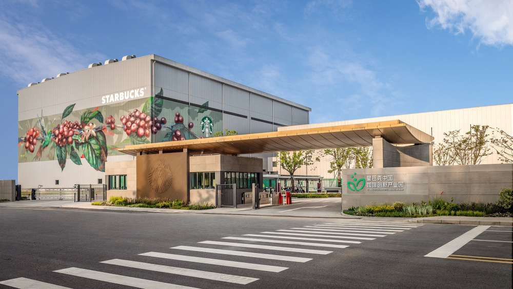

# 星巴克中国狂飙，投资15亿元加码供应链，平均9小时开一家新店

本文来源：时代财经 作者：王言

中国咖啡战事愈演愈烈，星巴克不断将产业链向上游延伸。

近日，星巴克中国咖啡创新产业园在江苏昆山落成投产。该产业园建设期间追加了两轮投资，总投资额达15亿元（约2.2亿美元），是星巴克在中国为了打造咖啡生产和物流基地所进行的最大投资。

_星巴克中国咖啡创新产业园。图片来源：星巴克中国_

根据官方资料，星巴克中国咖啡创新产业园总占地面积约8万平方米，核心主体分为咖啡烘焙工厂、整合物流中心和咖啡之旅体验中心三部分，覆盖了咖啡豆产业链上的进口、烘焙、包装、储存和物流等环节。

星巴克中国相关负责人告诉时代财经，该产业园投产后，星巴克将把来自包括中国在内的30多个国家和地区的阿拉比咖啡豆运到这里烘焙，再发往全国门店。

未来，星巴克在中国所有门店所使用的咖啡豆都将主要来自本土烘焙。在此之前，星巴克在全球的烘焙产能主要集中在美国与荷兰。

**加大上游投入**

今年以来，星巴克持续加大在中国市场的投资力度。

就在星巴克中国咖啡创新产业园投产的一个月前，星巴克宣布在深圳福田开设星巴克中国创新科技中心，预计未来三年首笔投资金额约为15亿元。

算上此前星巴克在中国云南设立的咖啡种植者支持中心，星巴克逐渐在中国打通了咖啡的种植、加工和销售的完整产业链。

与此同时，门店扩张也在提速。按照星巴克全球CEO纳思瀚 (Laxman Narasimhan)的说法，星巴克正在全速发展中国业务。

官方数据显示，在进入中国市场后的前10年，星巴克只开设了190家自营门店。

截至今年第三季度末，星巴克在中国的250个城市运营着6480家门店。根据星巴克的2025年中国战略愿景，在未来三年内，公司将在中国增开3000家门店，门店总数量达到9000家。截至目前，星巴克在中国正在以平均9小时开一家新店的速度扩张。

纳思瀚还称，在突破了9000家之后，星巴克门店数量还会继续增长。

此外，星巴克还在不断向下沉市场渗透。在产业园开幕当天，星巴克中国董事长兼首席执行官王静瑛披露，目前星巴克已经进入中国近800个县级市场。王静瑛表示，通常在一年中，星巴克在中国40%的新增门店位于低线城市。

门店规模的快速增长，需要上游的资源补给，以推动整个产业链的高效运行。这也是星巴克近年来不断加大上游投入的原因之一。

一般来说，咖啡豆的贸易环节会极大影响咖啡品牌的采购成本，而烘焙环节主要影响一杯咖啡的新鲜程度。在中国设立烘培基地，可以推动星巴克更快地进行咖啡拼配和产品创新。

纳思瀚表示，星巴克肯定会继续进行投资，且不仅局限于供应链上，以推动星巴克在中国市场继续增长。

为快速推动本土化经营，星巴克也在近期披露了一项人事任命，以完善其组织架构。9月18日，星巴克宣布任命刘文娟为星巴克执行副总裁兼星巴克中国联席首席执行官。

根据官方资料，刘文娟于2012年加入星巴克，作为数字创新业务的负责人，曾推出包括“专星送”“啡快”数字点单等数字化业务。2021年起，刘文娟担任星巴克中国首席运营官，如今她将与王静瑛共同领导星巴克中国的业务。

**规模和流量并不是全部**

在中国市场不断扩张和投入的不止星巴克一家。就在星巴克宣布星巴克中国咖啡创新产业园投产的同一天，Tims天好中国宣布启动合伙人项目，首批加盟区域在北京和上海两地，加盟店型为小店模式，即TimsGo（捷枫店）。

根据官方数据，截至今年9月，Tims天好咖啡全国门店数达到700余家，覆盖40余个城市，用户规模快速增长，品牌注册会员总数超1700万。Tims天好咖啡表示，公司对开放加盟非常审慎，是过去5年将直营门店盈利模型打磨成熟后，才正式启动加盟业务。

此外，中国本土咖啡品牌瑞幸也在今年9月初通过与白酒龙头贵州茅台联名推出“酱香拿铁”，引爆市场。财报显示，今年第二季度，瑞幸的单季度营收额已经超过星巴克中国第三财季的营收，门店数量也于今年6月突破一万家。

虽然目前中国咖啡市场的竞争异常激烈，但头部品牌所注重的并不只是规模与流量。

2023年5月30日，纳思瀚在上任星巴克首席执行官后首次访华，面对中国咖啡市场的激烈竞争，他表示，“我们欢迎竞争，因为它能扩大市场。”

此外，纳思瀚还表示，星巴克目前不考虑采取特许经营模式来扩张，长期来看仍然是通过直营门店扩张业务，“我们已经有了一个很好的业务模式，适应了中国市场的需求和文化，未来我们仍将继续依靠该模式来增长业务”。

眼下，在投资回报率相对乐观的情况下，坚持以直营的模式扩张，也能帮助星巴克确保门店产品和服务达到其自身的标准。

在此次咖啡创新产业园开幕期间，纳思瀚表示，从人均咖啡消费量角度比较，星巴克还有很大的机会。“我考察过上海市场，我们在上海有近1100家门店，但我们有能力开出更多。中国的人均咖啡消费量是一年人均12杯，上海的要高一些，但仍远低于日本的人均280杯和美国的380杯，尚处于早期阶段。这就是我们在中国看到的巨大业务增长空间。”

官方数据显示，2023年第三财季，星巴克季度营收为91.68亿美元，同比增长12.5%；净利润11.42亿元，同比增长25.1%。中国市场营收达8.219亿美元（约合人民币59.6亿元），同比增长51%，环比上一季度增长10%。同店销售额增速达46%，同店交易量增长48%。

