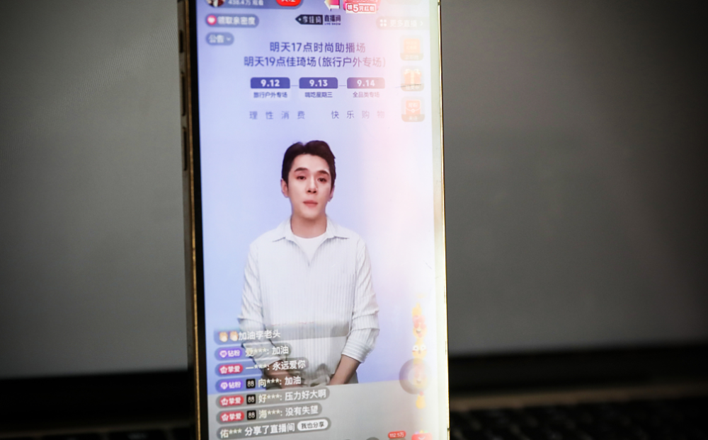
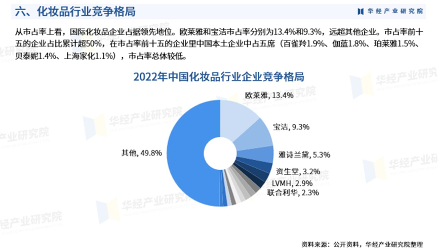

# 花西子被李佳琦反噬，新老国货内斗，便宜了外资品牌

 _来源：视觉中国_

作者 | 叶蓁

编辑 | 康晓

出品 | 深网.小满工作室

李佳琦直播间事件在发酵了十多天后，舆论的焦点从超头部主播转移到了新国货品牌花西子。

这源于花西子19日的一个道歉信，花西子坦陈了直播间事件后其状态——诚惶诚恐，手足无措，但其回避了问题本身——79元眉笔的价格质疑，最后着重强调了“我们是国货”。

这封道歉信把花西子直接送上了热搜。花西子想把其自身与国货联系起来，也无可厚非。因为李佳琦的不当言论引发了用户对花西子等新消费品牌的质疑，也引来了蜂花等传统国货品牌的狂欢，网友调侃，“这泼天的富贵，终于轮到国货了。”

这里的国货，特指历史悠久、定价低廉、当下努力求生的老牌国货，而在2012年后诞生的那一拨新国货品牌，多数对标的都是国外大牌，要么是淘品牌，要么是抖品牌，要么就是搭上了超头部主播的快车，实现了品牌发展的弯道超车。

一度，花西子是“新国货美妆”的代表，2021年花西子全年销售额突破54亿元。新国货身上的标签是“海外大牌替代”，借着渠道变迁和直播红利起飞。

而李佳琦直播间的不当言论直接引发了新国货美妆品牌们的危机，尤其是用户对其价格上比肩甚至赶超国外大牌的质疑——打着国货的旗号收割用户，赚取高额利润。当然，这种危机也可以被视为流量的反噬。

这一波流量狂欢里，老牌国货也终于借机搭上了直播的快车，接上了渠道变迁的红利，但流量红利往往来了就走。近些年在与外资品牌的缠斗中，国货品牌能活下来已实属不易，而这一轮新老国货品牌的内斗，获利最丰的可能是隔岸观火的国际美妆品牌。

**李佳琦的花西子？**

花西子凭一己之力，把众多网友投射在李佳琦身上的火力，转移到品牌自身。这封451字的道歉信被业内分成三个部分：154字抱歉，218字宣传，12+67字套话”，且被归结为“啥也没说。”

也有媒体采访了花西子的公关，证明该道歉信是老板个人意志，公关部已有员工主动辞职。目前花西子公关部仍有几位员工在职，但他们也倾向于离职或已经决定离开。花西子的公关部极力撇清和道歉信的关系，再次引发负面舆情。

《橡果商业评论》和花西子公关部人员的采访显示：这封信是由老板吴成龙主导。吴成龙在2017年在杭州创立花西子品牌（浙江宜格企业管理集团有限公司，注册资本5000万元，实缴500万元）。

吴成龙80后，大学学的是园林设计。业界对吴成龙的认知是营销高手，他曾是百雀羚的天猫旗舰店运营总监，策划了百雀羚三生花品牌，一度成为爆品；2014年，吴成龙又负责运营水密码天猫旗舰店，成绩不俗。

毋容置疑，吴成龙是懂营销的。但花西子成立后，一直被同年成立的完美日记所碾压，2018年，花西子GMV约4300万元，完美日记则达到7.6亿元。直到花西子与当时的直播新贵李佳琦深度绑定，其逆袭之路才开始。

在深度绑定李佳琦之前，花西子只是一个在天猫销量平淡的美妆新品，而进入李佳琦直播间后，花西子搭上了流量火箭。在16个月内，花西子销量持续增长，最终在2020年618登顶天猫GMV第一。

据国元证券统计，2020年，花西子品牌进入李佳琦直播间的次数高达71次，其中5月超10次。2020年花西子30%流量来自李佳琦直播间，双11的GMV占到花西子总GMV60%以上。

那么多国货品牌，为什么只有花西子得到了李佳琦的加持。李佳琦近期在直播间是这样阐述的，“我跟花西子跟了多少年，花西子怎么起来的我是最知道的一个人，他们就差点把他们家掏给我了，差点花西子姓李了。”

36氪报道称，传闻与花西子合作，李佳琦拿到的利润分成高达100%-120%，相当于品牌倒贴。花西子官方否认了这一说法，称公司和主播的合作在行业平均水平。

这个就回到了网友争议的本身，花西子到底贵不贵？北京商报曝光花西子眉笔的成本构成：一支79元的眉笔，工厂成本7元，工厂税前利润4元，其他成本5元，而李佳琦的的渠道费用则高达63元。这意味着吴成龙把利润大头基本都给了渠道李佳琦。

**流量的反噬**

李佳琦是花西子崛起的流量密码，在李佳琦的加持下，花西子走的顺风顺水。

众所周知，2020年被称为“新消费时代”元年，万亿资本涌入，打造新消费品牌盛宴。“原来投TMT的都转到消费上来了，他们也给了新消费公司比较高的估值。”天图资本的管理合伙人潘攀2021年4月接受《深网》访谈时阐述。事实也的确如此，整个新消费赛道，高瓴、红杉、GGV、启明、五源资本、金沙江……都杀进来了。

因此，当时的新消费投资如火如荼。甚至有人总结出一个打造新消费品牌的固定公式：5000篇小红书+2000篇知乎问答+超级头部主播带货。也出现了一种To
VC式创业——创业团队中有人懂融资、有人懂营销、有人有产业资源，一个新品牌就诞生了。

但吴成龙和花西子，在那波新消费投融资的狂欢中，成为一个“异类”，自始至终没有融资。

2021年花西子联合创始人飞慢曾对此事做出回应，“其一，投资机构数量繁多流程复杂，如要融资需要花费大量时间去研究和了解；其二，花西子要成就的是一个百年品牌，而如果资本过早介入，可能会一定程度改变花西子打造品牌的节奏和方式。”

而在2021年，有媒体报道称，花西子在与红杉、高瓴资本接触，并在寻求新的CFO加入。但这一消息很快被花西子否认。直到2022年4月，原摩根士丹利执行董事April
Fan（范新鹏）加入花西子担任CFO，而引进CFO常常被视为公司在资本市场意欲有所作为的信号。

可以得出的一个结论是：花西子的现金流是可以的，不需要融资。

**现金流充足和跟花西子的价格定位有关系。有新消费品牌的从业者告诉《深网》：“花西子走的是高端国潮品牌的路线，因此其定价策略也是。”其企业相关专利中，外观设计占了一半左右。数据显示，花西子早期仅在直播平台上每月营销费用就投入2000万元。**

**这种定价策略也使得花西子即便与李佳琦深度捆绑之下，也不用向一级市场的投资机构折腰。当李佳琦为花西子喊出“哪里贵了？”并让粉丝找自己买不起的原因时，其高端潮牌的定价，就成为了一把匕首，刺向自身和深度捆绑的李佳琦。**

因此，当李佳琦遭遇流量反噬的时候，花西子被反噬就成了一种必然，这是历史的宿命。而当花西子在这一波流量反噬中，想用道歉信把自己重置到“国货”行列中，享受李佳琦翻车带来的这一波国货流量的红利，却带来了更大的舆论危机。

**新老国货的共同窘境**

最先接住79元流量密码的是蜂花，在直播间上架三款79元的洗护套装商品链接，表示“79可以买5斤半”“我家护发素一瓶只要0.12个花西币哦”。

紧接着，郁美净、冷酸灵、鸿星尔克、活力28和白猫等加入战局。

整活的这些老国货，接住了这“泼天富贵”。活力28旗下三位刚接触直播的大叔主播，4天12场带货直播，销售额超1400万元。新抖数据显示，9月11日起，蜂花直播预估带货2500万-5000万，创半年来最高纪录，近几日累计涨粉超260万。

北京师范大学教授万喆在文章中称，花西子和蜂花同为国货品牌，却仿佛代表了泾渭分明的两大阵营——“老国货”与“新国货”。

近几日，新国货品牌除了花西子主动把自己送上火山口，大部分都选择了低调的“回避”策略，这种回避中，新国货品牌的困境也可窥一斑。

“过去20年，中国真正跑出来的消费品牌很少，爬过10亿元门槛的品牌都罕见，就是因为它们被流量逻辑锁住了。品牌如果逃不出流量拐点的话，永远成不了胜出的玩家。这就好比鱿鱼游戏，所有人参与搏杀，最后的人获得奖品，其他人全是炮灰。”加华资本宋向前阐述。

宋向前认为，“玩流量其实玩的是算法，而算法被平台卡住了。平台就是庄家，不可能贴着钱给创业者，所以ROI不可能超过它。很多人说线下是流量洼地，创业容易了，其实是越来越难了。因为品牌消费的是商业地产的流量，必须交租。在与平台或商业地产的流量博弈中，品牌很难赢。”

总的说来，新消费投资品牌要么给互联网平台打工，要么给商业地产打工，要么给头部主播打工，复购率并不好。雪上加霜的是：二级市场上的几家新消费公司的表现并不好。被称为“国货之光”的完美日记也好，奈雪的茶也罢，在二级市场投资者都选择了用“脚”投票。

新国货的困境和瓶颈不言而喻，而老牌国货们亦是如此：转型不及时，无法与国际大牌一样投入昂贵的营销费用，不断进入短暂的流量带来的高光时刻、而后再度遇冷。

新国货也好，老国货也罢，他们需要面对的现实是：他们的竞争对手其实一直都是国际美妆巨头。

蝉妈妈数据显示:
“一花落，万花生”的一个大赢家是欧莱雅。从9月12日到9月17日，直播带货榜前十名都有一半以上产品来自欧莱雅品牌，其中9月15日甚至有七款。

无论新老国潮品牌怎么互抢流量，他们真正的对手都是国际美妆巨头。财报显示，2022年欧莱雅（中国）整体业绩增长5.5%，同期中国化妆品零售额整体下滑4.5%。

显然，李佳琦事件引发的国货品牌大乱斗，进一步放大了国货与国际品牌的差距。

