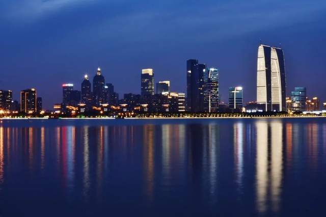
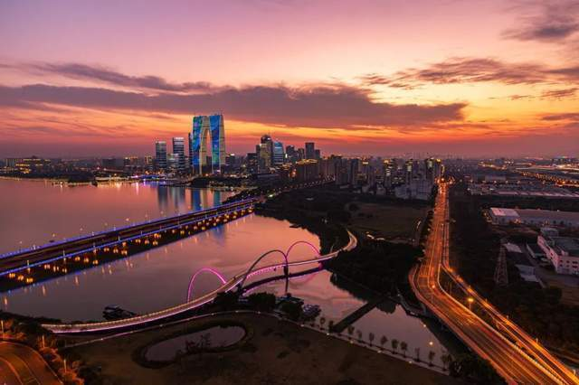

# 苏州升级特大城市，说好的虹吸效应呢？

**行政壁垒破除，资源双向流动，单向度的虹吸效应就会大大削弱。即便上海虹吸苏州，上海的一些资源，苏州人也能够通过便利的流动去共享，这可以做到资源利用的最大化，避免单向度的汲取。**

**撰稿丨熊志**

最强地级市苏州，正式升级，晋级超大城市。

日前，苏州官方对“苏州工业园区并入姑苏区”一事辟谣，表示调整并非是区划调整，只是统计口径的调整。

按照此次调整的统计口径，以七普人口数据来算，苏州城区常住人口为512.51万人。
**按照城市规模划分标准，城区常住人口500万以上1000万以下为特大城市，这标志着苏州从大城市升级为特大城市。**

_▲苏州中心广场（图/图虫创意）_

到2022年，苏州的GDP达到23958.34亿元，位列全国第六，常住人口1291.1万人，城市规模指标位居全国前列。此次口径调整，规模升级，苏州的城市能级再向前跃升一步。

地级市的“平民”身份，成长为如今的经济重镇，苏州凭什么？在毗邻上海的区位下，苏州又为什么没有像其他一些城市那样，被上海虹吸，而是取得了快速发展？

01

人口规模是一个城市综合实力的重要体现，但全域人口和城区人口，并非一个概念。

在千万人口城市中，像临沂、石家庄等城市，不同于一二线城市，大量人口分布在县城。相对来说，城区常住人口规模占比更高，城镇化率更高，千万人口的含金量也更足。

苏州虽然是千万人口城市，但事实上它的城区常住人口数一直偏低，在七普统计时，只有400万人左右， **城市规模等级和经济体量不匹配的情况比较突出。**

当然，苏州的情况和临沂并不相同。苏州能够胜任最牛地级市的称号，离不开发达的县域经济，下辖的昆山、张家港、常熟和太仓，是县级市的身份，却有着富可敌省会的实力，并非一般意义上的县城。

以昆山为例，2022年GDP达到5006.7亿元，常住人口超过200万人，几乎是一个中等城市的体量了，在赛迪顾问发布的县域经济百强榜中位居榜首。

此外张家港、常熟和太仓同样位居前十，而4个县级市的人口数超过600万人，占到整个苏州的一半。

 _▲昆山（图/图虫创意）_

**发达的县域经济，撑起了苏州的城市规模。**
不过，这也导致苏州显得比较“散”，400万左右常住人口的中心城区，驱动着一个2.4万亿GDP规模的城市前行，小马拉大车，资源统筹能力受到一定影响。

当然这次调整不是区划调整，统计口径变更也只涉及苏州工业园，但从官方数据看，至少给城区人口带来了120万左右的增量。调整其实不是数字游戏，2022年苏州工业园的GDP超过3000亿规模，发展水平已经媲美主城区了，按照城区分类并无不妥。

城市规模等级升级，对苏州参与长三角甚至全国的资源竞争，会有较大的帮助。在交通、教育、医疗等基础设施层面，配置规格也可以随之升级。

总之，城市综合竞争力得到提升，中心城区牵引力不够的问题，也能得到一定的破解。

02

上有天堂，下有苏杭。历史上的苏州，曾是富庶的江南宝地，在很长一段时间，位居城市体系的金字塔顶端。

但在近代发展历程中，却因为种种因素错过了行政升级的机会，无缘计划单列市扩容，也无缘副省级城市名单，只能作为地级市参与竞争，也是十强城市中唯一的一个地级市，还是连机场都没有的地级市。

我们都知道， **中国的城市等级体系中，资源的分配和城市的级别，以及城市主官的级别，是紧密相关的。**

那么，苏州一个普通的地级市，为何能在改革开放40多年来，经济体量一路向上跃升，从二十强升到十强，再到坐稳全国第六的位置，并吸引大量人口成长为特大城市？

其实苏州的崛起，没有什么秘诀。它可以简单概括为，“苏南模式”打下基础，港口优势为境外投资引入创造条件，帮助苏州快速融入全球产业链，毗邻上海又能承接制造业转移的红利。

_▲苏州（图/图虫创意）_

不管是费孝通笔下的“苏南模式”，也即利用农村剩余劳动力和集体资源发展乡镇企业，还是大力引入境外投资，发展外向型经济，为上海作产业配套，不难发现，苏州是一座非常善于抓取机遇的城市，它有着沿海地区那种开阔的视野。

浓缩一下，就四个字：开放搞活。 **对外开放，对内搞活。**

以外资为例，给大家提供几个数据，苏州现在有外资企业1.7万家，世界500强企业中有160家在苏州投资。苏州实际利用外资的总量，仅次于上海和北京。

而且，苏州还是大陆台商投资最活跃、台资企业最密集的地区之一，有台资企业超1.3万家。正所谓“苏州堵车，全球缺货”，县级市昆山，还有着“小台北”的称号。

近年来，全球博弈愈发激烈化，贸易摩擦加剧，脱钩断链的思维在舆论场很有市场，一些网友动辄鼓吹对抗，歧视境外资本，甚至仇视非本土品牌。

从城市发展的角度看， **一旦闭关锁国起来，除了一线城市外，苏州可能是最受伤的那一个了。**

当然在境外资本的投资布局下，苏州虽然形成了完备的工业体系，但外资台企的到来，除了市场主要就是成本驱动，在劳动力、土地成本上升的大背景下，境外资本撤离导致的产业链外迁，也成为苏州的阵痛。

据媒体报道，富士康、和硕、仁宝等台企，已经纷纷开始在东南亚扩建工厂。随着境外投资因为成本敏感而外迁，摆脱代工模式，向产业链、价值链上游进发，苏州产业升级的紧迫性愈发强烈。

03

除了利用境外投资外，苏州的快速崛起，离不开上海的产业外溢红利。

《大国大城》的作者陆铭在调研时发现，“一个现代大城市对外围制造业的辐射带动作用范围集中在100公里左右的半径以内”。上海和苏州的距离，恰恰在这个半径之内。上海轨道交通11号线，连接昆山和上海，还是全国首条跨省市的地铁。

在上海的制造业转移浪潮中，苏州近水楼台先得月，还出现了从上海引进“星期日工程师”这样有趣的现象，上海和苏州也形成了前店后厂的分工格局。

一个有意思的现象是，大城市对周边地区的资源虹吸，是区域经济的一个普遍现象，由此很容易形成中心城市发达，环中心城市带落后的局面。但苏州毗邻上海，却还成长为GDP超两万亿、常住人口过千万的特大城市，到底是为什么呢？

作为对比，我们可以参考成都，环绕成都的城市，经济总量最高的只有3000亿出头，成都高首位度的同时，省域内部经济落差明显。

**事实上，虹吸效应的强弱，很大程度上取决于中心城市的发展水平、阶段。**

上海发展至今，资源集聚效应已经发挥到了极致，已经处在疏解功能、瘦身健体的阶段了，在落户门槛上也有较高的限制。

这意味着，它不仅仅是像抽水机一样抽取周边的资源，还会转移一些中低端的产业，而且出于物流成本和协同便利考虑，这种转移不会转移到中西部，而是就近转移到周边。

比如特斯拉生产基地在上海，很多零部件供应商，就分布在苏州、宁波等城市。

**这个承接产业转移的过程，前提是城市之间错位分工。**
在这方面，苏州在产业定位上很早就明确了一点——“上海做的，苏州一般不去做，而苏州要做的，是上海不想做、不便做，或者做起来成本太高的产业”。

_▲苏州金鸡湖（图/图虫创意）_

影响虹吸效应的另一个重要因素是一体化程度，长三角恰恰是走在了全国前列。三省一市融合程度高，地铁很早就贯通了，“一网通办”“一卡通行”也提升了便利程度。

行政壁垒破除，资源双向流动，单向度的虹吸效应就会大大削弱。即便上海虹吸苏州，上海的一些资源，苏州人也能够通过便利的流动去共享，这可以做到资源利用的最大化，避免单向度的汲取。

这解释了很多中西部强省会，有一个高首位度的中心城市，周边地区却始终无法摆脱落后的状态。发展阶段、工业化水平不如上海，一体化程度不如长三角，无疑是重要的因素。

不过，作为“大树底下的碧螺春”， **既然是错位分工，一些高端的产业资源，特别是高端的服务业资源要素，苏州可能很难从上海手中承接过来。**

但话说回来，一个地级市，能靠开放搞活收获今天的成就，还要什么自行车呢？

