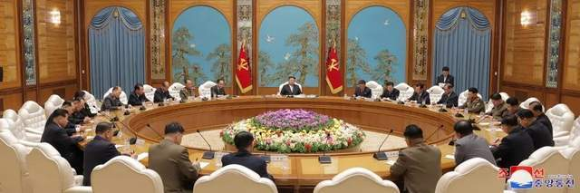
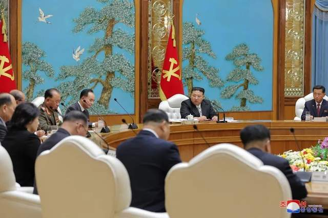
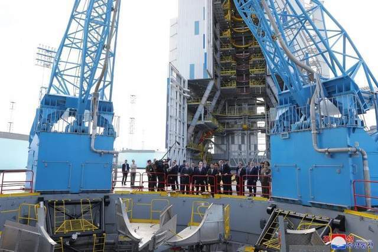

# 金正恩向朝鲜高层传达访俄成果：世界版图发生根本变化

据朝中社9月22日报道，朝鲜劳动党第八届中央委员会第十六次政治局会议9月20日在党中央委员会本部大楼举行。朝鲜最高领导人金正恩出席会议。政治局会议听取了有关金正恩对俄罗斯联邦正式友好访问成果的报告。受党中央政治局委托，党中央委员会部长金成男向政治局会议汇报了金正恩访俄成果。

报道称，相关报告称，以此次访问为契机，朝俄关系顺应新时代要求提升至新的战略高度，世界政治版图也发生了根本变化。

报告指出，金正恩统筹部署建设性措施，以便进入巩固访问成果的实践阶段，进一步加强朝俄传统睦邻合作的纽带，在各领域进一步搞活双边关系使之发展到新的更高阶段。

报告强调，要朝俄有关部门之间密切接触并加强联动以多方面扩大和发展各领域的合作，为增进两国人民的福利做出实际贡献。

报道还称，政治局就全面践行落实金正恩外交成果问题讨论了一系列的方法途径。

普京与金正恩9月13日在位于俄罗斯阿穆尔州的东方航天发射场举行会谈，这是两国自2019年4月以来首次举行领导人会谈。普京表示，和朝鲜在太空领域的合作是他和金正恩来到东方发射场的原因，“朝鲜领导人对火箭设备很感兴趣，也在尝试开发太空技术”，而俄罗斯“将帮助朝鲜进行太空探索和火箭建造”。

俄朝领导人及高级官员当天大范围会谈结束后，俄总统新闻秘书佩斯科夫对媒体表示，俄罗斯和朝鲜“全方位”的关系“包括军事技术合作和安全方面的意见交流”。俄媒认为，普京与金正恩的会晤是向美国及其盟友发出信号，“要让美国、日本和韩国明白，不要试图发动军事挑衅”。

来源丨朝中社、韩联社、环球网

