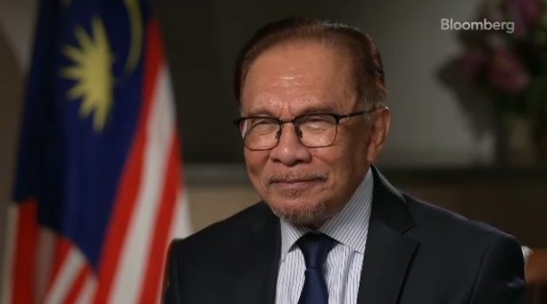
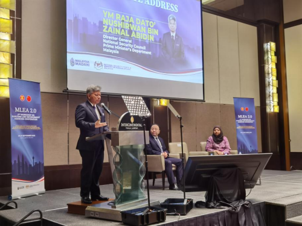

# 马来西亚总理：南海问题应该在地区内部解决，中方的说明令人放心

（观察者网讯）据美媒彭博社当地时间22日报道，在采访中被问“希望美国在南海问题中发挥什么作用”时，马来西亚总理安瓦尔表示，他主张由该区域内的国家自行解决南海问题，鼓励各方对话谈判而非互相挑衅。他还提到，自己刚与中方讨论过中国最新发布的标准地图，中方的解释说明“令人放心”。

8月底，中国发布了最新的2023年版标准地图，有关南海内容引来西方媒体炒作。我外交部对此回应，中方在南海问题上的立场是一贯、明确的。中方主管部门每年都会例行发布各类型标准地图，旨在为社会各界提供标准地图服务，提高公众规范使用地图意识。希望有关方面客观理性看待。

_马来西亚总理安瓦尔 截图自彭博社_

彭博社报道称，马来西亚总理安瓦尔正在美国纽约参加联合国大会。前不久（17日），安瓦尔来到中国广西出席第二十届中国—东盟博览会。

“我提到了地图的事。”安瓦尔表示，中方在会面中承诺在南海问题上将继续推进对话谈判，以寻求各方达成友好解决方案。他指出，中方的解释说明“令人放心”。

被问到“希望美国在南海等问题上扮演什么角色”时，安瓦尔强调，他主张南海问题应该在该地区内部解决，各方都不应该进行不必要的挑衅。

他说：“美国一直是我们的传统盟友，但我认为，我们在该地区的目标是确保与邻国保持良好的关系，尤其是出于务实的考虑，中国是马来西亚重要的贸易伙伴和最大投资者。”

安瓦尔继续补充道，“至于南海问题，我们的立场是，这是东盟的核心问题，应该在东盟内部和地区内解决。当然，我们在东盟内部也要保持坚定立场，鼓励对话，而不是再次挑衅。这也是我们对美国的立场。”

对于西方一再炒作南海冲突，他笑了笑，“几十年来，这些人一直对爆发冲突的可能性故作姿态，但这种情况实际上没有发生，我对未来持有更为乐观的看法。”

“我们与邻国的关系非常好，没有理由过分担心可能出现的紧张局势。”安瓦尔进一步表示，基于他自己与中国和美国方面的接触，他并没有看到任何“真正的威胁或紧张局势”，他认为一些所谓的担忧之声是“可以理解的”，但他对此不会“过度担心”。

另据中国驻马来西亚大使馆消息，9月20日，在吉隆坡第二届海上执法机构合作研讨会开幕式上，马来西亚国家安全委员会主任、驻华大使努西尔万也表示，东盟有关国家和中国要继续通过协商、对话的方式解决争议，共同维护南海地区和平稳定。

_马来西亚驻华大使努西尔万 图自中国外交部官网_

努西尔万还曾明确表示，美国在南海问题上立场的改变，不会影响马来西亚通过外交渠道与中国解决南海事务的立场。马来西亚赞赏中国政府不强迫东南亚诸国选边站的立场，认为中国政府非常支持区域内国家采取独立的外交政策。

对于南海问题，我外交部多次表示，中方一贯反对个别域外国家在南海制造事端、挑动对抗，破坏地区和平稳定。中国和东盟国家正积极推动“南海行为准则”磋商。域外国家应当尊重地区国家为商谈南海规则、维护南海和平稳定作出的努力。

此外，彭博社采访中，主持人还提问安瓦尔，马来西亚正向微软、特斯拉等诸多美国公司抛出橄榄枝，这是否意味着与中国相比，马来西亚更倾向于美国。

安瓦尔对此重申了马来西亚的中立态度，他希望平等地吸引来自美国和中国的投资，“美国和欧洲的机会就在那里，我们应该关注它，但不能以牺牲中国为代价。”

他补充道：“中国正在非常积极并且大量地向马来西亚投资。对于马来西亚来说，向中国表示欢迎至关重要，对于其他潜在的海外投资亦是如此。”

据马来西亚投资发展局3月公布的报告显示，2022年，中国是马来西亚最大外资来源地，马来西亚共批准外国直接投资1633亿林吉特（1美元约合4.43林吉特），来自中国的投资额达554亿林吉特，占比33.9%。据中方统计，2022年中马双边贸易额为2036亿美元，同比增长15.3%，中国连续14年成为马来西亚最大贸易伙伴。

9月19日，马来西亚统计局公布数据显示，今年前8个月，中国依然是马来西亚最大贸易伙伴，新加坡和美国分居二、三位。

**本文系观察者网独家稿件，未经授权，不得转载。**

