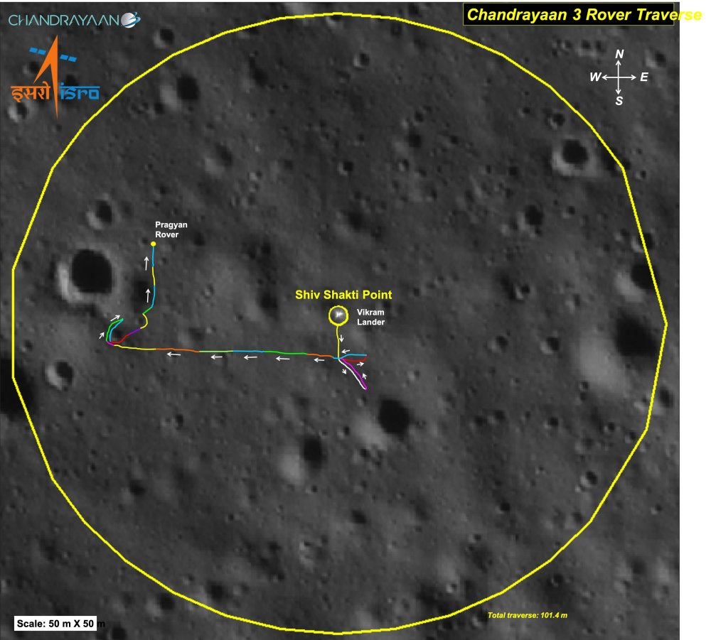

# 印度未能与月球探测器重新建立联系，印专家：中国成功过

（观察者网讯）据英国广播公司（BBC）9月22日报道，印度空间研究组织（ISRO）称，在下一次着陆区日出来临之时，他们就试图与月球着陆器和月球车取得联系，但是到目前为止还没有收到任何信号。

此前有专家指出，由于月球车设计水平有限，唤醒成功的概率可能不高。ISRO也提前预告，“希望我们能够唤醒月球车，否则它将作为印度的‘月球大使’永远留在那里。”

_ISRO发布的“普拉吉安”月球车驶离着陆器画面_

周五，ISRO在社交平台X（原推特）上发文称，“将继续努力与‘维克拉姆’着陆器和‘普拉吉安’月球车建立联系”。

印度此前消息称，由于“普拉吉安”号的设计无法承受月球夜间的低温环境，ISRO决定提前让月球车进入休眠状态，并尝试在着陆区域下一次日出时将其唤醒。

ISRO宣布，当地时间9月2日，印度“月船3号”探测器携带的“普拉吉安”月球车已经完成探索任务，在关闭有效载荷后进入休眠模式。ISRO主席索马纳特2日表示：“我们将在接下来几天内让它们（着陆器和月球车）休眠，这样它们就有可能撑过夜晚的考验。”

专家为此引用了中国“嫦娥四号”着陆器和“玉兔二号”月球车的例子，它们确实在日出时顺利唤醒，开展工作。

但ISRO前主席基兰·库马尔（Kiran
Kumar）告诉BBC，这并不是必然的，因为月球南极附近的夜间温度通常会降到零下200摄氏度到零下250摄氏度，电池并没有设计在这种极端温度下运行或储存。

BBC称，ISRO试图降低人们的期待。

后者在声明中表示，月球车科学仪器获取的数据通过着陆器传回了地球。目前，月球车的电池已经充满，太阳能电池板对准了9月22日着陆区域下一次日出时的方向，“希望我们能够唤醒月球车，否则它将作为印度的‘月球大使’永远留在那里。”

_ISRO发布的“普拉吉安”月球车行驶轨迹_

一名ISRO科学家告诉《印度快报》，月球车能否顺利唤醒，主要取决于电池能不能在月球漫长的夜晚保持运转，“这就像是在找到充电线之前让手机保持省电模式。对于着陆器和月球车来说，月球表面的日出就是那条充电线。”

印度科普作家、航天分析人士帕拉瓦·巴格拉（Pallava
Bagla）担心，月球车的设计和所用设备都无法经受月球夜晚低温环境的考验，成功唤醒月球车的几率并不高，“印度还不具备制造能够承受月球极低温环境的电路和电子元件的技术”。

印度月球车名为“普拉吉安”（Pragyan），在梵语中意为“智慧”。8月23日，在月球南极附近区域着陆的“月船3号”部署月球车，开启月球探索任务。据《印度斯坦时报》报道，在将近11天时间里，“普拉吉安”号在月球表面行驶了100多米，传回一批有关月球土壤的数据。

在行驶过程中，“普拉吉安”号月球车曾遭遇一个直径4米的陨石坑，不得不在地面指挥下掉头改变行驶路线。

ISRO在8月29日发布消息称，利用月球车上装备的激光诱导击穿光谱仪（LIBS）和α粒子X射线光谱仪（APXS）科学仪器，“普拉吉安”号证实月球南极附近区域存在硫，并检测到了铝、铁、钙、铬、钛、锰、氧和硅等多种物质。

印度“月船3号”探测器于7月14日从印度萨迪什·达万航天中心发射升空，印度当地时间8月23日18时04分（北京时间20时34分）成功在月球南极附近区域软着陆。这使得印度成为世界上第四个成功着陆月球的国家，也是首个在月球南极附近登陆的国家。

**本文系观察者网独家稿件，未经授权，不得转载。**

