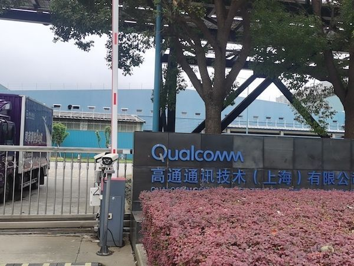
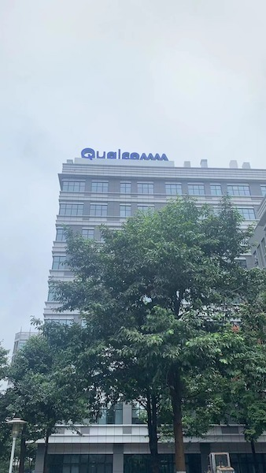
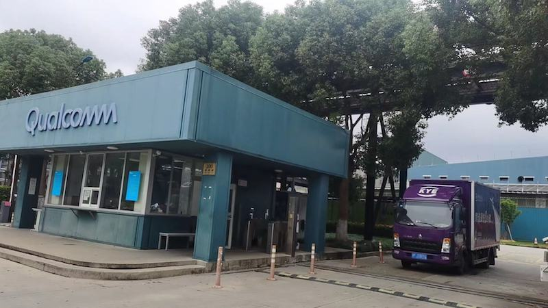

# 实探暴风眼中的上海高通：裁员消息属实，麒麟回归后高通何去何从？

_高通位于上海自贸区的工厂_

近日，多个社交平台上有关“高通上海公司即将大规模裁员”的消息传得沸沸扬扬，有网友爆料称“本次裁员主要集中于无线业务研发部门，补偿标准为普通员工（包含刚入职的员工）N+4，无固定期限的资深员工N+7”。

对于市场传闻，高通公司21日对媒体回应表示，公司确有裁员计划，但市场所传的“大规模裁员”“关闭办公室”“撤离上海”等说法夸大其词。对此，高通对外媒体公关向《华夏时报》记者确认了澄清内容的真实性。

9月22日，《华夏时报》记者先后来到位于上海张江亮秀路及碧波路的高通公司办公室，因安保原因，记者并未进入到办公区，但高通内部工作人员向记者透露，公司目前的日常工作仍在正常进行，并未出现“关闭办公室”的情况。

随后记者来到位于上海自贸区内的高通工厂，工厂内机器运作的轰鸣声在厂外即可听见，时常有运输货车来往。据现在工作人员介绍，工厂内一切工作正常。

一位高通芯片设计工程师向《华夏时报》记者表示，目前自己并没有接到裁员通知，但近期公司确实在裁员，已经有同事陆续谈话离职，但也并没有网上说的那么夸张。另有一位接近高通管理层的市场人士向本报记者表示：“裁员并非针对上海，高通在中国区的裁员大概在20%左右，10月份的动作应该会更加集中。”

“裁员或才刚刚开始”

据网传消息显示，由于高通公司业务的调整需要，将采取一次规模较大的“人员调整”。
高通此次裁员涉及整个中国区，上海的WiFi部门大约50多人（包括软件＋验证）将会全部裁掉，设计相关人员等通知；其余每个部门将会裁员20%；补偿标准为普通员工为N＋4，资深无固定期限合约员工N＋7，且没有三倍封顶限制。

_高通位于上海浦东新区亮秀路的办公楼_

_高通位于上海张江碧波路的办公室_

还有消息称，高通的移动部门将是裁员重灾区，预计将裁减约20%的员工。该部门主要负责智能手机芯片，也是高通的主要收入来源之一。

记者了解到，此次传言中高通中国区被裁撤的WiFi部门源自12年前的一项收购。2011年1月，高通宣布斥资31亿美元收购了WiFi芯片巨头Atheros
Communications，以弥补其在无线局域网络产品组合上的短板。而彼时Atheros
Communications在中国的研发部门正是高通中国区WiFi部门的前身。

一位高通模拟IC设计工程师向本报记者确认，WiFi部门确实有一个小团队被裁员了，但还没有外界传得“一锅端”，不过据高通中层领导向其透露，裁员或许才刚刚开始，后续还会裁员，规模会更大。

记者致电上海、北京、深圳、西安的高通公司，其中上海办公室的电话始终断线，北京和深圳的办公室电话无人接听，仅有西安办公室的工作人员向《华夏时报》记者表示，西安地区的主要职位是工程师，但近期并未听说有裁员的相关情况，西安高通公司目前一切如常。

针对裁员传言，高通公司在9月21日对外公开回应称，高通在第三季度财报电话会议上和8月提交的10Q报告中曾说过，鉴于宏观经济和需求环境的持续不确定性，公司预计将进一步采取调整措施，以实现对重要增长机遇和业务多元化的持续投资。虽然相应计划还在制定中，但预计主要措施将包括裁员，不过市场所传的“大规模裁员”“关闭办公室”“撤离上海”等说法夸大其词。

高通公司还表示，预计与裁员等措施相关的行动将产生大量额外的调整费用，而其中很大一部分预计将发生在2023财年第四季度。高通目前预计，相应的调整措施将在2024财年上半年基本完成。在中国采取的调整措施也是之前对外沟通的相应计划的一部分。

公开资料显示，高通公司创立于1985年，总部设于美国加利福尼亚州圣迭戈市，是全球最大的移动芯片供应商。1994年，高通公司正式进入中国，在随后近30年的时间里，高通陆续在北京、上海、深圳和西安开设了4个办公室，并且在北京和上海设立了研发中心。根据统计机构的数据显示，目前高通在中国区的员工总数大约有5000人。

事实上，为了削减成本，高通早已开启全球裁员模式。

早在2022年底，高通将手机芯片销售跌幅预测从个位数下调至较低两位数百分比，同时还调整了资本支出计划，并开始对某些部门进行选择性裁员。彼时，高通首席财务官Akash
Palkhiwala向媒体表示，全球面临许多不确定性，高通第一件事就是减少更成熟领域支出，并对某些部门选择性裁员，并减缓招聘。

自2022年末至今年3月，高通美国加州总部共有232名员工被裁；今年5月高通宣布将在全球裁员5%，主要集中于移动部门；6月，高通宣布将继续裁减加州圣地亚哥总部的415名员工，其中大多数职位为工程师；8月，高通公司被传在台湾将裁员200人，并且不会调薪，再加上之前离职的上百人，高通在台1700人的营运规模已经下降到1400人。

Akash
Palkhiwala曾公开表示，预计公司削减成本的措施将持续到下一个财年。除了各大科技企业都在做的降本增效之外，疫情期间高通存在的过度招聘员工情况，也是高通今年持续裁员的重要原因。数据显示，高通在上个季度中用于重组的费用为2.85亿美元，其中就包含有较高比例的员工遣散费用，高通预计这项费用在第四季度将达到更高数额。

高通不“通”了

在移动通讯领域，高通一直是全球最大的芯片供应商之一，而手机通信芯片是其业绩的重要支撑。但在过去两年，全球手机销量陷入增长停滞状态。

根据Canalys的数据显示，截至今年二季度，全球智能手机市场出货量连续第五个季度下滑。其中，2023年一季度同比下滑12%；2023年二季度出货量同比下滑11%。从销售额来看，市场研究机构Counterpoint的数据显示，2023年第二季度，全球智能手机市场的销售额同比下降8%，季度环比下降5%。这是连续第八个季度出现同比下降。

中国是高通手机芯片的最大市场，根据财报，高通2022财年在中国市场营收达281亿美元，占总营收的64%；小米、OPPO、华为、vivo、荣耀等中国手机厂商以及大部分新能源汽车厂商，都是高通的客户。

但与全球手机市场一样，中国智能手机市场也持续萎靡。IDC发布的数据显示，2023年上半年，中国智能手机市场出货量约1.3亿台，同比下滑了7.4%。虽然第二季度中国智能手机市场出货量约6570万台，同比下降2.1%，降幅明显收窄，但是这主要得益于中国大陆618购物节的推动，且效果远低于去年同期。而在短暂的促销刺激需求之后，智能手机市场似乎陷入了更为低迷的局面。

在智能手机市场持续下行的背景下，高通核心业务手机芯片的业绩也随之闪崩。8月初，高通发布了截至2023年6月25日的2023财年第三财季财报。根据财报，高通第三财季营收84.51亿美元（约合人民币607亿元），相比去年同期的
109.36
亿美元下滑22.7%；净利润为18.03亿美元（约合人民币130亿元），相比去年同期的37.3亿美元下滑51.7%。而在一季度，两项关键指标的下滑幅度分别为17%和41%。

此外，高通公司的半导体业务（QCT）和专利技术许可业务（QTL）两大核心业务部门均下滑。半导体业务（QCT）中的手机终端板块占据主要地位，受全球智能手机市场下行的影响，该业务板块营收同比下滑超过
25%，物联网也同比下滑近 24%。高通公司唯一实现增长的汽车芯片虽然同比增长 12.7%，但是与 QCT 旗下的手机终端和物联网相比，其营收占比仅为
5%，对整体业绩贡献程度较低。

记者了解到，今年高通公司为了尽快清库存回血，大幅降低了中低端5G智能手机的芯片价格，部分芯片的降幅甚至超过了20%。但尽管如此，高通的存货水平仍在持续攀升。截至2023年第二季度末，高通的存货价值为66.28亿美元，比截至2022财年末（2022年三季度末）的63.41亿美元还要高。

高通财务主管Akash Palkhiwala在与分析师举行的财报电话会议上表示：“手机持续复苏的时间仍难以预测，客户对购买仍持谨慎态度。”

高通对于第四财季（三季度）业绩展望为，营收将达到81亿美元至89亿美元；每股摊薄收益将达到1.37美元至1.57美元，整体的业绩指引不及市场预期。同时，高通还预计今年手机销量将出现“高个位数百分比”下降，部分原因是中国经济复苏缓慢，这将会对于高通全年业绩产生不利影响。

对此，九三学社中央科技委委员陈根向《华夏时报》记者表示，高通业绩的下滑主要体现两方面的问题，一方面是全球消费电子复苏乏力；另外一方面是中国市场的不断国产化，一定程度的摆脱对高通的依赖。在这两方面的影响下，就拖累了高通的业绩，导致高通出现裁员也是必然现象。

华为苹果“打架”，却苦了高通

“美国在芯片产业的打压与脱钩战略不进行调整，将会对高通等相关企业的业绩带来比较大的影响。而随着华为为首的企业，在芯片领域自主化创新的突破，以及主产替代产业链的不断完善与成熟，以及苹果等企业在5G领域的自研突破，将会持续性地摆脱对高通等企业的依赖。”陈根说。

事实的确如此，随着近期华为新机Mate60系列携麒麟芯片重新上线，让高通的神经不得不紧张起来。

8月29日，在没有召开新品发布会的情况下，华为基于自研麒麟芯片的新一代旗舰手机Mate60Pro正式开售，虽然定价高达6999元，但依然备受追捧，线上线下均“一机难求”。此后Mate60、Mate60Pro＋、MateX5等多款新机型陆续开售，仍都是供不应求。而在这些新品背后，丝毫没有高通的身影。

随着华为麒麟芯片的强势回归，势必将减少华为对于高通芯片的需求。天风国际分析师郭明錤指出，华为在2022年和2023年分别向高通采购了2300万—2500万片和4000万—4200万片面向智能手机的骁龙SoC，给高通带来了一笔额外的收入。但是随着华为Mate
60系列及后续其他新机型重新采用自研的麒麟芯片，预计将快速减少对于高通骁龙芯片的需求。

根据郭明錤预计，华为新机型可能将从2024年开始全面采用全新自研麒麟处理器，届时高通将彻底失去华为的订单，同时还将面临着华为手机重新崛起，导致其他非华为品牌手机出货量下滑的风险。其中，众多的安卓智能手机品牌厂商的众多机型都有采用高通的骁龙处理器，这也意味着，随着华为从其他安卓智能手机品牌厂商手中抢下更多的市场份额，这些安卓智能手机厂商对于高通骁龙芯片的需求也将会出现大幅下滑。同样，华为旗舰机型也将会对苹果iPhone形成竞争，这也将在一定程度上导致高通对苹果5G基带芯片出货的减少。

或是为了顺应时势，日前，高通宣布了一项轰动业内的决定：他们将开始支持华为自主研发的鸿蒙操作系统，消息一出，便引起了国内外的广泛关注和热议。

高通方面表示，接入鸿蒙系统将为鸿蒙系统提供更多的硬件支持和兼容性。高通在全球芯片广泛应用于全球各种设备，其与鸿蒙系统的对接将使得几乎所有搭载高通芯片的设备都可以安装和使用鸿蒙系统。

而除华为之外，苹果也在试图摆脱对高通的依赖。9月22日，iPhone15正式发售，与华为的Mate60系列“正面硬刚”。虽然此前，高通公司宣布已与苹果达成芯片供应协议，将为其2024年、2025年和2026年推出的智能手机提供骁龙5G调制解调器和射频系统。但尽管如此，苹果自2019年来一直致力打造自己的基带芯片，并为此收购了英特尔的调制解调器部门。分析师郭明錤此前预计苹果会在2025年推出自研5G基带的iPhone机型。届时，苹果作为高通公司的大客户，芯片订单自然也会减少。

对此，资深产业经济观察家梁振鹏向《华夏时报》记者表示，苹果自研5G芯片，华为麒麟芯片卷土重来，高通将面临来自两个强大竞争对手的夹击，手机芯片市场的竞争也将更加激烈。

“手机芯片市场接下来的发展趋势包括更大的专注于5G技术，以及更高性能和更低功耗的芯片。随着5G网络的普及，手机芯片将需要更好地支持高速数据传输和处理能力。同时，随着人工智能和物联网等技术的发展，手机芯片也将需要更强大的计算和处理能力。因此，手机芯片市场将趋向于更高性能、更多功能和更低功耗的发展方向。”梁振鹏说。

责任编辑：徐芸茜 主编：公培佳

