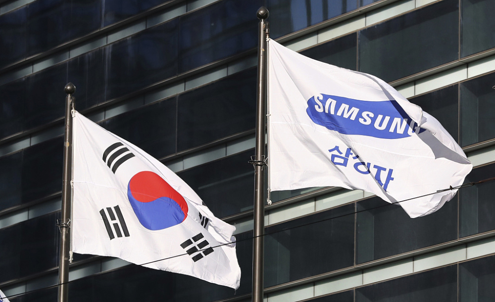

# 对华芯片管制豁免，韩国催美国拿出明确解决方案

【环球时报驻韩国特派记者
张悦】韩国产业通商资源部长官方文圭22日在首尔会见了美国商务部副部长唐·格雷夫斯，要求美国在芯片出口管制和投资补贴方面给出明确解决方案。韩国三星电子和SK海力士在华工厂进口美国芯片设备的豁免权将于今年10月到期，但美国迄今仍未就是否延长期限作出具体说明。

据《韩国先驱经济》报道，格雷夫斯访韩就两国因供应链、《芯片和科学法》、《通胀削减法》产生的问题进行协商。方文圭在会见时强调，“希望美国商务部积极协助，使半导体出口管制、‘护栏条款’等产生的问题得到圆满解决”。

_韩国三星电子 资料图_

美国去年10月颁布了禁止美企向中国半导体生产企业出口部分尖端半导体生产设备的规定。但对于三星电子和SK海力士等在中国设有半导体工厂的韩国企业，相关措施的适用期限推迟一年。另外，今年3月，美国商务部发布了《芯片和科学法》中的所谓“护栏条款”，对获得美国补贴的半导体制造商的在华业务施加严格限制。今年5月，韩国政府对“护栏条款”提出正式意见，认为条款不能以给在美国投资的企业带来不正当负担的方式履行。《日本经济新闻》8月曾引用消息人士的话透露，美国已决定延长为期一年的豁免。

韩国《中央日报》分析称，由于美国的技术控制和出口限制，韩国正失去中国巨大的半导体市场。如果中国的半导体自主速度加快，高度依赖半导体产业的韩国经济必然会蒙受损失。《韩民族日报》引述韩国半导体产业结构先进化研究会会长卢和旭的话称，美国布下新的“经济安全网”，韩国半导体和电池产业落入其中。（韩国政府）强调“经济安全论”并站在美国这一边，使韩企和经济沦为人质。韩联社称，韩国今年的国税收入将较预期减少59万亿韩元（约合3247亿元人民币），主要原因之一就是半导体企业业绩不振。

