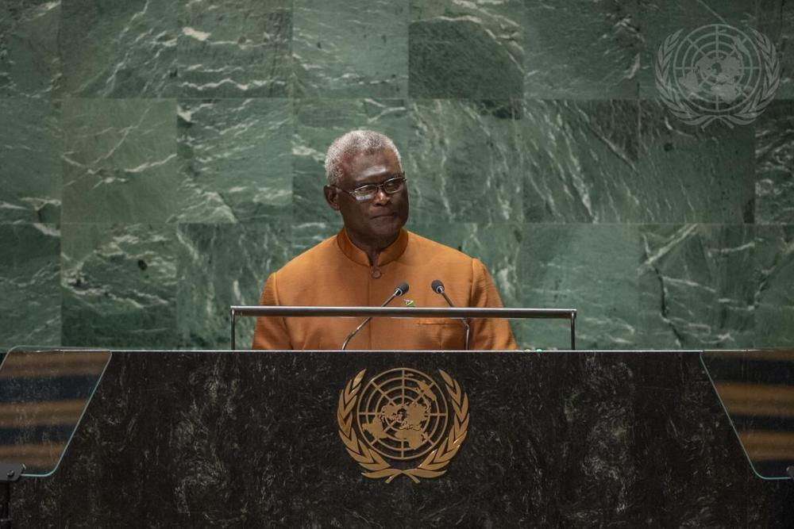
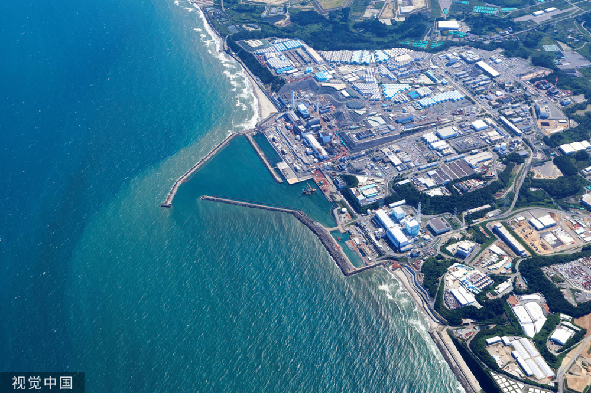

# 所罗门群岛总理联大讲话怒批日本：应立即停止核污染水排海

（观察者网讯）当地时间9月22日，所罗门群岛总理索加瓦雷在第78届联合国大会一般性辩论发言时，谴责日本向太平洋排放核污染水的做法“令人震惊”，呼吁日本政府立即停止核污染水排海。

他还同时谴责了美国等国家在太平洋进行核试验的历史，“我们有发言权吗？我们从来没有。这些国家及其人民应当得到相应的赔偿。”

索加瓦雷还主张改革国际金融体系，号召国际社会加强对多边主义的承诺。他称赞中国提出的“一带一路”等多项倡议，呼吁所有合作伙伴采用同样的“变革性伙伴关系模式”，以恢复世界的信任和团结。

 _9月22日，所罗门群岛总理索加瓦雷在联大发表讲话
图自联合国网站_

根据联合国网站发布的讲话实录，索加瓦雷在22日的演讲中指出，所罗门群岛是《不扩散核武器条约》和《南太平洋无核区条约》的缔约国，对保持“蓝色太平洋大陆”无核化的承诺不容妥协。所罗门群岛与其他想法一致的太平洋岛国站在一起，对日本排放核污染水“感到震惊”。

他指出，国际原子能机构（IAEA）有关福岛核污染水的评估报告并无定论，报告提供的科学数据不完整、不全面且存在偏见，“如果这些核污染水是安全的，那么就应该储存在日本。但核污染水被排入海洋的举动表明，它并不安全。”

索加瓦雷呼吁日本政府立即停止向太平洋排放核污染水，探索其他处理方案。他强调，“如果我们要重建信任，重新团结世界，我们必须诚实、坦率地保护我们的海洋，这是我们人民的命脉。”

此外，索加瓦雷在讲话中还谴责了美国、英国和法国在太平洋进行核试验的历史。他指出，从1946年到1996年，有关国家在马绍尔群岛、基里巴斯和法属波利尼西亚进行了300多次核试验，“我们有发言权吗？我们从来没有。这些国家及其人民应当得到相应的赔偿。”

_2023年8月24日，日本福岛，福岛第一核电站核污染水被排放到海洋中 图源：视觉中国_

索加瓦雷还号召国际社会加强对多边主义的承诺，敦促发达国家为最不发达国家的贸易提供优惠。索加瓦雷肯定了南南合作的价值，并对中国提出的“一带一路”等多项倡议表示赞赏，他表示，中所两国建立“全面战略框架”是一项变革性举措，有助于所罗门群岛实现国家发展战略和2030年议程。

索加瓦雷呼吁所有合作伙伴采用同样的“变革性伙伴关系模式”，“如果我们要恢复信任和团结，就让我们从参与和改革国际金融体系开始。”

日本福岛第一核电站内储存有超过130万吨核污染水，但日本政府和东京电力公司以核电站内大量储水罐妨碍废堆作业为由，决定将核污染水排放入海。8月24日，日本政府不顾国内外强烈反对，宣布启动核污染水排海进程。

对于日本政府这一举动，中国外交部发言人8月24日表示，海洋是全人类的共同财产，强行启动向海洋排放福岛核污染水，属无视国际公共利益的极端自私和不负责任之举。日方所作所为是将风险转嫁给全世界，将伤痛延续给人类的子孙后代，成为生态环境破坏者和全球海洋污染者，侵犯各国人民健康权、发展权和环境权，违背自身道义责任和国际法义务。日方将核污染水一排了之，同时也将自己置于国际被告席，必将长期受到国际社会谴责。

据央视新闻消息，联合国人权理事会第54届会议9月19日举行与有毒废料处置对人权影响问题特别报告员互动对话。中国代表在人权理事会持续揭批日本向海洋排放核污染水侵犯人权引发强烈反响。人权理事会特别报告员在对话中呼吁国际社会高度关注日本核污染水排海问题。

萨摩亚和朝鲜的代表在发言中指出，日本排放核污染水对海洋生物多样性和小岛屿发展中国家粮食安全造成严重威胁，侵犯太平洋沿岸国家乃至全球人民的人权，呼吁国际社会共同反对日本核污染水排海行为。

**本文系观察者网独家稿件，未经授权，不得转载。**

