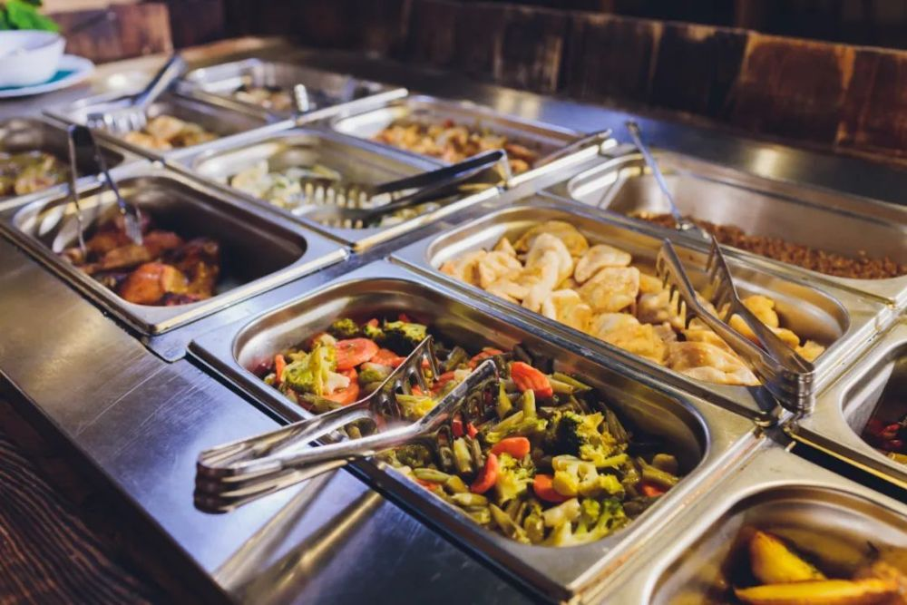
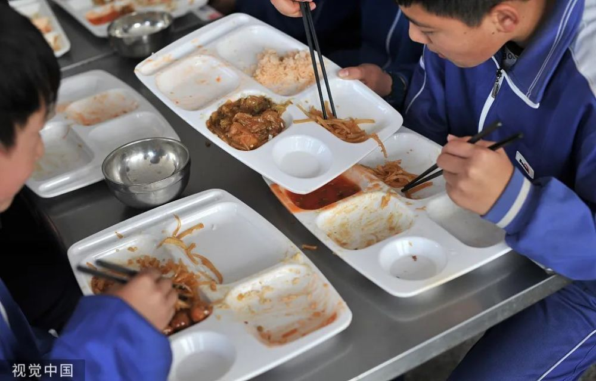

# 比预制菜更可恨的，是承包学校食堂的“小舅子”

眼下，可能没有比预制菜更让家长操心的事情了。

近日，全国多地曝出预制菜进校园的消息，从幼儿园到小学，从中学到大学，这也引发了家长的高度不安和焦虑。

为了让孩子吃上一口放心饭，家长们不停与学校、教育部门交涉，甚至特地辞职送饭，不少学校门口挤满了送餐的家长。

预制菜并非新鲜事物，在餐饮市场早已流行多年，为何进入校园却会引发轩然大波？

**行业鱼龙混杂**

**引发家长焦虑**

讨论预制菜要不要进校园，首先要搞清楚什么是预制菜。

根据中国烹饪协会联合多家单位共同参与起草的《预制菜》团体标准，预制菜的定义是“以一种或多种农产品为主要原料，运用标准化流水作业，经预加工（如分切、搅拌、腌制、滚揉、成型、调味等）和/或预烹调（如炒、炸、烤、煮、蒸等）制成，并进行预包装的成品或半成品菜肴”。

依据上述定义，预制菜通常被分为四大类：即食（如八宝粥、即食罐头）；即热（如速冻汤圆、自热火锅）；即烹（须加热烹饪的半成品菜肴）；即配（如免洗免切的净菜）。

_图/图虫创意_

预制菜的流行，与食品工业化和餐饮连锁化分不开。

资深连锁产业专家文志宏向中国新闻周刊表示，预制菜有利于餐厅提升效率、稳定出品。过去，原材料的分拣、清洗、切配等环节需要耗费大量的人力成本，一方面降低了餐厅的运营效率，另一方面需要面积较大的厨房，提高了餐厅的经营成本。而预制菜是由工厂统一生产加工，可以降低对厨师的依赖，为餐饮企业节约人力和租金成本，提升运营效率。

据中国酒店业协会对样本餐饮企业的测算，使用预制菜的餐饮企业能有效节省人力成本、压缩出餐时间，利润率有望提升7%，同时可使餐厅的原料采购成本下降10%。

目前，预制菜已是餐饮行业的大势所趋。艾媒咨询数据显示，2022年中国预制菜市场规模为4196亿元，同比增长21.3%，预计未来中国预制菜市场保持较高的增长速度，2026年预制菜市场规模将达10720亿元。

按理说，对于如此成熟的一个产品，公众不应该还有这么大的疑虑。毕竟从食品工业角度来说，预防微生物增殖腐败的工艺技术早已成熟。

科信食品与健康信息交流中心科技传播部主任阮光锋表示，很多家长认为预制菜都是“料理包”，但在预制菜中，即配型和即烹型才是主流。

“在某些方面，即配、即烹类的预制菜或许更能保障食品安全。”阮光锋进一步分析指出，食堂是食源性疾病容易暴发的地方，而集中加工预制半成品的中央厨房，因为生产规模较大，机械化水平较高，且配备专业人员，能够更加精准地控制每个环节的配料、温度和时间，有效降低食品安全风险。

但家长们的担心并非多余。

2022年2月，江苏省消保委曾发布过《预制菜消费调查报告》。其中显示，消费者对于预制菜最关心的还是食品安全问题，占比接近三成，包括食材新鲜程度、制作流程是否干净卫生等。

而根据本次调查结果，部分消费者反映自己购买的预制菜出现菜品变质腐败、食材不新鲜、菜内含有异物以及存在过期等现象。

这些令家长焦虑和不安的问题，根源在于各家预制菜企业标准不一。

由于预制菜行业门槛较低，再加上我国还没有出台预制菜国家统一标准，难以对其进行监管，因此随着预制菜概念愈发火爆，行业也愈发鱼龙混杂。

安信证券研究显示，由于我国预制菜肴的加工起步较晚，七成以上预制菜加工企业仍处于小、弱、散的状态，不少是个体工商户和作坊式的加工生产模式，没有形成较为完备的商业经营模式，产品单一，无法保证产品质量及食品安全。

“预制菜第一股”味知香的董事长夏靖就对预制菜的“火爆”有些担心。在其看来，预制菜赛道虽热，但未来发展仍不明晰，大批不明真相的企业涌入赛道之后，必然会出现各种问题。

或许，这才是消费者担忧的源头所在。

**校园后勤监管难**

**家长没有选择权**

即便抛开预制菜的安全与营养不谈，导致家长焦虑的还有一个因素，就是在校园餐面前，家长和孩子没有选择权。

_图/视觉中国_

文志宏分析，校园市场与大众餐饮市场是两个截然不同的消费场景。餐厅不好吃，可以给差评，可以投诉，可以选择再也不去了。但学校不行，特别是中小学，家长和孩子选择余地不多，甚至没得选，因此也就无法通过“用脚投票”的方式，倒逼企业做出调整。

据中国新闻周刊此前报道，因为一些学校采用预制菜当餐食，不少家长不得不在午餐时段选择给孩子送饭。

从一些由家长发布在社交媒体上的视频中可以看到，由于家长不能进入校园，且校园中食堂关闭后没有就餐的地方，学校门口挤满了送餐的家长，不少学生只能在校门口蹲或站着，就着家长手中的餐盒快速吃午餐。

没有选择的同时，校园后勤系统高度不透明、监管难度大的特点进一步加剧了家长的不信任感。

现如今，校园市场已是团餐行业最大的消费场景，占比在35%-40%。不过相较于社会餐饮，团餐行业仍然处于比较原始的阶段，其一大特征是企业获取订单大多依靠资源驱动，这在整个行业内非常普遍。“说得好听是不太市场化，说得不好听就是桌面下的东西比较多。”知支之（上海）商业管理有限公司创始人孟庆刚告诉中国新闻周刊。

数字经济智库高级研究员佘宗明也表示认同，“学校后勤是个透明度极低的系统，能承包学校食堂的，不是校长的小姑子、书记的小舅子，就是其他有关系的人。”

文志宏进一步解释道，过去校园餐这类业务形态，真正披露出来的问题并不多，但这并不是说校园餐没有问题，相反问题可能还很大。

2017年全国食物中毒事件流行特征分析显示，按发生单位性质分类，学校是食物中毒事件发生的重要场所，其中学校集体食堂是学校食物中毒事件的主要发生场所，事件数和中毒人数分别占学校食物中毒事件总数和中毒总人数的65.5%和59.91%。

而另一方面，餐饮是非常专业的事情，而学校和教委都是教育教学部门，“会不会管”也需要打个问号。

孟庆刚指出，校园餐的监管有两个重点，一个是经营者，就是做饭的，另一个则是供应商，负责送菜的。目前对校园餐的监管重在前端，比如明厨亮灶，卫生清洁等，也就是针对做菜的。

“但其实供应链才是核心，比如食材从哪里买的，怎么进入的食堂，过程中是否需要冷链，这是重中之重。”孟庆刚表示。

在监督欠奉的情况下，在商人逐利的天性下，如何保证学校食堂能制作出安全健康可口的饭菜挑战不小。

阮光锋建议，如果采用预制菜，第一要分辨哪些预制菜产品可以提高食品安全水平，比如包装好的各种肉类食物、只需简单切配加热就可以吃的，比生鲜肉类的安全风险要小很多。第二，加强食品安全与营养科普。对学生和家长加强食品与营养科普宣传，帮助学生和家长理性认识预制菜。第三，加强对供应商的资质审核，确保预制菜达到营养餐标准。在选择时，建议有营养专业人士参与，确保日常供餐营养健康。

佘宗明则对现阶段预制菜进校园不容乐观。“支持预制菜产业做大，但反对预制菜现阶段进校园，至少现阶段条件还不成熟。”

如果校园后勤系统没有公开和透明，永远有下一个被家长抵制的“预制菜”。

作者：余源

