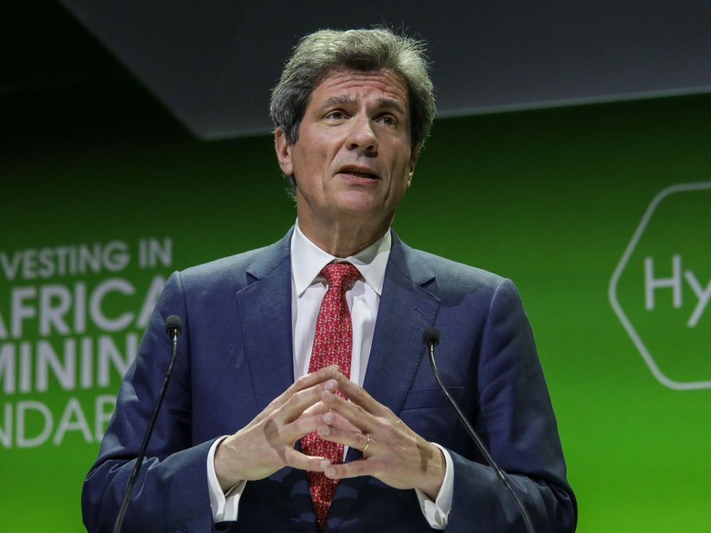

# 美副国务卿：无法将中国排除在关键矿产供应链之外，非常乐意合作

（观察者网讯）据美国彭博社消息，当地时间9月22日，美国国务院负责经济增长和环境事务的副国务卿何塞·费尔南德斯（Jose
Fernandez）表示，尽管华盛顿正寻求实现产品原材料来源“多元化”，但美国不可能将中国排除在关键的矿产供应链之外，需要继续与中国合作。

费尔南德斯在纽约出席新闻发布会时表示，中国在原材料加工等领域发挥着至关重要的作用，“我们非常乐意与中国在这方面开展合作，目前我们从中国公司购买了许多矿产品。”

他指出，中国依然是美国的“重要合作伙伴”，特别是因为中国加工的矿产品是电动汽车电池的关键组成部分，而推广电动汽车是拜登政府应对气候变化努力的核心原则。“更大的问题是气候变化，世界需要中国的参与。没有中国，我们无法解决气候危机。”

费尔南德斯强调，中国是世界第二大经济体，是美国主要的贸易伙伴，“我们将继续与他们合作”。但他同时声称，美国政府将在合作的同时保护美国公司的利益，并在美方认为所谓“应该指责的地方”指责中国。

_资料图：美国国务院负责经济增长和环境事务的副国务卿何塞·费尔南德斯 图自彭博社_

美国总统拜登19日在联合国大会发表讲话时也表示，美国不寻求与中国发生冲突，不想与中国脱钩。拜登在讲话中说，美国寻求以“负责任的方式”管理两国竞争，避免竞争演变成冲突。但他同时声称，美国政府致力于确保所谓“自由公平的经济竞争环境和规则”。

美国政府在去年与澳大利亚、英国、法国、德国、日本、韩国等伙伴国家建立了“矿产安全伙伴关系”，这项倡议即由费尔南德斯领导，旨在加强美国的关键供应链。彭博社称，美国政府想要通过倡议将外国投资和西方专业知识引入发展中国家的采矿业，帮助美国获取锂、锰和钴等关键原材料的供应。

尽管美国政府一再鼓吹要“减少对中国供应链的依赖”，美国经济学家近期发布的研究报告显示，美国虽然减少了来自中国的直接进口，但经由产业链在越南、墨西哥等第三国的再分配，中美的“间接供应链”联系依然完好，甚至有所加强。

中方宣布自8月1日起对镓和锗两种稀有金属实施出口管制后，美国商务部表示“坚决反对”，美国国防部则发现美军“缺乏镓的储备”。镓和锗对于半导体、电信和可再生能源行业至关重要，其中镓更是用于半导体和军用雷达系统的关键物质，美军的多款“尖端军用雷达”，都依赖镓来支持其天线和其他重要部件。

为保障美国的镓供应，五角大楼计划在今年年底前首次向美国或加拿大企业签署回收镓的合同，“重点从现有的其他产品废物流中回收镓”。

美国国会下设的“美中经济与安全评估委员会”曾在2022年的年度报告中援引美国地质调查局（USGS）的数据称，在美国净进口依赖度超过50%的47种材料中，中国是其中25种材料的唯一或主要进口来源之一，其中就包括镓。

有关“关键矿产领域对华依赖”的说法，中国外交部此前表示，中方一贯认为，关键矿产资源国都应该为保障相关产业链供应链安全稳定发挥积极作用，共同承担全球相关矿产供应的责任，确保相关经贸合作正常开展。同时，不应将世界经济政治化、工具化、武器化，破坏全球产业链供应链稳定，冲击现有世界经济体系。中方将继续深度参与全球产业分工和合作，维护多元稳定的国际经济格局和经贸关系。

中国外交部发言人汪文斌9月1日谈及中美关系时也表示，渲染竞争有百弊而无一利，寻求合作是必需而不是选择。事实反复证明，中美合则两利，斗则俱伤。要跳出竞争对抗逻辑，照顾彼此利益和关切，寻求交流合作的最大公约数，画出合作共赢的最大同心圆，为中美两国各自发展、共同繁荣，为全世界和平与发展共同贡献大国智慧和力量。

**本文系观察者网独家稿件，未经授权，不得转载。**

