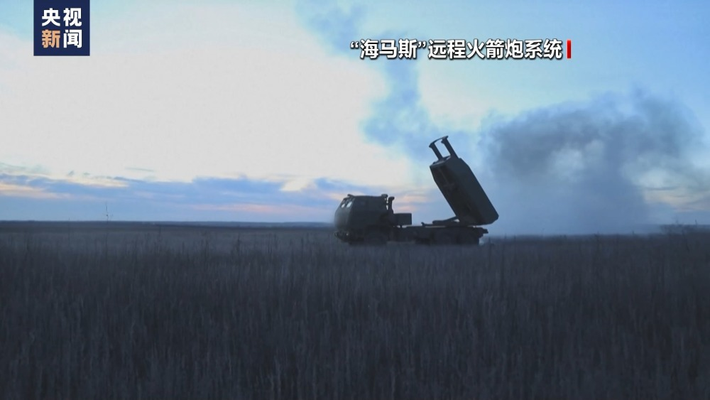

# 美媒：美国将向乌提供陆军战术导弹系统

据央视新闻客户端消息，当地时间22日，美国全国广播公司援引美国官员的消息报道称，美国总统拜登已经对乌克兰总统泽连斯基表示，美方将向乌方提供陆军战术导弹系统。

报道称，美国官员表示，尽管他们尚不清楚向乌方提供陆军战术导弹系统的具体时间和具体型号，但美国政府已经确定将满足乌克兰的要求，进一步加码对乌提供军事装备的规模。

据了解，陆军战术导弹系统由美国洛克希德·马丁公司于上世纪80年代研发，射程达300公里。同时它还可以通过“海马斯”火箭炮发射，并与此前英国提供的机载“风暴之影”巡航导弹形成互补。此前数月，乌克兰就一直要求美国提供陆军战术导弹，进而打击克里米亚的俄方目标。

编辑 辛婧

