# 美股收盘：美联储官员放鹰，美股反弹失利四连跌，中概强势反攻

本周最直接打击美股的来源——美国国债收益率暂时止住创多年新高的势头。但美联储官员又放鹰声：理事鲍曼和波士顿联储主席柯林斯都称，如果经济数据不配合，美联储仍可能继续加息，鲍曼暗示可能加不止一次。美股周五盘中冲高回落，全周只有中国公布信贷数据向好的周一一日上涨。

有“全球资产定价之锚”称号的基准十年期美债收益率在周五亚市盘中曾2007年来首次突破4.50%，连续第四日创2007年来新高，欧美交易时段总体回落。对利率敏感的两年期美债收益率继续回落，一度较周四所创的2006年来高位后回落超过10个基点。但美债收益率全周升势不改。

美债收益率回落减轻了成长型科技股的压力，芯片股力挺大盘反弹，而特斯拉为首的多只蓝筹科技股继续拖累大盘。中概股周五强劲反弹，更胜大盘一筹。中美关系新消息提振市场，央视报道称中美商定成立经济领域工作组，工作组将定期、不定期举行会议，就经济、金融领域相关问题加强沟通和交流。

在美联储暂停加息但放鹰、英国和瑞士央行也暂停行动但为加息敞开大门的“超级央行周”，美国股债双杀继续上演，标普和纳指自硅谷银行倒闭半年多来从未如此全周惨淡，美债收益率一再创多年新高。分析师称，本周美联储的态度比市场更为强硬，欧央行传达了加息还未结束的预期，挪威和瑞典也保留了进一步加息的可能性，市场不得不开始适应“高利率持续更久”的新游戏规则。

在美联储本周三公布上调明后两年利率预期、及周五美联储鹰派讲话后，市场重新定价对美联储利率的路径预期，今年内加息和明年降息的预期都有所降温。

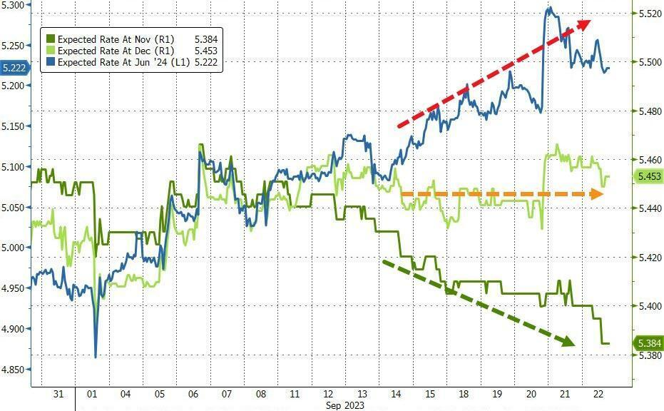

_本周市场对今年11月美联储加息的预期有所下降，对明年降息的语气明显下降_

虽然欧美股市齐跌，但英国国债本周未追随美国和欧元区国债价格下挫，反而收益率加速下行。对利率敏感的两年期英债收益率降幅超过20个基点，主要体现英国公布8月CPI意外未加快增长、反而同比增速创一年半新低的影响。

主要央行的决策周五继续冲击汇市，日元周四的反弹昙花一现，在日本央行维持超级宽松不变、重申必要时加码刺激后盘中跳水，日元兑美元迅速跌回148.00下方，一度逼近十个月低位，周五日本财务大臣铃木俊一称，不排除对外汇过度波动采取任何应对的可能，市场对日本干预汇市的猜测继续升温。

受益于日元盘中跳水，美元指数连续第三日创半年多来新高，虽然在体现美国企业活动几乎停滞的9月PMI公布后“闪崩”、短线转跌，但无碍全周涨势，继续创2014年来最长连涨。评论称，在美元指数至此连涨十周后，PMI数据可能给了美元多头一个获利回吐的借口。

大宗商品中，美债收益率回落到支持下，黄金反弹，因美元走强的压力，涨幅有限，未能扭转周四大幅回落导致的全周跌势；美国PMI公布后，国际原油持续回吐涨幅转跌，美油微涨，布油继续收跌，一个月来首次单周累跌，受累于美联储鹰派暂停加息后周三加速回落。

欧洲天然气成为本周商品中的大赢家。雪佛龙在澳大利亚的液化天然气（LNG）的工厂同工会达成协议，结束罢工，欧洲天然气周五曾盘中曾跌超3%，但此后转涨，继续刷新一个月来高位。评论称，俄罗斯宣布汽油和柴油出口禁令的气价走高的部分推手，禁令公布后，周四欧洲气价和油价就同步上涨，周五布油盘中走高也带动了气价。此外，交易者密切关注欧洲最大天然气供应国挪威的季节性维护期生产情况。

标普纳指创硅谷银行倒闭以来最大周跌 特斯拉所在板块领跌 芯片股跑赢大盘 中概股指收涨近3%

三大美国股指集体高开。标普500指数和纳斯达克综合指数早盘一直保持涨势，标普曾涨超0.6%，纳指曾涨近1%。道琼斯工业平均指数盘初转跌，开盘约半小时后彻底摆脱跌势，早盘曾涨超80点、涨近0.3%。午盘美股指回吐涨幅，道指和标普不止一次转跌，尾盘刷新日低时，道指跌超120点、跌近0.4%标普跌0.3%，尾盘纳指也转跌。

最终，三大指数连续四日集体收跌。道指收跌106.58点，跌幅0.31%，报33963.84点，连续两日刷新7月10日以来低位。标普收跌0.23%，报4320.06点，刷新6月9日以来低位。纳指收跌0.09%，报13211.81点，连续两日刷新6月7日以来收盘低位。

科技股为重的纳斯达克100指数早盘曾涨超1%，午盘回落后微幅收涨0.05%，仍接近周四连跌三日所创的6月26日以来低位。价值股为主的小盘股指罗素2000收跌0.3%，连跌六日，三日刷新6月1日以来低位。

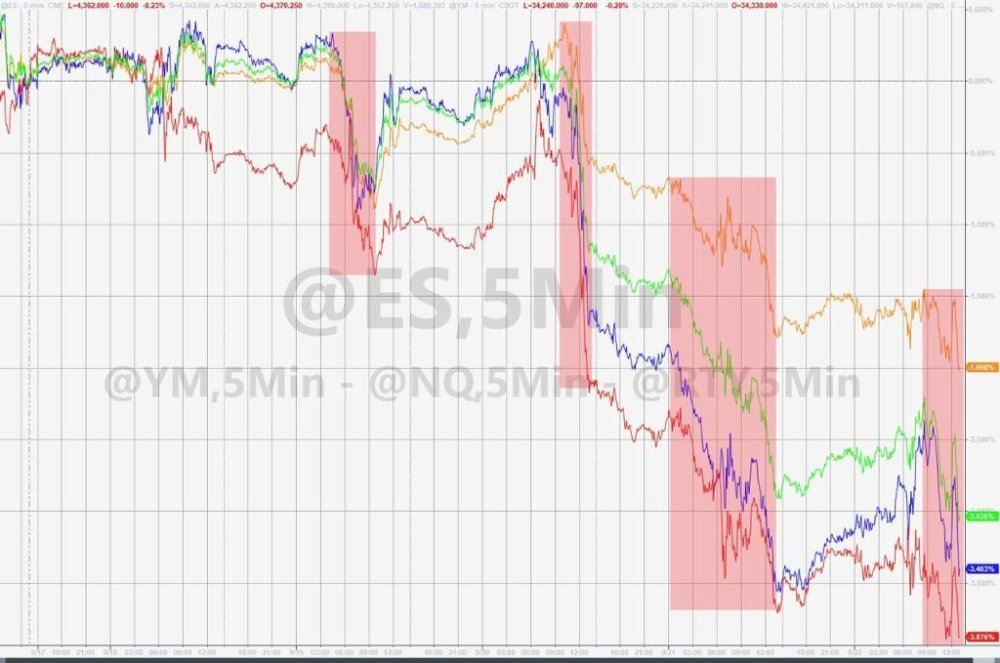

_主要美股指本周走势_

本周主要股指都累计下跌。标普累跌2.93%，纳指累跌3.62%，纳斯达克100累跌3.3%，均创截至3月10日一周、即硅谷银行倒闭当周以来最大周跌幅，都在连涨两周后连跌三周。罗素2000累跌3.82%，连跌三周，最近八周内第七周累跌。上周小幅反弹的道指累跌1.89%，创8月18日一周来最大周跌幅，最近六周内第四周累跌。

标普500各大板块中，周五只有两个收涨，芯片股所在的IT涨近0.3%，能源涨近0.2%。特斯拉所在的非必需消费品跌近0.9%领跌，金融和房产跌逾0.7%，其他板块跌不足0.5%，Meta所在的通信服务跌不到0.1%、跌幅最小。

本周各板块齐跌，至少跌超1%，其中非必需消费品跌超6%，对利率敏感的房产跌超5%，通信服务和材料跌超3%，IT连续三周每周跌超2%，金融、能源、工业本周也跌超2%。

龙头科技股部分盘中转跌，反弹失利。而特斯拉高开低走盘初转跌，收跌4.2%，连跌三日，三日刷新周一跌超3%所创的9月8日以来收盘低位，在连涨四周后本周累跌10.8%，悉数回吐上周约10%的涨幅。

FAANMG六大科技股中，周四连跌两日至8月30日以来低位的Facebook母公司Meta收涨1.1%；周四连跌两日至5月25日以来低位的苹果收涨近0.5%；而周四跌超4%领跌的亚马逊收跌近0.2%，连跌七日，两日刷新8月3日以来低位；谷歌母公司Alphabet收跌近0.2%、微软和奈飞分别收跌0.8%和1.1%，分别连跌四日、六日和三日，继续刷新各自周四所创的8月25日以来、8月18日以来和5月26日以来收盘低位。

本周这些科技股集体累跌，亚马逊跌约8%，Alphabet跌5.2%，上周大跌10%的奈飞跌4.3%，微软跌4%，微软和苹果分别跌0.4%和0.1%。

芯片股在总体连跌三日后反弹，跑赢大盘。费城半导体指数和半导体行业ETF
SOXX盘中涨超1%，收涨约0.8%，告别周四刷新的5月24日以来收盘低位，本周分别累跌3.2%和3.1%。个股中，收盘时，安森美涨超3%，周四因可能失去谷歌AI芯片供应商身份而一度跌超4%的博通涨超2%，英伟达、美光科技、西部数据、微芯科技涨超1%，AMD涨不足0.1%，而英特尔跌超1%；高通尾盘转跌，跌近0.3%；英国芯片设计巨头Arm在上市第七日盘中曾跌超3%，收跌1.6%，连跌六日，上市以来仅涨近25%的上周四上市首日收涨，在上市后首个完整周本周累跌15.5%。

截至周五收盘，英伟达股价较高峰时的8月末收盘累计跌去将近16%。

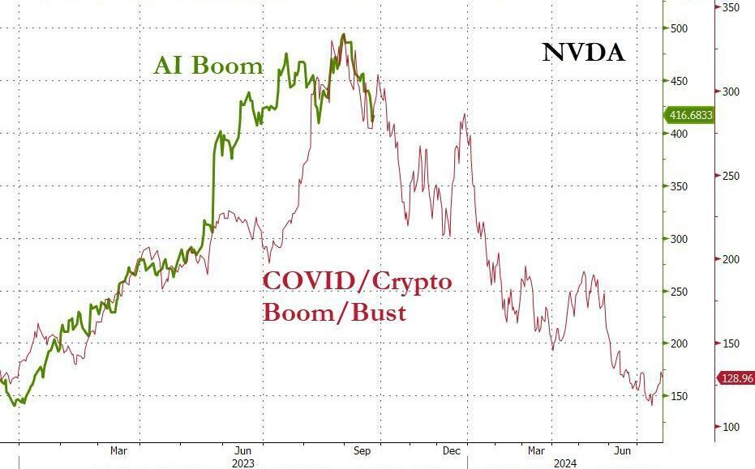

 _英伟达股价远离8月末的高位_

AI概念股大多继续下跌，收盘时C3.ai（AI）、SoundHound.ai（SOUN）、BigBear.ai（BBAI）跌超4%，Adobe（ADBE）跌近0.2%，而Palantir（PLTR）涨0.9%。Vanda
Research指出，流入AI概念股的投资资金继续下降。散户对微软、英伟达、Palantir等AI概念股的兴趣都在减少。

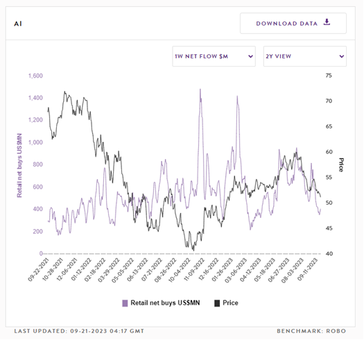

_散户对AI概念股的净买入资金持续下降_

热门中概股总体强势反弹。纳斯达克金龙中国指数（HXC）早盘曾涨约3.9%，收涨约2.9%，脱离连跌五日所创的7月6日以来收盘低位，本周累跌约2.6%。个股中，收盘时B站涨超5%，网易涨超5%，阿里巴巴涨近5%，拼多多、老虎证券涨超4%，爱奇艺涨近4%，腾讯粉单、百度、小鹏汽车涨超3%，理想汽车涨超2%，京东涨2%，蔚来汽车涨近1%。

银行股指数连跌六日。整体银行业指标KBW银行指数（BKX）收跌1.3%，刷新6月25日以来低位，本周累跌4.6%；地区银行指数KBW Nasdaq
Regional Banking Index（KRX）和地区银行股ETF
SPDR标普地区银行ETF（KRE）分别收跌0.5%和近0.7%，连续两日刷新7月6日以来低位，本周分别跌近5%和约5.8%。

重点个股中，全美汽车工会UAW宣布扩大在通用汽车和Stellantis的罢工范围、福特罢工并未升级后，福特汽车（F）盘中曾涨超2%，收涨约1.9%，通用（GM）收跌近0.4%，Stellantis（STLA）收涨0.1%。

波动较大的个股中，季度亏损高于预期、营收低于预期的出版和传媒公司Scholastic（SCHL）收跌13.2%；被瑞银初始覆盖给予买入评级、认为其产品组合稳健、品牌知名度不断扩后，网站创建平台Squarespace（SQSP）收涨4.2%。

泛欧股指连跌两日，跌幅较周四超过1%的明显缓和。欧洲斯托克600指数刷新8月25日以来收盘低位。主要欧洲国家股指多数连跌两日，周四止步两连涨的英股微幅收涨。

各板块中，周五只有科技、油气、基础资源、个人与家庭用品收涨，科技涨近0.8%领跑，工程跌1%领跌，公用事业跌0.9%。个股中，受荷兰国会议员支持对银行增税打击，两家荷兰银行ING和ABN分别跌6.4%和4.5%，ING领跌欧元区蓝筹股指；披露收到Permira和黑石领衔的求购方收购提议后，挪威线上分类广告公司Adevinta飙涨26.5%。

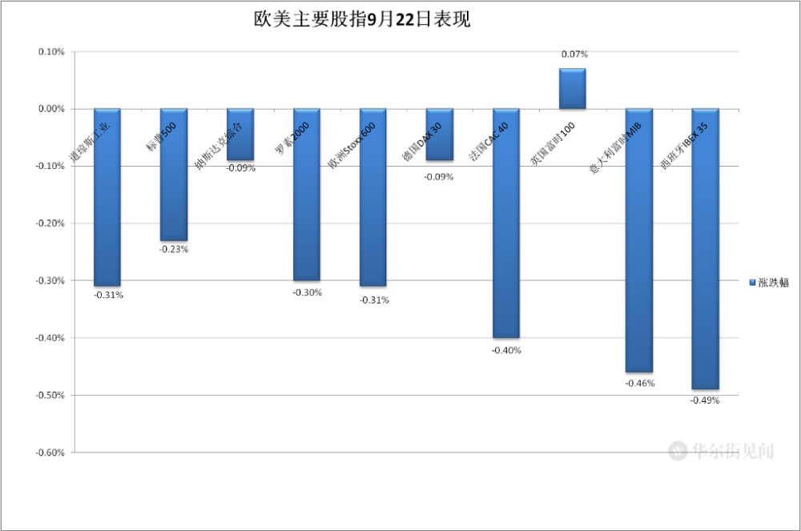

本周斯托克600指数跌约1.9%，创8月18日以来最大周跌幅，抹平上周反弹1.6%所创1月13日以来最大周涨幅，主要源于周四跌1.3%，创8月2日以来最大日跌幅。各国股指均累跌。

本周只有涨近0.4%的电信和涨0.3%的银行两个板块累涨， 累跌的17个板块中，除了跌近0.7%的油气、跌近0.4%的汽车和食品外，其他板块至少跌超1%
旅游跌超5%领跌，化工和工业跌超3%，上周大涨7%的矿业股所在板块基础资源跌超2%，受累于铜等部分金属回落。

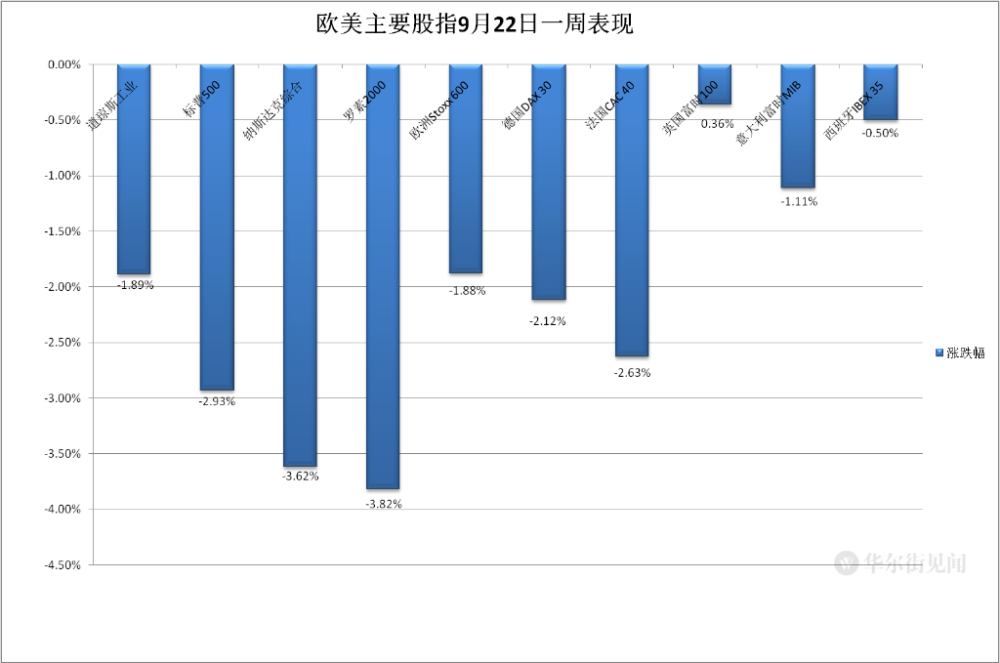

两年期英债收益率一周降超20个基点 十年期美债收益率2007年来首次升破4.5%后回落 仍连升三周

欧洲国债价格大多反弹，收益率回升。到债市尾盘，英国10年期基准国债收益率收报4.24%，日内降5个基点，继周二和周三后本周第三日下降，美联储宣布决议当天曾接近4.21%，创7月24日以来新低；2年期英债收益率收报4.77%，日内降5个基点；基准10年期德国国债收益率收报2.74%，持平周四同时段水平，暂别周四美国失业数据创新低当天逼近2.78%所创的2011年7月以来盘中高位；2年期德债收益率收报3.24%，日内降1个基点。

本周欧债继续表现各异。10年期英债收益率本周累计下降约11个基点，2年期英债收益率降约23个基点，降幅均超过上周，主要源于周三英国公布8月CPI超预期放缓增长后，英债收益率一日至少降超10个基点；10年期德债收益率累计约7个基点，2年期德债收益率升约3个基点，均连升三周。

美国10年期基准国债收益率
在亚市盘中曾升破4.50%接近4.51%，连续四日刷新2007年来将近十六年高位，日内升约1个基点，欧美股市交易期间总体回落，美股开盘后降幅扩大，午盘曾下破4.43%，较日高回落逾8个基点，到债市尾盘时约为4.43%，日内降约6个基点，连升三日后回落，在只有周一和周五下降的本周累计升约10个基点，连升三周，最近九周内第七周攀升。

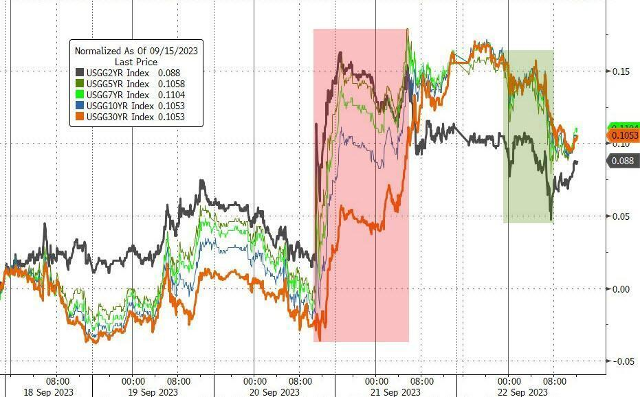

_各期限美债收益率周三盘中拉升，周五有所回落_

对利率前景更敏感的2年期美债收益率在亚市早盘处于5.14%左右的日内高位，自欧股盘中起加速回落，美股早盘下破5.10%，午盘一度降至5.08%下方，较周四逼近5.20%而连续三日刷新的2006年以来来高位回落约12个基点，到债市尾盘时约为5.11%，日内降约3个基点，在连升五日后连降两日，本周累计升约8个基点，连升两周，最近七周内第六周攀升，升幅还不及上上周的11个基点。

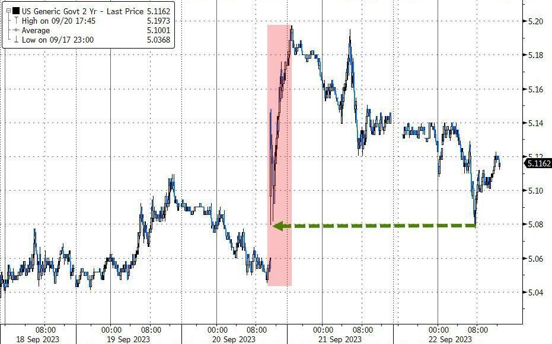

_两年期美债收益率周五盘中回落到周三美联储主席鲍威尔讲话期间水平_

美元指数三日连创半年新高 盘中“闪跌”但连涨十周 日央行决议后日元跳水

追踪美元兑欧元等六种主要货币一篮子汇价的ICE美元指数（DXY）周五全天基本保持涨势，日本央行决议公布后拉升，欧股盘初曾接近150.80，在周三创3月9日以来新高后，连续两日刷新3月8日以来盘中高位，日内涨近0.3%，不过，在美股早盘美国9月PMI公布后短线转跌，跌破105.32刷新日低。

到周五美股收盘时，美元指数逼近105.60，日内涨超0.2%，本周累涨逾0.2%；追踪美元兑其他十种货币汇率的彭博美元现货指数涨0.1%，继续刷新9月8日以来同时段高位，在上周回落后本周累涨0.3%，和美元指数均在连跌三日后连涨三日。

本周美元指数连涨十周，连续三周创2014年以来九年最长连涨周。彭博美元现货指数截至上上周连涨八周，创有纪录以来最长连涨周。

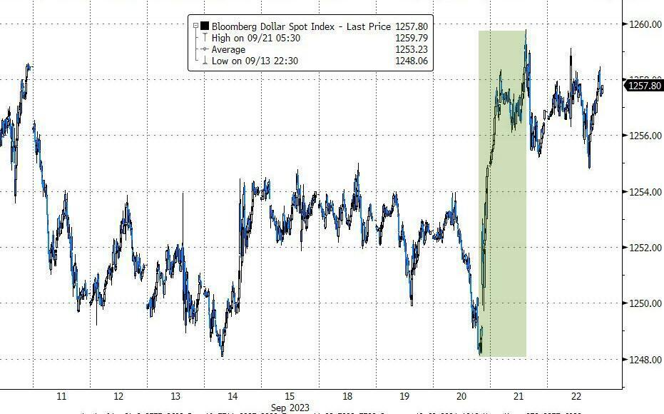

 _彭博美元现货指数最近十周内第九周累涨_

非美货币中，日本央行保持超级宽松，日元盘中跳水，美元兑日元在亚市盘中日本央行公布决议后拉升，迅速重上148.00，在欧股盘前曾涨破148.40、逼近周三盘中靠近148.50而连续三日刷新的去年10月末以来高位，日内涨近0.6%，美股早盘曾短线下破148.00，午盘再度上测148.40；英镑兑美元在欧股盘中曾接近1.2230，刷新周四英国央行暂停加息后所创的约半年低位；欧元兑美元在欧股盘初曾跌破1.0620，连续两日创半年新低，美股早盘美元指数闪跌时抹平多数跌幅，美股收盘后日内跌超0.1%。

离岸人民币（CNH）兑美元在亚市早盘刷新日低至7.3170，转涨后保持反弹势头，美股早盘突破7.30刷新日高至7.2947，日内涨194点，较日低回涨223点，脱离周四跌破7.32刷新的9月11日以来盘中低位。北京时间9月23日4点59分，离岸人民币兑美元报7.2990元，较周四纽约尾盘涨151点，终结四日连跌，本周累跌183点，在上周反弹超800点后回落，最近五周内第二周累跌。

比特币（BTC）在欧股早盘曾涨破2.67万美元刷新日高，后有所回落，美股收盘时处于2.66万美元下方，最近24小时小幅累跌，仍远离周二涨破2.75万美元刷新的8月31日以来高位，最近七日累涨不足0.5%。

欧洲天然气连创四周新高 全周涨近10% 原油止步三周连涨 布油四连阴

欧洲天然气周五有惊无险盘中转涨，连涨四日，虽然涨势较周四缓和，但连涨两周。早盘刷新日低时跌3.5%的英国天然气期货收涨1.58%，报102.16便士/千卡，本周累涨约10.9%；早盘刷新日低时跌约3.9%的欧洲大陆TTF基准荷兰天然气期货收涨1.75%，报39.791欧元/兆瓦时，和英国天然气均连续两日刷新8月22日以来高位，本周累涨约9.1%。

国际原油期货周五因盘中转跌而收盘涨跌各异。美股早盘刷新日高时，美国WTI原油涨至91.33美元，日内涨近1.9%，布伦特原油涨至94.64美元，日内涨超1.4%，美国PMI公布后持续回吐涨幅，午盘曾转跌，刷新日低时，美油跌至89.31美元，日内跌近0.4%，
布油跌至92.2美元，日内跌近1.2%，后美油转涨，布油抹平多数跌幅。

最终，WTI
11月原油期货收涨0.44%，报90.03美元/桶，脱离周四自9月13日以来首次跌穿90美元刷新的一周多来低位，止住三连跌；布伦特11月原油期货收跌0.03%，报93.27美元/桶，连跌四日，连续两日刷新9月13日以来收盘低位。

本周美油累跌约0.03%，布油跌0.7%，止步三周连涨。虽然周一齐创去年11月以来新高，但此后连日回落，尤其是美联储暗示今年内还有一次加息后，跌幅扩大。周三当天美油收跌1%，布油跌近1%。

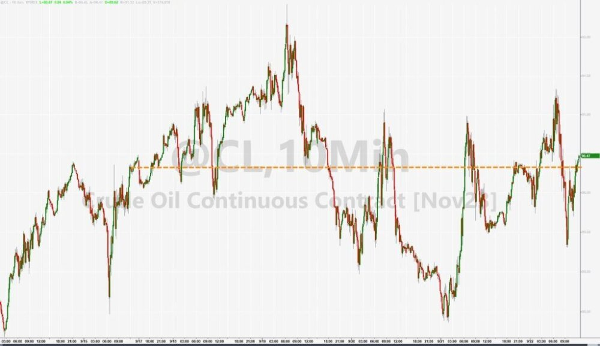

_美国WTI原油一周走势_

伦铜脱离五周低位 一周跌超2% 伦锡连涨两周 黄金告别一周低位 全周仍未累涨

周四齐跌的伦敦基本金属期货全线反弹。领涨的伦锡涨超2%，抹平周四回落到跌幅，两周多来首次收盘涨破2.62万美元。两连跌的伦镍涨超1%，走出2021年12月以来低谷。伦铜重上8200美元，告别周四回落所创的五周低位。连跌四日的伦铅止住连续两日创8月末以来新低之势。周四回落的伦锌和伦铝分别涨涨近2%和逾1%，伦锌逼近上周四所创的四个月高位，伦铝靠近周三所创的七周高位。

本周基本金属涨跌各异。伦铜、伦铅跌超2%，回吐上周反弹的涨幅，伦镍也跌超2%，连跌三周，而伦铝、伦锡涨超2%，伦锌涨超1%，连涨两周。

纽约黄金期货反弹，但涨幅有限，美股早盘刷新日高至1949.1美元时涨近0.5%。最终，COMEX
12月黄金期货收涨0.31%，报1945.6美元/盎司，告别周四刷新的9月14日以来收盘低位。

在只有周四一日下跌的本周，期金累跌0.03%，未能连涨两周，最近五周内第二周累跌，受累于周四跌1.4%创8月1日以来最大日跌幅。

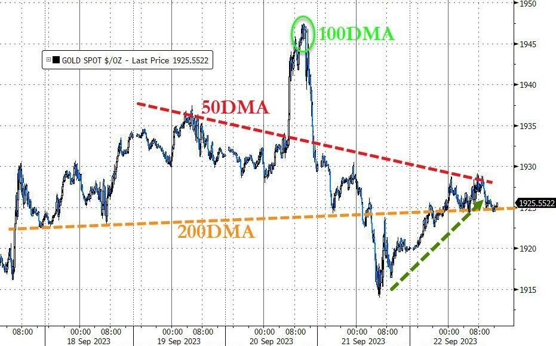

 _现货黄金全周周五大致回到上周五水平，周五盘中曾跌破200日均线，后重回上方_

