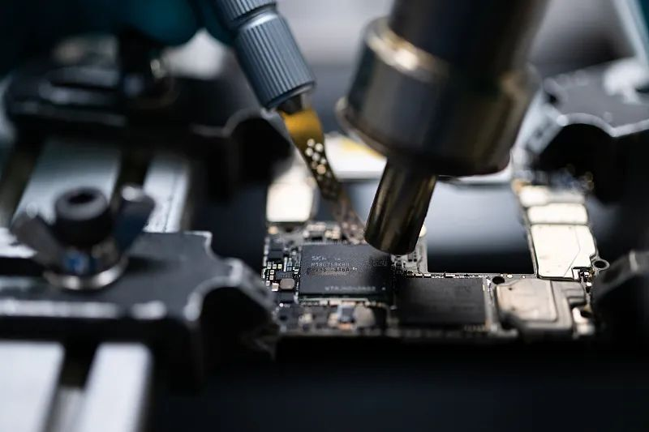

# 美国芯片法案细则定板

《美国芯片法》最后的执行细则出台之后，美国公司获取补助款基本扫清了最后障碍

文 |《财经》特派记者 金焱 发自华盛顿

编辑 | 苏琦

美国商务部当地时间9月22日公布了《美国芯片法》最后的执行细则。其目的是在对美国半导体和电子制造业提供补助的同时，确保不会让中国以及其他被美国视为安全关切国家的半导体行业从中受惠。有媒体报道，全球半导体销售额2022年总计约5700亿美元，近三分之一来自中国。中国不但是消费类电子商品的全球制造中心，从2021年开始，中国大陆的芯片制造能力也超过了日本，成为仅次于韩国和中国台湾地区的最大行业参与者。

美国商务部不具名官员对《财经》记者表示，该规则详细阐述了两个核心条款：一是禁止法案的补助资金接受者在十年内扩大被视为安全关切国家的半导体设备和材料的制造能力；其次，限制补助资金接受者与相关外国实体进行某些联合研究或提供技术转让和许可。美国商务部长雷蒙多此前在国会作证时表示，
“我们必须绝对警惕，不要让一分钱帮助中国超越我们。”

全球芯片生态系统极为复杂，出口管制目的是去影响国家安全，但存在更广泛的供应链问题。摄《财经》记者金焱

美国总统拜登一年前签署了《美国芯片法》，旨在为美国半导体芯片行业的生产、研发和人才培养提供总额高达527亿美元的资金支持，以便强化美国在高科技领域与中国的竞争，同时降低美国在先进半导体芯片上对外国和外国公司的依赖。2022年10月，美国商务部进一步收紧对中国半导体行业的出口管制，禁止某些使用美国设备生产的半导体芯片向中国出口，目的则是希望借此减缓北京的技术，特别是军事技术的进步。美国的努力不仅局限于在产业政策和人才方面与中国竞争，更为推进制造业生产力和经济包容性等广泛的国家目标，同时增加美国联邦政府对科学和技术的投资。

美国商务部长雷蒙多日前表示，在她访问中国期间，华为推出了一款搭载先进芯片的新型手机，这让她感到不悦。

专门研究信息和传播政治经济学的国际知名学者、美国佐治亚理工学院公共政策学院教授弥尔顿·穆勒（Milton
Mueller）对《财经》记者表示，这个所谓的“安全护栏”
计划通过禁止美国、中国台湾地区、韩国或日本公司利用《美国芯片法》中的补贴与中国大陆合作或投资，加强了对中国大陆芯片生产的封锁。这对于台积电或一些可能希望获得补贴的美国公司来说最为重要。如果他们得到了补贴，他们就不能以各种方式与中国合作，倘若他们以各种形式同中国合作，美国会收回补贴资金。

此前全球最大芯片代工企业台积电为其美国芯片工厂项目寻求最高150亿美元的美国政府补贴。不过台积电也明确表示，反对美国方面为该补贴设置的一些附加条件。据报道美方可能要求台积电方面分享芯片厂利润，并提供详细运营信息。台积电2022年12月6日在美国亚利桑那州的工厂举行移机典礼，美国总统拜登亲临现场。台积电的这一海外最大投资计划对亚利桑那州两座芯片工厂投资400亿美元，其中一期工称预计从2024年开始生产4纳米制程技术，二期工程预计于2026年开始生产3纳米制程技术。

此刻，中美两国领导人11月借亚太经合组织峰会会晤的准备工作已然在幕后进行。同时，为落实中美两国元首巴厘岛会晤重要共识，根据国务院副总理、中美经贸中方牵头人何立峰与美国财政部部长珍妮特·耶伦达成的共识，中美双方商定，成立经济领域工作组，包括“经济工作组”和“金融工作组”。“经济工作组”由中美两国财政部副部长级官员牵头，“金融工作组”由中国人民银行和美国财政部副部长级官员牵头。两个工作组将定期、不定期举行会议，就经济、金融领域相关问题加强沟通和交流。

美国商务部长雷蒙多8月底对中国访问时，双方同意就两国间的经贸往来建立新的沟通渠道，其中包括一个新的商务事务工作组和出口管制信息交流机制。多位中美关系专家对《财经》记者表示，中美承诺更多的进行对话，但显然在相当多的领域没有太多的妥协空间。

芯片制造，特别是高端芯片制造本土化的强调越来越成为大势所趋。围绕芯片制造的妥协空间也越来越小。摄《财经》记者金焱

美国的半导体芯片补助资金为527亿美元。美国商务部从2023年6月起开始接受美国半导体制造业以及芯片制造设备和材料行业总额为390亿美元补助的申请，并于8月9日透露，一共有460多家公司对获取美国政府提供的巨额半导体芯片补助款表达了兴趣。据信，《美国芯片法》最后的执行细则出台之后，美国公司获取补助款基本扫清了最后障碍。

新推出的规定禁止补助资金接收者在10年内大幅扩大相关受关切国家的半导体制造能力，同时也限制补助接收者与受关切国家的实体进行某些联合研究或技术转移许可，但是允许国际标准、专利许可、晶圆代工以及封装服务。新推出的最后规则禁止补助接收者在10年内实质扩大受关切外国尖端和先进设施的半导体制造能力，同时澄清说晶圆生产也包含在半导体制造业之内。规定还将扩大半导体制造能力与增加洁净室或其他生产空间直接联系起来，认定扩大产能5%以上就是实质性扩大半导体产能。规定还禁止补助接收者增加受关切外国半导体企业新的洁净室面积或生产线，使其产能增加10%以上。规定还将某些半导体芯片认定为对国家安全至关重要，因此对包括在高辐射环境下或其他专用于军事能力方面的量子计算当代及成熟节点芯片要施以更加严厉的限制。

责编 |张雨菲

题图 | 视觉中国

