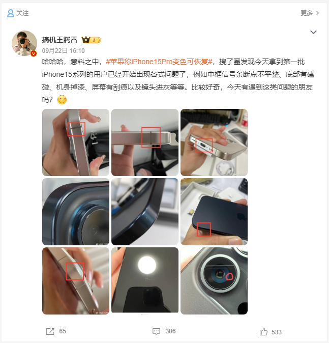
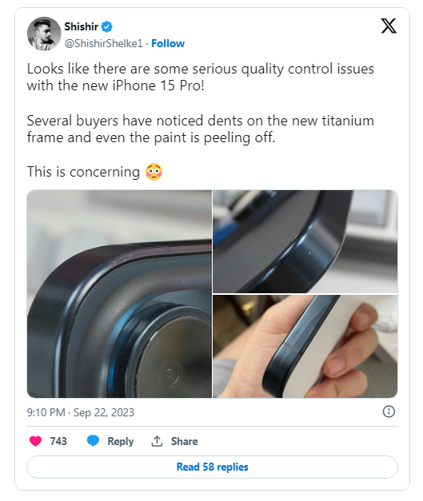
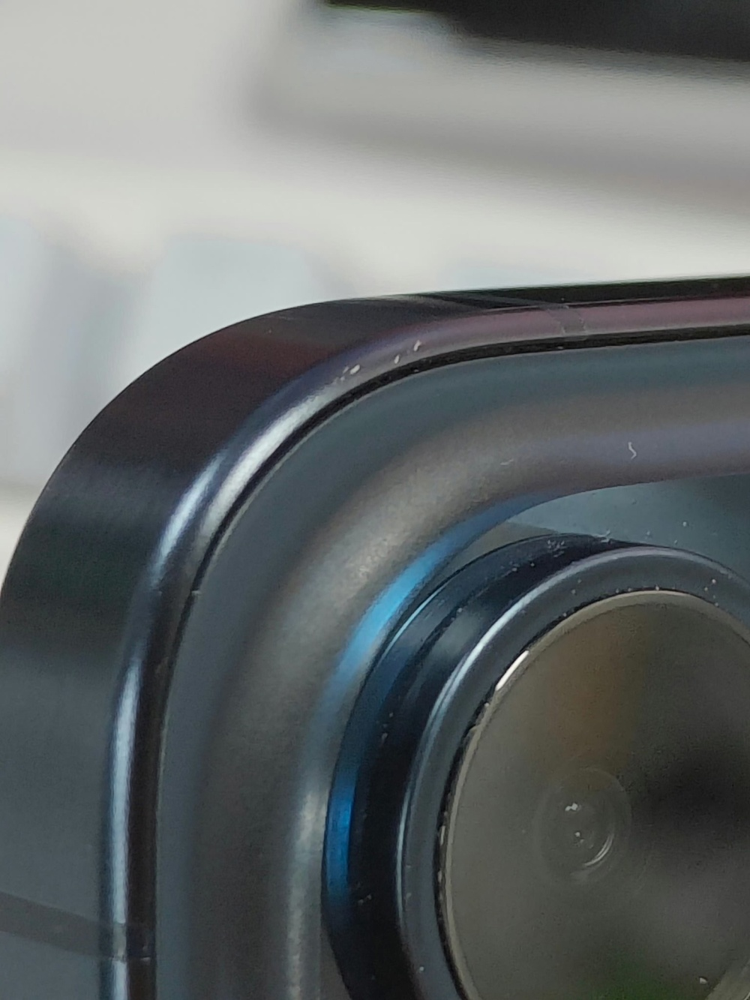

# 镜头进灰、机身掉漆、屏幕有刮痕，iPhone 15 Pro开箱即翻车？

IT之家 9 月 23 日消息，苹果今年推出的 iPhone 15 Pro 和 iPhone 15 Pro Max
改用钛合金材质，但不少用户反馈开箱就出现了掉漆的情况，此外还出现了中框信号条断点不平整、底部有磕碰、机身掉漆、屏幕有刮痕以及镜头进灰等各种问题。

IT之家查询微博、X（推特）等社交平台，发现这些问题并非个例，也并非仅出现在国内，基本上全球都有用户反馈存在上述问题。

_图源搞机王腾霄_

苹果官方表示在 iPhone 15 Pro 和 iPhone 15 Pro Max
两款机型上，在沾染指纹之后，可能会改变钛合金边框的颜色，但这种变色并非永久性，可以像前代 iPhone 一样擦去，恢复干净的表面。

**延伸阅读：**

[iPhone 15 Pro耐用性测试：钛合金更容易出现划痕](https://new.qq.com/rain/a/20230923A011GL00)

