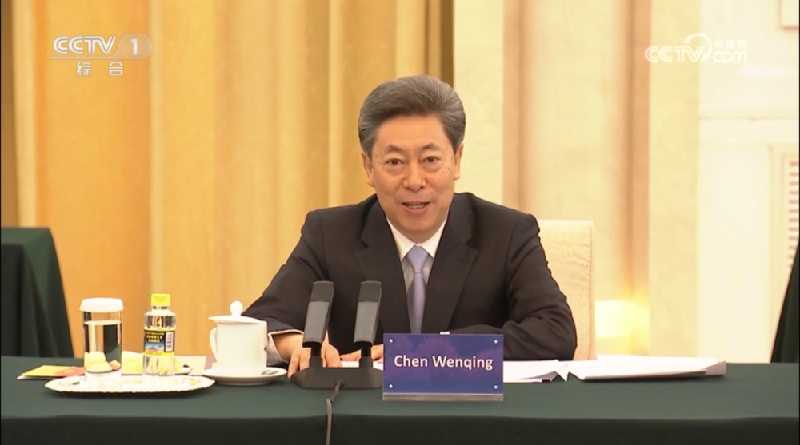
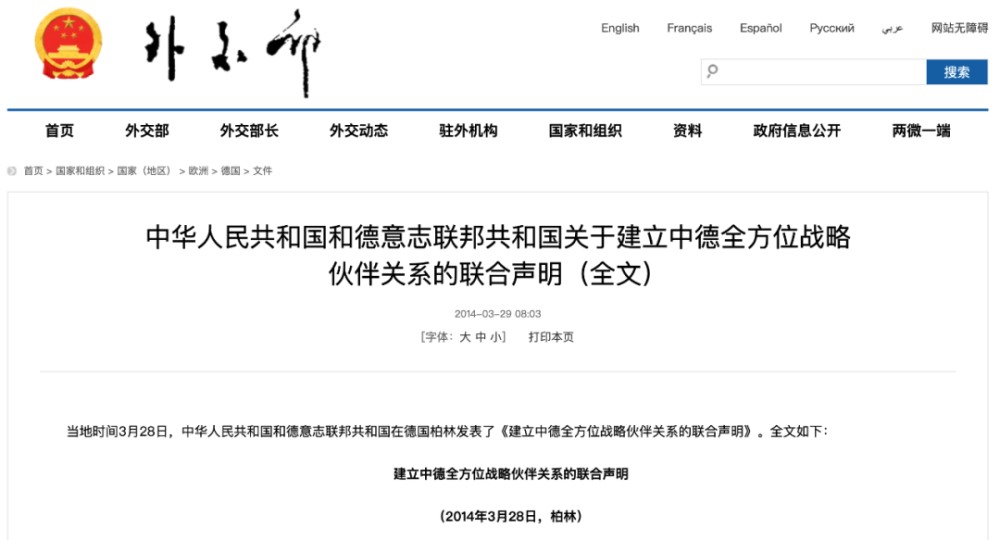

# 中央政法委书记陈文清出国参会，时隔四年机制重启，出现一个重要变化

**撰文 | 高语阳**

新华社消息，当地时间9月22日，中共中央政治局委员、中央政法委书记陈文清在罗马会见意大利副总理兼外长塔亚尼。

此前，新华社报道，陈文清将于9月21日至28日前往德国出席第四次中德高级别安全对话并访问德国、意大利、塞尔维亚。

这是陈文清2022年10月底出任中央政法委书记以来，第二次出国参会，并首次专程出访他国。

而且，这是中德高级别安全对话时隔4年再次举行。

**重要变化**

今年5月下旬，陈文清应邀前往俄罗斯出席第十一届安全事务高级代表国际会议和中俄执法安全合作机制第八次会议。

这次前往德国出席第四次中德高级别安全对话，是陈文清出任中央政法委书记以来，第二次出国参会。

_资料图_

**2017年中德高级别安全对话机制建立。**

2017年6月13日，首次中德高级别安全对话在北京举行。时任中央政法委秘书长汪永清与德国联邦总理府情报国务秘书克劳斯-迪特·弗里彻共同主持对话；

2018年9月21日，第二次中德高级别安全对话于在德国柏林举行，时任中央政法委秘书长陈一新与德国联邦总理府情报国务秘书盖斯曼共同主持对话；

2019年8月30日第三次中德高级别安全对话于在浙江省杭州市举行，时任中央政法委秘书长陈一新与德国联邦总理府情报国务秘书盖斯曼共同主持对话。

**时隔4年，第四次中德高级别安全对话在德国举行。一个重要变化是，这次中方参加对话的是中央政法委书记陈文清。**

**中德发表联合声明**

新华社此前报道显示，建立中德高级别安全对话机制是落实习近平主席与默克尔总理共同发表的《建立中德全方位战略伙伴关系的联合声明》的重要举措，体现了两国在安全领域的相互重视以及充满信任的合作。

政知君注意到，2014年3月28日至30日，国家主席习近平对德国进行国事访问。

当时，两国在德国柏林发表了《建立中德全方位战略伙伴关系的联合声明》。

“安全”两字在《声明》中多次出现。

《声明》指出，双方决定建立全方位战略伙伴关系。

**为深化战略伙伴关系，中德两国致力于定期就地区和全球政治、安全问题举行磋商。**

**双方愿意在双边、多边以及中国和欧盟关系框架内深化外交和安全领域战略合作，更加积极参与解决地区与国际冲突。**

**双方决定将现有的战略对话拓展为外交与安全战略对话。**

此外，德国欢迎中国和平发展，中国由此将为国际与地区安全作出更大贡献。

**首次专程出访他国**

这次出国，除了参加第四次中德高级别安全对话，陈文清的行程中还包括访问德国、意大利、塞尔维亚。

新华社报道，当地时间9月22日，陈文清在罗马会见意大利副总理兼外长塔亚尼。

**陈文清说，中方高度重视发展中意关系，视意大利为全面战略伙伴和推动中欧关系健康发展的积极力量。**

“中意同为文明古国，友好交往历史悠久，拥有广泛共同利益和深厚合作基础，理应继承和发扬友好传统，继续为不同社会制度、不同文化背景国家发展双边友好关系树立典范。”

关于“执法安全合作”，陈文清表示，两国相关职能部门多年来在反恐怖、大型活动安保、打击跨国有组织犯罪等领域取得了务实合作成果。

面对复杂的国际形势和严峻的全球性挑战，
**中方愿与意方同行携手，完善安全合作机制建设，全面加强双方各领域各层级交流与合作，为维护两国安全利益作出新的贡献。**

**塔亚尼则表示，意中两国合作广泛、多样化，安全领域合作大有可为。意方愿同中方加强执法安全交流与合作，保护好两国人民安全。**

此外，访意期间，陈文清还会见了意大利内政部长皮安泰多西等意方有关部门负责人。

**资料 ｜ 新华社 中国长安网 中国政府网**

**【版权声明】本文著作权归政知新媒体独家所有，未经授权，不得转载。**

