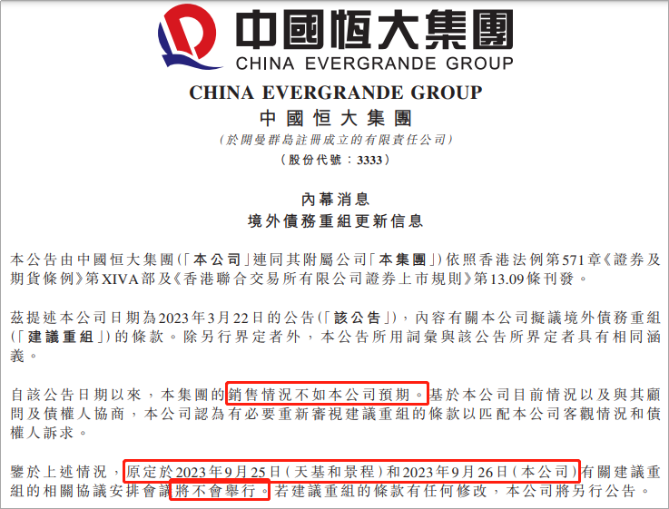

# 恒大公告内幕，基本宣布重组失败

恒大的债务重组，怕是难了。

刚刚，恒大发布内幕消息：

鉴于恒大地产集团正被立案调查，公司目前的情况，无法满足新票据的发行资格。

这意味着，恒大这轮债务重组，倒在第一步，基本宣布失败。

短期内，应该没戏了。

这则公告，透露了两个关键信息点。

一是， **无法发行新票据** 。

这对恒大的债主，彻底泼了一盆凉水。

要知道，此前恒大债务重组表决会议一推再推，到周五（9月22日）时更是直接公告称，债务重组会议不会举行。

放鸽子的理由，也十分牵强：“房子卖得不太好。”

其实，恒大重组方案，是今年3月底公布的。

当时的方案，有三个选择：

第一种，恒大再发行期限长达10-12年的 **新票据** ，用新票据置换旧债；

第二种，发行期限5-9年的 **新票据** ，并且与恒大物业和恒大汽车股权挂钩，债转股；

第三种，就是一和二的组合。

发现没？无论是哪一个方案，都是借新还旧，都要 **发行新票据** ！

结果整了半年，恒大说，我发不了新票据。

这不拉倒了吗？

债务重组，倒在了第一步。

二是，恒大地产集团被立案调查。

这件事发生在8月16日，因涉嫌信息披露违法违规，证监会决定对恒大地产集团立案。

目前还没有调查结果出来，但猫崽推测，其中也许和许家印的离婚传闻有关。

约一个月前，有消息确认，许家印和丁玉梅早在去年就办理了离婚事宜。

但作为上市公司的主席兼实控人，许家印的婚变消息并没有发布正式公告。

这是不对的！

最近一段时间，关于恒大的风声很紧，相关责任人被抓或被调查，颇有一种秋后算账。

许家印的金融帝国，也崩了。

前两年，恒大与盛京银行切割，持有的盛京银行股份被拍卖，剔除董事会。如今，恒大理财、恒大人寿也接连进行整顿。

一周前，恒大财富杜某等涉嫌犯罪人员被深圳公安采取刑事强制措施。

市场消息称，这次恒大财富被抓的人员，均为管理层级别；

不仅如此，恒大人寿被地方国资、太平人寿等组建的金融机构接管。

而恒大人寿原董事长、现中融人寿代行董事长朱加麟也于近日被带走调查，或与其在恒大人寿任职有关。

恒大，债务重组还有希望吗？

债务重组，事关恒大能不能活下去，如果债务重组不成功，许家印面对的结局只有一个——破产清算。

截至今年6月底，恒大借款总额6247.7亿元，现金及等价物仅40.47亿。

今夜，恒大的6248亿元债主无眠。

