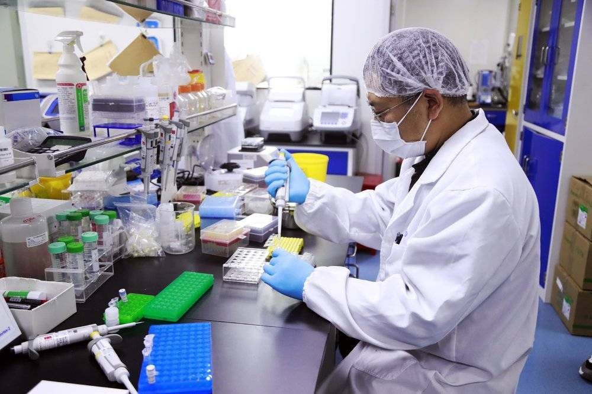

# 百济神州暴跌背后：中国创新药正处在一个危险的时刻

出品｜虎嗅医疗组

作者｜陈广晶

编辑｜廖影

头图｜视觉中国

刚刚凭借泽布替尼在美国热卖，坐稳中国创新药“一哥”之位的百济神州，再次实现了中国新药“零的突破”，但是这次迎接他的却是股价的持续下跌。

9月19日晚，百济神州发布了关于新药出海的消息，称该公司核心产品百泽安（替雷利珠单抗）获得欧盟批准，用于单药治疗既往接受过含铂化疗的不可切除、局部晚期或转移性食管鳞状细胞癌(ESCC)。同时美国药监局也受理了该药另一项一线治疗该病适应症的上市许可申请。

**百泽安的化学名是替雷利珠单抗，是第三款国产PD-1。上述消息意味着，继2019年泽布替尼成功出海美国以后，百济神州又带领PD-1首次冲进了欧洲市场，并有望很快登陆美国。**

这在国产新药领域，是一个非常炸裂的消息。要知道，因为泽布替尼在美国销售额的快速增长，百济神州今年上半年营业收入大涨了72%，总收入达72.5亿元，虽然还没有扭亏，也大大提振了产业界和投资界的士气。

然而，上述消息一出，百济神州的在A股、港股、美股的股价，齐刷刷开始下跌。其中，A股股价在冲到145.88元的新高点之后，连续三天下跌，累计跌幅约10.2%；美股和港股的累积跌幅也都超过了10%。

来自：东方财富网

欧美市场是最受创新药青睐的海外市场，特别是审评审批比美国更为宽松，且更加重视性价比的欧洲，几乎是中国创新药最理想的出海目的地。作为全球创新药的第二大市场，欧洲年度创新药市场规模可占全球总量的16%。

**百泽安如果能够出海欧洲，也有望进一步增加百济神州的销售额。**

尽管有默沙东的K药（帕博利珠单抗）这座大山在，百济神州总裁、首席运营官吴晓滨博士仍然看好百泽安市场前景。他在接受21世纪经济报道采访时还乐观估计，按照PD-1市场全球总规模500亿美元，百泽安能获得1%的市场，就意味着5亿美元的收益。

**如果可以获得2%的市场规模，就可以迈过年销10亿美元的大关了。这对于整个创新药产业来说，都算得上“里程碑”事件了。**

既然如此，为什么资本市场会给出如此负面的反应？背后反映出创新药产业怎样的变化？

百济神州为什么下跌？

百济神州股价下跌的背后，是利好消息与创新药领域的悲观情绪的角力中，悲观情绪占了上风。

从公司发布的公告看，百济神州在发布产品进入欧洲市场消息的同时，也发布了另一个消息，就是其海外子公司百济神州瑞士与合作伙伴诺华签订《共同终止和释放协议》，
**“重新获得开发、生产和商业化替雷利珠单抗的全部全球权利，且无需支付特许使用费”。**

百济神州和跨国药企诺华的这次合作可以追溯到2021年1月11日。当时也正是中国创新药风光无两的时刻，在前一年年底的“国谈”（国家医保谈判）中，中国4款PD-1同时进入医保支付范围，在企业和投资者的想象中，接下来，国产PD-1的销量将会有一个非常大的增长。

作为替雷利珠单抗出海的关键一笔，百济神州不仅得到了进入欧美市场的有力帮手，还拿到了6.5亿美元首付款，加上里程碑款这一合作总额超过22亿美元，在当时刷新了最高纪录；授权范围也囊括了美国、加拿大、欧盟成员国、英国、俄罗斯和日本等11个国家和地区。

**可以说，这一合作无论是成交金额还是合作范围都是空前的，在当时被认为是中国生物制药产业全球化的一个里程碑事件，合作双方和投资人都是对此寄予厚望的。**

然而短短2年多，这个里程碑就“夭折”了。新的协议名义上是百济神州“收回”了全球权益，实际上也就是诺华“退掉”了这款药，不收回6.5亿美元的首付款，也不再持续支付余下的超15亿美元的里程碑款。

这次解约称得上是体面的分手，但是也增加了外界对替雷利珠单抗下一步出海进程的疑虑。

**更重要的是，这成了中国创新药领域近期“坏消息”中的一个。**

就在百济神州公布PD-1出海喜讯之前，mRNA龙头企业斯微生物创始人李航文被列入失信人名单。从天眼查信息看，该公司仅作为被告的合同纠纷就有10个。其中9个发生在2023年，涉及金额从十几万到数百万不等。

几乎同时，多家媒体报道了恒瑞医药“解散”其子公司瑞石生物的消息。根据财联社等媒体的消息，9月15日下午瑞石生物已经召集员工开会通报了董事会决议，其中就包括要终止经营活动、部分员工将被遣散、遣散方案在制定中。这则消息尚未得到企业证实。

9月19日，另一家知名创新药企君实生物也曝出了裁员的消息。根据财经大健康的报道，有君实生物相关人士向其证实，旗下一个子公司实验室裁了十几个人的项目组，属于“研发资源的整合优化”。

从去年开始就有业内人士预测，中国将有500至2000家创新药企消失。如今看在，至少创新药企业收缩、裁员的号角已经吹响了，而这一切还只是开始。

“这也是好机会，我们等市场验证过，再去投活着的企业。”在9月19日至20日，由BioBAY主办的第十二届中国医疗器械产业大会期间，有知名投资人自嘲说。

这未必是正式的决策，不过，也在一定程度上反映了创新药械领域的投资现状——对于已经有一定进展的企业投资，资本开始持观望态度，对于研发周期更长的生物制药更是如此。
**可以说，此刻中国创新药正处在一个危险的时刻，百济神州的“退货”消息，则在这种微妙的悲观情绪上，又踏上了一脚。**

百济模式还行得通吗？

客观来说，任何创新技术发展都不可避免要经历周期，高光和低谷都是其中的一部分。在投入大、研发耗时长、市场回报预期高，堪比豪赌的创新药领域，这样强势来袭的周期，更加具有浓重的宿命感。

从百济神州的发展轨迹来看，他们顺应大势，走出了独特的“高举高打”之路，但是如今“窗口期”已经过去，无论是百济神州还是其追随者，如果不尽快调整策略，结果都会非常危险。

**长期以来，百济神州因为大手笔投资搞研发、高调引入行业顶级人才等“烧钱”之举而饱受争议。**

_百济神州在广州的生物岛创新中心。 来自：视觉中国_

**近期该公司的市场表现似乎在证明其发展模式的正确性。**
从数据看，除了2019年12月份，该公司的小分子药“泽布替尼”获FDA批准上市，2023年上半年也是这家企业的高光时刻。根据百济神州的财报，今年上半年其产品收入66.96亿元，同比上升82.2%。

这个数字占到了该公司当期总收入的92%以上，其中泽布替尼的全球收入贡献了几乎一半的收入。

更加细分的数据显示，泽布替尼在美国的销售额25.19亿元（约2.6亿美元），已经远超中国市场贡献。而且不同于很多企业出海销售主要依靠合作伙伴，百济神州在中国和美国都有自建的销售渠道，这样的结果也被认为是验证了该策略的胜利。

受此鼓舞，吴晓滨在前不久举办的第十六届西普会上曾经乐观估计， **按照这个速度，泽布替尼今年的销售额很可能超过10亿美元，“那是非常可观的利润”。**

相比中国市场，欧美市场门槛更高，一旦越过这个门槛，也就证明了产品的价值，药品的利润空间也更大。从百济神州2022年年度报告看，该公司在海外的毛利率达98.32%，远高于国内的67.75%。

而且在这些市场上市，也获得了更多国家和地区的“通行证”。除了赚欧美市场的钱，吴晓滨认为中国新药在不发达国家的广阔市场会更有所作为。

“他们有几十亿人口，还在继续重复着中国《我不是药神》的故事。”吴晓滨指出，中国创新药应该考虑如何走到这些国家去，东南亚和“一带一路”国家，走到其他发展中国家去，“让他们的《我不是药神》的时代过去，我们国家的创新药作用就太大了”。

**只不过，要实现这个愿景，不仅要有好的研发团队，还要有好的销售团队。所有这一切都需要钱，需要大量的资金投入，而且在相当长时间内见不到回报。**

从百济神州的经验看，截至6月30日，该公司累计未弥补亏损已经达到561.91亿元，如果算上已经“弥补”上的资金投入，这家成立于2010年的创新药公司，仅2016年上市以来就已经烧掉了700多亿元。就在加紧布局全球渠道的2022年，他们产品销售投入增加了近20亿元，增幅约74%。

从百济神州2023年上半年的业绩报告看，1-6月份，其营业总成本高达126.3亿元，几乎是产品收入的两倍，比去年同期又多花了20亿元左右。

_数据来自百济神州年报，虎嗅制图_

未来随着收回全球销售权，且不论收益会如何，单从营业成本看，就很可能会水涨船高。要知道，在国内，百济神州也因为销售团队的人均开支远超同类公司而备受关注。

按照公开资料推算，2022年，百济神州人均销售费用已经达到157万元。业绩增长背后，成本也非常高昂。针对最卷的PD-1赛道，曾有业内人士吐槽，为了抢新的肿瘤病患，很多企业前期都不赚钱，百济神州也为此亏了很多。

**如果说，凭借高举高打的“烧钱”模式，百济神州还是有很大机会扭亏为盈，跻身大药厂之列，那么想要踩着这家公司的脚印，重复百济发展故事的后来者，就根本没有希望了。它们只能等待新一轮周期的到来。**

何时涅槃重生？

事实上，百济神州并不是个案，它和绝大多数创新药企业都有周期留下的烙印。

在资本过热的几年里，想要获得资本的青睐，就必须有足够多的新药管线，必要的时候还必须有自建的厂房、产线。过多的管线带来更多的可能性，固定资产可以带来更多的保障，但是这些抬高了估值，也必然需要更多的资金投入。

**百济神州只是更大胆，跑得更快，抢在窗口关闭前实现了商业化，阶段性跑赢了周期。**

2016年赴美上市以来，该公司在短期内完成数百亿元融资，达到传统药企需要十几年的积累才能企及的规模，从而快速在研发、生产、销售上占据了优势地位。这种方式在消费品、互联网等领域颇为常见，但是因为研发耗时长，成功率低（药品研发失败率超过90%），正常情况下很难实现。过去几年的资本对创新药的狂热为其提供了绝佳的契机。

这也使百济神州在一众“烧钱”无数的药企中脱颖而出，成了中国创新药领域上一个急剧膨胀又快速沉寂周期的“幸存者”。

不过窗口期很快关闭，想要重复这个故事已经不可能了。 **身处困境的斯微生物就是这种模式的失败案例。**

疫情期间的疯狂扩张被认为是该公司陷入危机的根本原因。

从公开资料看，斯微生物过去两年里融资总额达到13亿元左右，团队规模从20多人扩张到400多人，在多地都设立分公司，并在短期内建起了3个工厂——天慈1号、天慈2号、奉贤3号，mRNA疫苗生产基地总规模近5万平方米，可以实现20亿剂原液生产和4亿支疫苗的灌装。

2023年已经成立13年的百济神州有23个管线在研，这家满打满算成立7年mRNA领域的明星公司，已有20多条产品管线。2021年9月份，该公司曾透露，其在研管线数量达到全球第三，仅次于拜恩泰科（BioNTech）和莫德纳（Moderna）。

**在此基础上，2022年底，斯微生物的估值达到66亿元，而2019年其估值还只有2亿元，3年间，估值涨了32倍！**

_2020年科研人员研发新冠mRNA疫苗的情景。 来自：视觉中国_

从今天的视角回溯，在资本助推下盲目扩张，把摊子铺得太大，研发进展太慢，没有产品上市就急着建厂似乎都难辞其咎。但是如果参照百济神州的模式看，斯微生物也是想在短期内实现规模效应。

斯微生物在mRNA领域之所以成为明星企业，很大程度是因为他们有自主研发的递送系统，而这个递送系统，在中国也是很难证明安全性的。

中国第一个获批的mRNA疫苗，是石药集团的产品，在总结经验时，很多业界人士曾向虎嗅指出，其质量和安全性能够通过监管部门的审批，获得监管部门的信任是关键的加分项之一——该集团有全球最大的纳米制剂研发和产业化基地，且此前就有纳米药物获批。

对于为什么建工厂，李航文也曾给出解释，是“为了企业未来的长足发展，也为了在国内搭建起mRNA技术平台，帮助中国的生物制药水平上一个新的台阶”。只可惜，有了“全球最大mRNA疫苗生产基地”加持，斯微生物仍然没能获得中国药监部门的认可，这些产能才成了笑话。

要说斯微生物“烧钱”，即便把2年融资都花光了，也就是13亿元，相比6年烧掉700多亿元的百济神州，真可谓是小巫见大巫了。从这个角度看，斯微生物之所以陷入困境，很可能不是因为步子太大，反而是步子太小了。

**从斯微生物的发展过程看，除了自身研发实力的问题，还有“时不我予”的无奈。而且这个时机，还不止是新冠疫情的变化，更是中国创新药上市、投资逻辑的急剧改变。**

在热钱涌动的时候，投资这些药企还可以通过IPO退出快速套现，这些标的是香饽饽；在资本退潮的今天，资本投资更加谨慎、更加侧重更早期的项目，这些估值高的过热标的，无论是收购还是IPO，都不是好的选择，特别是前不久，相关部门还刚刚发布了IPO收紧、限制亏损企业再融资等新政。

同时，监管部门也开始出台新的政策，对同质化严重的赛道提出更高的要求。这些都指向新药融资、上市，乃至支付的逻辑变化。

很多跑得不够快，仍然没有产品上市或在研项目可供license
out（对外许可）的企业，已经形如搁浅在沙滩上的鱼，它们或许也手握潜力管线，但是没有试验数据、官方背书，就没有源源不断的资金注入，不能重复百济神州的故事；也没有更多的退出方案，无法重新开始，只能苦苦挣扎。

**不过，从全局来看，创新药的一地焦土之下，中国创新药已经在开启新一轮周期了。**

根据医药行业第三方机构Citeline发布的《2023年医药研发年度回顾》，截至今年4月份，中国已有5402条在研管线，占全球总量的23.6%，居全球第二位，总量同比去年增加了23%以上。

在新的研发、投资、支付体系导向下，新增的管线中，不乏有望全球领先的管线。尽管仍然存在同质化问题，但是创业者和投资者都明显更加重视管线的差异化、更加注重产品能否解决临床上的实际问题。

**而在上一轮周期中，已经跑在前面的企业，也并没有“上岸”。接下来，产品收入的增速，何时能够超过烧钱的速度，将是更加残酷的大考。**

