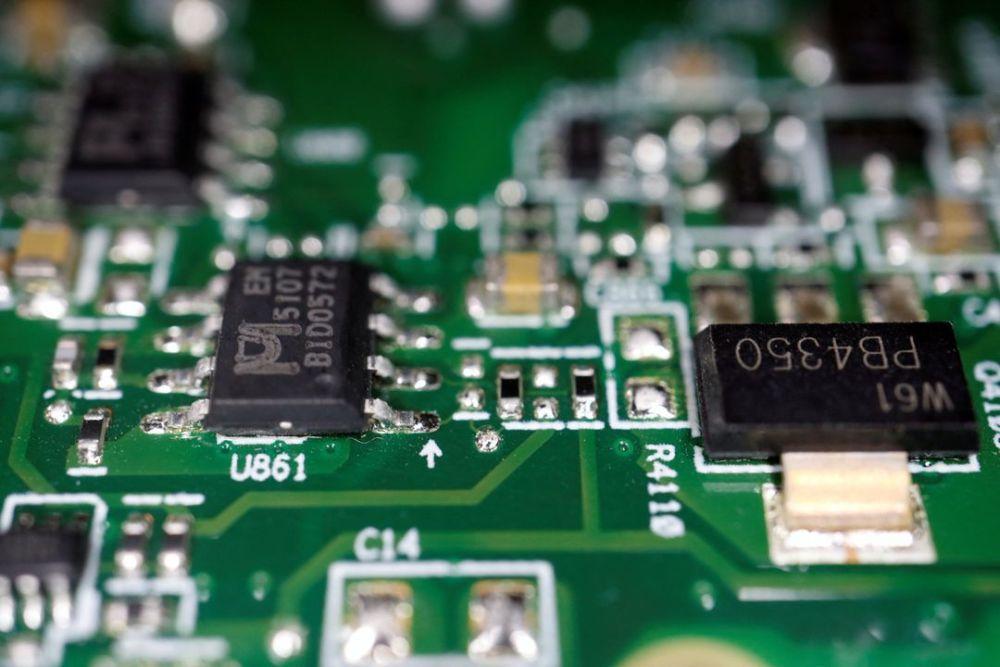
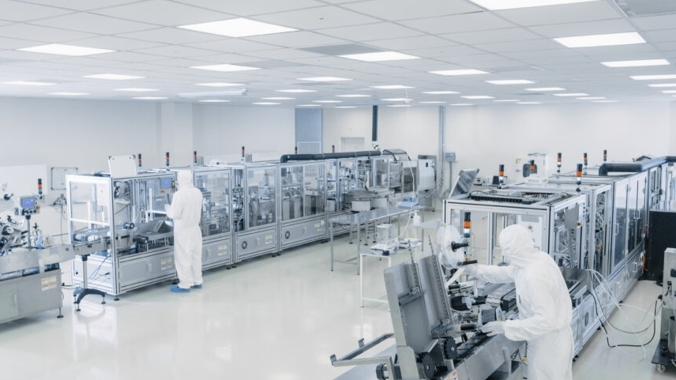

# 美国想将越南打造为芯片制造中心？合格工程师严重短缺成最大瓶颈

**划重点：**

  * _1_ 美国和越南已经签署协议，将部分《芯片法案》的资金用于发展越南的半导体产业。
  * _2_ 越南缺少大量芯片专家，目前这个领域约有5000经过培训的工程师，未来5年预计缺口将达到1.5万人。
  * _3_ 美国公司专注于在越南组装芯片，越南需要在10年内增加10倍的工程师来满足需求。

腾讯科技讯
长期以来，越南都在努力推动半导体产业发展，同时美国也希望快速推动越南成为芯片制造中心，以打造多元化供应链。美国和越南最近建立了“全面战略伙伴关系”，此举可能会为越南半导体行业带来数十亿美元的资金。但业内人士、分析人士和投资者表示，训练有素的专家数量太少，将成为越南芯片行业快速发展的一个关键障碍。

**01 五年内缺口1.5万人，十年内需求增加10倍**

2004年，一位越南裔美国企业家在河内开了一家微芯片设计公司，原因之一是为了接近他的越南妻子。尽管他对芯片行业缺乏了解，但他聘请了电气工程和电信专业的学生阮清仁（Nguyen
Thanh Yen)。在这项工作开始的头三个月里，阮清仁如饥似渴地阅读大量有关芯片设计方面的书籍。

快进到今天，阮清仁已经成为韩国芯片设计公司CoAsia
Semi河内分公司的首席工程师。尽管事业蒸蒸日上，但他仍然面临着和他的第一位老板同样的难题，即找到足够的芯片工程师。阮清仁表示，过去三年里，他只招到了70名芯片设计工程师，距离300人的目标还差着一大截。

阮清仁甚至为工科学生开设了一门课程，帮助培养更多芯片设计师。他说：“要想找到300名经验丰富的芯片设计工程师是不可能的，所以我说服了公司让我创建一个培训项目。我为自己亲手打造的这支团队感到非常自豪。”

9月10日，美国和越南签署了“全面战略伙伴关系”，此次合作的核心是一项新的半导体合作伙伴关系，旨在支持美国的弹性供应链，其中包括美国政府提供的200万美元初始种子资金，用于在越南开发半导体组装、测试和封装的教学实验室和培训课程。

这笔资金来自《芯片法案》下的国际技术安全和创新(ITSI)基金，该基金旨在“扩大美国在印度-太平洋和美洲的下游产能并使其多样化”。

然而，阮清仁估计，越南目前只有大约5000名受过芯片行业培训的硬件工程师。阮清仁还在Facebook上经营着一个颇受欢迎的微芯片工程师社区。据报道，为了满足未来10年半导体公司的预期需求，越南将不得不将硬件工程师的数量增加近10倍。

美国-东盟商业理事会越南办事处主任Vu Tu
Thanh也表示，虽然越南的人口超过1亿，但其在芯片领域只有5000至6000名经过培训的硬件工程师，而预计五年内需求将达到20000人，十年内将达到50000人。

业内专家表示，虽然美国急需经验丰富的越南芯片工程师，但后者的人才储备却严重不足。越南院校中有关芯片制造的课程很少，学生对该职业的认识也很低。获得必要劳动力的最快途径是对电气和其他工程师进行再培训，就像阮清仁在做的那样。

**02 越南半导体领域仍由外国公司主导**

根据越南政府的数据，这个东南亚国家的半导体产业每年对美国的出口额超过5亿美元，目前主要集中在供应链的后端制造阶段，即芯片的组装、封装和测试，不过它正在缓慢向设计等领域扩张。

美国尚未具体说明将优先考虑提升越南芯片行业的哪些领域，但该国行业高管表示，后端是一个关键的增长领域。在这些考量中，中国发挥了重要作用。波士顿咨询集团的数据显示，2019年，全球67%的后端制造业在中国大陆和台湾地区，美国只占2%。这使得组装行业成为仅次于芯片制造行业的集中度最高的行业之一。

越南的半导体发展可以追溯到几十年前，但由于缺乏资金和技术，其发展始终受到阻碍。越南的半导体领域由大约40家外国公司主导，其中最著名的是美国科技巨头英特尔，该公司在胡志明市拥有最大的芯片组装和测试设施。根据美国人口普查局的数据，这已经使越南成为美国第三大芯片出口源，仅次于马来西亚和中国台湾地区。

迁往越南的大多数半导体制造商都集中在芯片设计领域，这是供应链中资本密集程度最低的部分，以利用越南工人工资较低的优势。然而，越南本土半导体企业寥寥无几，只有军方运营的电信公司越南电信(Viettel)和科技巨头FPT处于领先地位。

不过，越南半导体生态系统在不断扩张。FPT已经在向日本输出其工程师，并且其首个自主设计的医疗设备芯片已经获得了数百万份订单。几家美国半导体公司最近也向越南扩张，Amkor
Technology计划下月在工业发达的北宁省(Bac
Ninh)建设一家芯片组装和测试工厂，投资达16亿美元。Synopsys将与西贡高科技园区合作开设半导体设计和孵化中心。Marvell计划在胡志明市建立一个半导体中心，英特尔已经在那里运营了15年以上。

皇家墨尔本理工大学越南校区供应链高级项目经理阮雄（Hung
Nguyen）表示，美国可能也有兴趣增加越南的芯片原材料供应，尤其是稀土。据估计，越南拥有仅次于中国的全球第二大稀土储量。越南也吸引了芯片制造设备制造商的兴趣，并表示将在2020年前建立本国首家半导体制造工厂。

然而，如果熟练劳动力短缺问题得不到妥善解决，使越南在面对马来西亚和印度等地区竞争对手时更加脆弱，那么越南的半导体雄心可能仍只是白日梦。

官员们说，英特尔一再敦促越南有关部门扩大技术工人的储备。消息人士今年早些时候表示，该公司曾考虑将其在越南的15亿美元业务增加近一倍，但目前尚不清楚该公司6月份宣布在欧洲进行大规模投资后是否仍在推动这项计划。

**03 卖芯片比卖稻米赚钱多了！**

然而，半导体领域巨头的到来还不足以吸引大量越南学生来满足雇主的需求。胡志明市附近的越南-德国大学电气工程高级讲师克莱因（Udo
Klein）称：“他们并没有真正意识到半导体工程方面的就业机会。与此同时，印度等国家也在大力发展半导体经济，加剧了对人才和市场份额的全球竞争。”

河内科技大学(HUST)是越南顶尖的工程学院，这里的光刻室通常是让许多研究人员流连忘返的地方。他们从头到脚都穿着无尘服，在温暖的黄色灯光下工作。河内科技大学的材料科学研究所成立于1992年，是越南和荷兰政府的合作的成果，去无尘室资金来自荷兰和日本的发展援助资金。

就在今年，河内科技大学推出了半导体制造与设计的本科学位，名为“微电子工程与纳米技术”，这是越南第一个也是唯一一个此类学位。Amkor
Technology、越南电信以及首尔半导体(Seoul
Semiconductor)等行业巨头都对合作表示了兴趣。首尔半导体甚至向学校赠送了学生所需的重要设备。

河内科技大学副教授阮文贵（Nguyen Van
Quy）在接受采访时表示：“教师们早就想开设半导体制造专业课了。在大型半导体公司加大了对越南的投资和扩张之后，校长终于在去年批准了这一项目。”

第一批89名学生上周开始了他们的课程，来自北宁省的阮当哈（Nguyen Dang
Ha）就是其中之一。他回忆说，他看到自家附近正在建造一座巨大的Amkor芯片工厂，这影响了他的决定。虽然他需要五年半的时间才能获得本科和硕士学位，不过他的抱负并不包括回国为这家美国芯片巨头工作，“我想出国继续深造”。

但为了利用与美国建立的伙伴关系，并让美国看到它所需要的快速成果，越南现在就需要更多芯片工程师。越南-
德国大学电气工程高级讲师克莱因表示：“目前的机会很难得，几年之后可能就不再有！”

阮清仁将此归咎于越南的人才流失，以及缺乏所得税减免、办公空间折扣等激励措施。他说，最重要的是，越南政府需要提供激励措施，鼓励企业聘用和培训应届毕业生进入该行业。在这个新兴行业闯荡的这些年里，他看到了这个行业对整个国家带来的巨大好处。

阮清仁来自一个水稻农民家庭，他解释称：“单个芯片的设计就像一粒稻种。只要你培育出一种稻种，就能卖出数十亿粒，但芯片要比卖大米赚钱多了！”

与此同时，阮清仁警告称：“越南必须获得他们芯片设计的所有权，否则我们只是在为美国人打工。”（文/金鹿）

