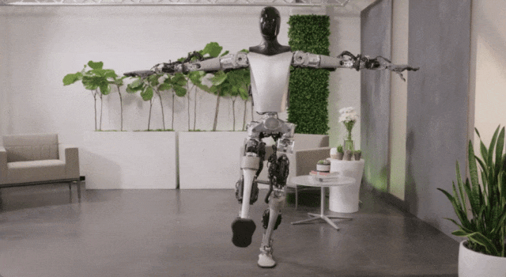

# 马斯克的人形机器人再进化：仅靠视觉就能将物体分类，还爱上了练瑜伽

也许未来，真如《终结者》等科幻电影那样，人形机器人将与真人无异。

沉寂了几个月的特斯拉人形机器人擎天柱（Optimus）终于有了新的动态。记得上一次看到它还是在[特斯拉股东大会](https://new.qq.com/rain/a/20230517A044V600)上，当时
Optimus 展示了自由行走、灵活抓取放下物体等技能。

今天，特斯拉 Optimus 又进化了。现在，它可以自主地对物体进行分类了。其中的亮点是神经网络完全端到端训练：输入视频，输出控制。这类似于特斯拉自动驾驶
FSD V12 开发中的神经网络训练 —— 处理所有输入信号，输出驾驶决策。

不禁要问，如何做到的呢？

Optimus 拥有了自我校准手臂和腿部的能力，仅使用视觉和关节位置编码器，它就可以在空间中精准定位自己的肢体。

精确的校准能力使 Optimus 更高效地学习各种任务，并且仅使用视觉，其神经网络完全实现了 on-board 运行。

这样一来，Optimus 可以完全自主地将物体按颜色进行分类。

即便有人干扰，Optimus 也能按颜色将物体准确分类。

Optimus 还展示了自主纠正（将歪倒的物体摆正）的行为能力。

经过训练后，它还能执行新任务，比如将分类好的物体打乱。

经过了一整天的「工作」，是时候伸展一下、做个双手合十吧。

团队资深软件工程师 Julian Ibarz 表示，「非常高兴分享团队在过去几个月中取得的进展。现在 Optimus
可以完成长期任务，比如完全以任务无关的方式自动对物体进行分类。只需要收集更多数据，则无需更改任何代码就可以训练新的复杂任务。」

马斯克也肯定了这一「进展」。

网友在震惊之余，也提出了一些问题，比如是否可以输入 prompt 让 Optimus
来执行任务？答案是肯定的，视频中使用相同的网络来执行分类或取消分类任务，只需要告诉 Optimus 你想做什么就行了。

Optimus 的「前世今生」

Optimus 并非一开始就是一个实体机器人的，它从「Tesla Bot」这样一个机器人通用计划慢慢孵化。

2021 年马斯克在「特斯拉 AI 日」上展示了 Tesla Bot 的大致形态。

甚至在 Tesla Bot
动作展示时，是由工作人员穿着特制的紧身服装，扮成机器人的模样表演了一段舞蹈。但就是这样一个想法，逐渐扎根，并走向现实，一次次突破给人们惊喜。

一年后的「特斯拉 AI 日」上，曾经由人扮演的 Tesla Bot 变为了机器人 Optimus。

_2022 年「特斯拉 AI 日」上 Optimus 和人们打招呼_

刚亮相的 Optimus 已经可以搬运箱子，给花浇水，在工厂里工作。但这不是 Optimus 的最终目标。Optimus 要成为拥有「大脑」的类人机器人。

_Optimus 在特斯拉超级工厂里工作_

马斯克表示，当时这个机器人设计出来只用了半年时间，未来成型的样子有很多值得期待的地方。

事实也正如此，2023 年特斯拉股东大会上的 Optimus 的脚步已经更加顺畅，动作也更加熟练。

_Optimus 灵活抓取、放下物体_

而现在，Optimus 已经向着它的目标不断前进，拥有「大脑」的路程也越走越清晰。下一次它将如何进化，我们拭目以待。

编辑：杜伟、大盘鸡

参考链接：

https://techau.com.au/tesla-shows-off-teslabot-running-fsd-v12-autonomously-
sorting-objects-using-video-in-controls-out/

