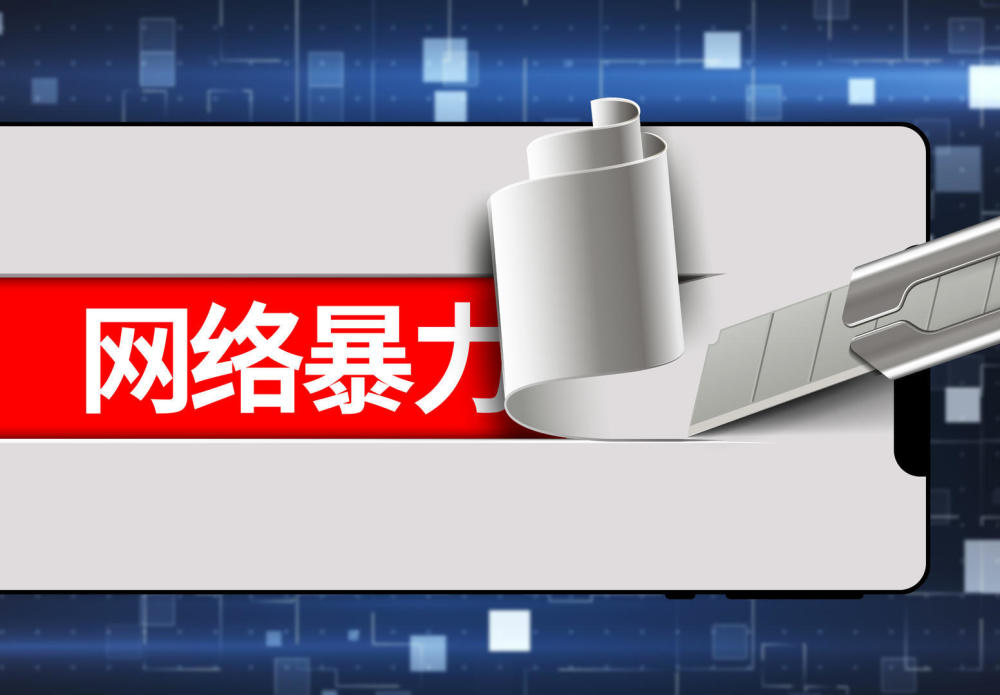

# 公安部：就网络侮辱、诽谤提起自诉的案件，被害人若取证难公安机关可协助取证

9月25日，最高人民法院、最高人民检察院、公安部联合发布《关于依法惩治网络暴力违法犯罪的指导意见》（下称《意见》）。同日，最高法召开新闻发布会，介绍相关情况。

会上，公安部法制局副局长孙萍表示，公安部高度重视网络暴力违法犯罪的打击治理工作。近年来，全国公安机关充分发挥职能作用，严打网络暴力违法犯罪活动，切实维护公民合法权益和正常网络秩序。

_图据IC photo_

据了解，公安机关依托“净网2023”专项行动和夏季治安打击整治行动，发起打击网络暴力违法犯罪集群战役，针对人身攻击、造谣传谣、“人肉搜索”等突出网络暴力违法犯罪行为，以及幕后网暴“黑手”“推手”，持续强化线索发现和打击惩处，侦破了网暴“湖北武汉被撞小学生妈妈”案、江苏无锡章某雇佣“网络水军”网暴他人案等一批社会关注度高的案件。截至目前，各地公安机关在今年“夏季行动”期间抓获涉嫌网络暴力相关犯罪人员35人、行政处罚57人、批评教育472人。此外还依托网络安全宣传周等活动，公开曝光多起网络暴力典型案例，释放“网络不是法外之地”的理念，警示教育广大网民文明上网、理性表达，自觉守法。

孙萍表示，下一步，公安部将组织各地认真学习、准确理解《意见》精神实质，严格执行《意见》规定，进一步依法严厉打击网络暴力违法犯罪行为，将重点开展几项工作。

一是组织开展学习培训和普法工作。加强对《意见》的学习培训，使办案民警熟练掌握、正确运用《意见》，准确把握法律适用尺度，加大对人民群众合法权益的保护，维护好正常的网络秩序。加强法制宣传教育，通过新闻媒体、微信公众号、微博等多种形式，教育引导广大网民遵纪守法，在全社会营造良好法治氛围。

二是持续加大网络暴力违法犯罪打击力度。对公民向公安机关报案、控告或者举报的网络暴力行为，构成违反治安管理的，公安机关将依法给予治安管理处罚；情节严重，经审查认为符合公诉条件的，依法及时立案侦查。继续依托“净网2023”专项行动和夏季治安打击整治行动，依法重点打击人民群众反映强烈的网络暴力案件，特别是针对未成年人等弱势群体、编造“涉性”话题侵害他人人格尊严，或者利用“深度合成”技术、组织“水军”“打手”实施的案件，以及造成被害人精神失常、自杀等恶劣社会影响的案件，切实矫正“法不责众”错误倾向，让人民群众充分感受到公平正义。

三是切实落实协助取证的法律规定。对于被害人就网络侮辱、诽谤提起自诉的案件，人民法院经审查认为被害人提供证据确有困难，要求公安机关提供协助的，公安机关将全力做好协助取证工作，切实帮助被害人有效维护自身合法权益。

四是积极促进网络暴力综合治理。立足公安机关的职能作用，切实加强与网信、宣传等有关主管部门的协同联动，形成监管合力。常态化开展网络安全监督执法，压紧压实网络服务提供者安全主体责任，推动网站平台强化企业自治、完善管理规范、健全畅通举报渠道，积极采取有效措施，及时阻断制止网络暴力事件。

红星新闻记者 祁彪 赵倩 北京报道

编辑 潘莉 责编 李彬彬

相关消息：

[“两高一部”出台意见依法惩治网络暴力违法犯罪](https://new.qq.com/rain/a/20230925A059ZW00)

[最高法公布一批依法惩治网络暴力违法犯罪典型案例](https://new.qq.com/rain/a/20230925A05B5H00)

