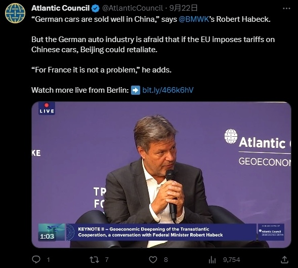
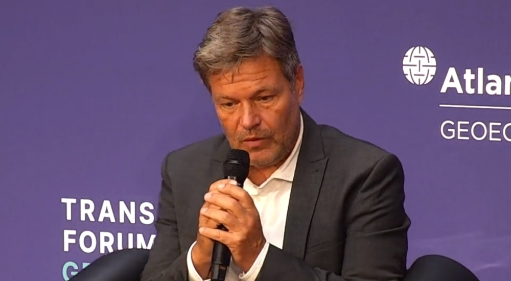

# 德国经济部长：中国人很聪明，现在向他们销售大量汽车变得有点困难

（观察者网讯）当地时间9月22日，德国经济部长哈贝克（绿党）出席在柏林举行的美国智库“大西洋理事会”地缘政治经济论坛。期间，哈贝克谈及中国电动汽车发展迅速，称德国向中国销售大量汽车“现在变得有点困难”，“因为他们很聪明，知道如何制造电动汽车”。

对于欧盟对中国电动汽车发起的反补贴调查，哈贝克表示，德国汽车制造商担心此举会招致中方“反制”。他同时承认，德国和法国就此问题存在分歧。

政治新闻网欧洲版“Politico EU”称，这是德国高级官员首次公开承认法德分歧，此前多家德媒指控法国是欧盟此项决定的“发起者”和既得利益者。

 _德国经济部长哈贝克出席“大西洋理事会”论坛，推文截图_

据“大西洋理事会”官方视频和Politico EU报道，哈贝克坦率地承认，德法两国在欧盟是否应对中国电动汽车展开反补贴调查问题上存在分歧。

哈贝克表示，法国曾强烈推动欧盟对中国电动汽车展开调查，但现实是，法国汽车制造商在中国的汽车销量远低于德国，因此在与中国潜在的电动汽车“关税战”中损失较小。

他进一步指出，“德国汽车在中国卖得好”，法国车在中国的销量不及德国车，在欧盟委员会主席冯德莱恩宣布对中国电动汽车发起的反补贴调查后，“德国经济体系和汽车工业担心，如果真的对中国汽车征收关税，我们将不得不担心（来自中方的）反制行动”。

“对法国来说，这不是问题，因为他们在中国市场上销售的汽车并不多”，哈贝克称，在考虑欧盟反补贴调查的影响和后果时，德国和法国存在分歧，“把所有这些不同的观点融合一起是非常非常困难的”。

谈及中国电动汽车时，哈贝克表示：“我们向中国销售大量汽车，但现在变得有点困难了。因为他们很聪明，知道如何制造电动汽车。中国的电动汽车市场增长非常非常快。”

Politico EU还提到，22日早些时候，德国总理朔尔茨的欧盟、经济和金融政策高级顾问库基斯（Jörg
Kukies）在同一场活动上声称，欧盟对中国电动汽车的反补贴调查“完全正常”且“完全合法”。但他同时强调，相关调查必须尊重“非常高的标准”，“证据和证明的门槛非常高”。

_“中国人很聪明，知道如何制造电动汽车”，视频截图_

近段时间以来，中国电动汽车在欧洲等市场刮起一股旋风。在欧盟内部，法国政府不断撺掇欧盟对中国电动汽车挥动“贸易大棒”，而以传统汽车强国德国为首的许多国家，则极力反对任何这样的惩罚性举措，认为任何贸易战都会带来巨大损失。

当地时间9月13日，欧盟委员会主席冯德莱恩在向欧洲议会发表年度“盟情咨文”时，仍旧宣布欧盟委员会将对中国电动汽车启动反补贴调查，声称以此保护自身免受受益于国家补贴的中国电动车生产商的影响。

_冯德莱恩13日宣布启动调查，视频截图_

冯德莱恩发表声明后，以德国为代表的欧洲汽车业界纷纷预警，提醒欧盟此举只会“玩火自焚”。奔驰、博世等德企也相继发声，称“贸易保护主义”和“关税战”的结果只会是双输。

与此同时，多家德媒将矛头指向法国。其中，《时代周报》援引消息称，冯德莱恩是“按照法国命令”行事，“巴黎不仅瞄准中国，还想削弱德国高端品牌”。《经济周刊》也认为，“欧洲这一举动，只会适得其反（This
shot backfires）”，而法国在中国没什么可失去的。

德媒《焦点》周刊9月17日援引专家的话称，欧盟此举只会适得其反，“如果中国征收关税或采取类似措施，将严重打击德国汽车制造商”，甚至德国机械工程等其他领域也会受到波及。

文章指出，目前，德国汽车工业近三分之一的汽车在中国销售，而电池等原材料和零部件很多都从中国采购。对一些在中国进行了数十亿投资的汽车企业来说，惩罚性关税问题是一个雷区。大众、梅赛德斯-
奔驰、特斯拉和福特等公司，不仅对中国丰富的原材料感兴趣，而且对在华建厂感兴趣。

事实上，欧盟以及德国政府也对可再生能源领域提供一系列补贴政策。维也纳经济研究所所长菲尔博迈尔（Gabriel
Felbermayr）告诉《法兰克福汇报》，鉴于欧盟也有类似的政策，欧盟现在启动调查的做法，是“坐在玻璃房子里，往外扔石头”（德语谚语，意思是如果对方反击的话，玻璃房便粉碎无疑）。

菲尔博迈尔进一步解释说，假如欧盟果真启动惩罚性关税，中国肯定会回击，其结果就像当年空客和波音的大战。届时“德国将很难支撑住”，因为德国不仅是出口大国，而且在中国有着广泛的生产基地。

9月19日，欧盟委员会负责能源事务的副主席谢夫乔维奇（Maroš
Šefčovič）接受美媒采访时表示，距离欧盟对中国电动汽车征收新关税“还很遥远”。他在解释这一说法时称：“我们距离对中国（电动）汽车征收进口关税还很遥远，我的意思是，这些调查要公平，必须进行得当。”

就在欧盟向中国电动汽车挥动“贸易大棒”之际，欧盟委员会执行副主席、欧盟贸易专员东布罗夫斯基斯（Valdis
Dombrovskis）9月23日抵华。在当天发表演讲时，他再三保证欧盟无意与中国“脱钩”，称欧盟寻求的是对华“去风险”，希望建立更为平衡的经济关系。

我商务部新闻发言人9月14日表示，中方认为，欧盟拟采取的调查措施是以“公平竞争”为名行保护自身产业之实，是赤裸裸的保护主义行为，将严重扰乱和扭曲包括欧盟在内的全球汽车产业链供应链，并将对中欧经贸关系产生负面影响。中欧汽车产业有着广泛的合作空间和共同利益，经过多年发展，早已形成“你中有我，我中有你”的格局。中方将密切关注欧方保护主义倾向和后续行动，坚定维护中国企业的合法权益。

**本文系观察者网独家稿件，未经授权，不得转载。**

